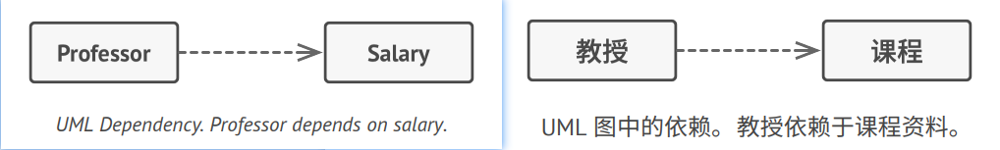
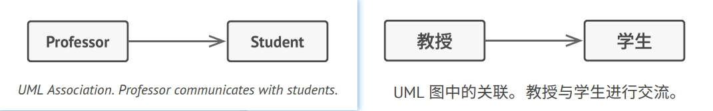
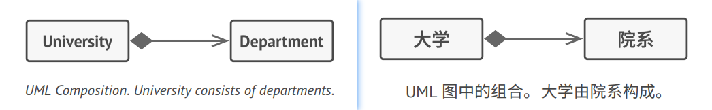
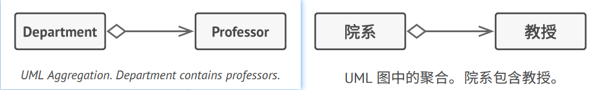
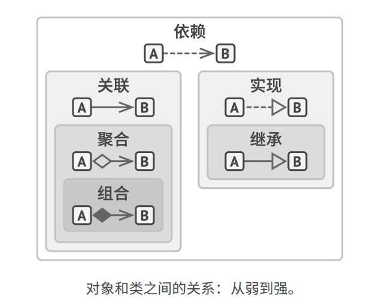

## Relations Between Objects 对象之间的关系
In addition to *inheritance* and *implementation* that we've already seen, there are other types of relations between
objects that we haven't talked about yet.   
译: 除了之前我们已经见到的*继承*和*实现*外，对象之间还有其他的关系我们尚未提及。


### Dependency 依赖


*Dependency* is a weaker variant of association that usually implies that there's no permanent link between objects.
Dependency typically (but not always) implies that an object accepts another object as a method parameter, instantiates, 
or uses another object. Here's how you can spot a dependency between classes: a dependency exists between two classes 
if changes to the definition of one class result in modifications in another class.   
补充: *依赖*是类之间最基础的、也是最微弱的关系类型。如果修改一个类的定义可能会造成另一个类的变化，那么这两个类之间就存在依赖关系。当你在代码中
使用具体类的名称时，通常意味着存在依赖关系。例如在指定方法签名类型时，或是通过调用构造函数对对象进行初始化时等。通过让代码依赖接口或抽象类(而不
是具体类)，你可以降低其依赖程度。

补充: 通常情况下，UML图不会展示所有依赖——它们在真实代码中的数量太多了。为了不让依赖关系破坏UML图，你必须对其进行精心选择，仅展示那些对沟通
你的想法来说重要的依赖关系。


### Association 关联


*Association* is a type of relationship in which one object uses or interacts with another. In UML diagrams, the 
association relationship is shown by a simple arrow drawn from an object and pointing to the object it uses. By the 
way, having a bidirectional association is a completely normal thing. In this case, the arrow has a point at each 
end.   
译: 关联是一个对象使用另一对象或与另一对象进行交互的关系。在UML图中，关联关系用起始于一个对象并指向其所使用的对象的简单箭头来表示。顺便一说，
双向关联也是完全正常的，这种情况就用双向箭头来表示。(补充: 关联可视为一种特殊类型的依赖，即一个对象总是拥有访问与其交互的对象的权限，而简单的
依赖关系并不会在对象间建立永久性的联系。)

In general, you use an association to represent something like a field in a class. The link is always there, in that 
you can always ask an order for its customer. It need not actually be a field, if you are modeling from a more 
interface perspective, it can just indicate the presence of a method that will return the order's customer.   
译: 一般来说，你可以使用关联来表示类似于成员变量这样的关系。这种关系将一直存在，这样你就总能通过订单来获取其顾客。当然它并非一定是成员变量，如果
你根据接口来创建类，它也可以表示为一个返回订单的顾客的方法。

补充: 为了巩固你对关联和依赖之间区别的理解，下面让我们来看一个二者结合的示例。假设我们有一个名为教授(Professor)的类:
```c++
class Professor is
    field Student student
    // ...
    method teach(Course c) is
        // ...
        this.student.remember(c.getKnowledge())
```

补充: 让我们来看看教授知识`teach`方法，它将接收一个来自课程`Course`类的参数。如果有人修改了课程`Course`类的`getKnowledge`方法(修改方法名或添加
一些必须的参数等)，那代码将会崩溃。这就是依赖关系。

补充: 现在，让我们来看看名为学生`student`的成员变量，以及如何在`teach`方法中使用该变量。我们可以肯定学生`Student`类是教授`Professor`类的依赖: 
如果`remember`方法被修改，教授`Professor`类的代码也将崩溃。但由于教授`Professor`类的所有方法总能访问学生`student`类的成员变量，所以学生`student`类
就不仅是依赖，而也是关联了。

### Composition 组合


*Composition* is a "whole-part" relationship between two objects, one of which is composed of one or more instances of
the other. The distinction between this relation and others is that the component can only exist as a part of the 
container. In UML the composition relationship is shown by a line with a filled diamond at the container end and an 
arrow at the end pointing toward the component.   
译: *组合*是一种特殊类型的聚合，其中一个对象由一个或多个其他对象实例构成。组合与其他关系的区别在于组件仅能作为容器的一部分存在。在UML图中，组合
与聚合关系的符号相同，但箭头起始处的菱形是实心的。

> While we talk about relations between objects, keep in mind that UML represents relations between classes. It means 
> that a university object might consist of multiple departments even though you see just one "block" for each entity 
> in the diagram. UML notation can represent quantities on both sides of relationships, but it's okay to omit them if 
> the quantities are clear from the context.   
> 译: 尽管我们在此讨论的是对象之间的关系，但请记住UML图表示的是类之间的关系。这意味着大学对象可能是由多个院系构成的，即便图中的每个实体只用一个
> "方框" 来表示。你可以使用UML符号在关系两端标明数量，但如果可以从上下文中明确数量的话，则可以省略此类标注。

### Aggregation 聚合


*Aggregation* is a less strict variant of composition, where one object merely contains a reference to another. The 
container doesn't control the life cycle of the component. The component can exist without the container and can be 
linked to several containers at the same time. In UML the aggregation relationship is drawn the same as for composition, 
but with an empty diamond at the arrow's base.   
译: *聚合*是一种特殊类型的关联，用于表示多个对象之间的"一对多"、"多对多"或"整体对部分"的关系。普通关联仅用于描述两个对象之间的关系。通常在聚合
关系中，一个对象 "拥有" 一组其他对象，并扮演着容器或集合的角色。组件可以独立于容器存在，也可以同时连接多个容器。在UML图中，聚合关系使用一端是空心
菱形，另一端指向组件的箭头来表示。

补充: 注意，在现实中许多人常常想说聚合和组合时使用"组合"这个术语。其中最恶名昭彰的例子是著名的"组合优于继承"原则。这并不是因为人们不清楚它们
之间的差别，而是因为"组合(例如'对象组合')"说起来更顺口。

### 总结(补充)
现在相信你已经对对象之间所有的关系类型有所了解了，那么就让我们来看看它们之间的联系吧，希望这能解答"聚合与组合有何区别?"或"继承是不是一种依赖关系?"
等问题。   


- **依赖**: 对类B进行修改会影响到类A
- **关联**: 对象A知道对象B。类A依赖于类B
- **聚合**: 对象A知道对象B且由B构成。类A依赖于类B
- **组合**: 对象A知道对象B、由B构成而且管理着B的生命周期。类A依赖于类B
- **实现**: 类A定义的方法由接口B声明。对象A可被视为对象B。类A依赖于类B
- **继承**: 类A继承类B的接口和实现，但是可以对其进行扩展。对象A可被视为对象B。类A依赖于类B
