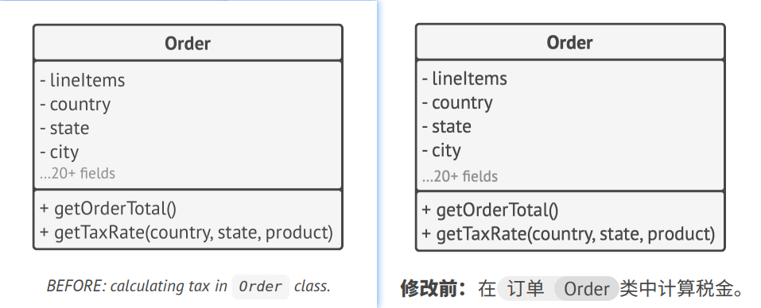
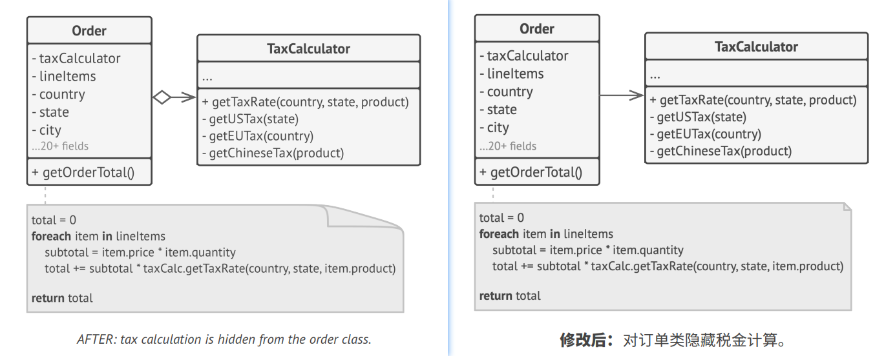

## Encapsulate What Varies 封装变化的内容
> Identify the aspects of your application that vary and separate them from what stays the same.
> 
> 译: 找到应用中变化的内容并将其与不变的内容分离开。

The main goal of this principle is to minimize the effect caused by changes.   
译: 该原则的主要目的是将变化造成的影响最小化。

Imagine that your program is a ship, and changes are hideous mines that linger underwater. Struck by the mine, the
ship sinks.   
译: 假设你的程序是一艘船，而变化就是徘徊在水下的可怕水雷。如果船撞上了水雷就会沉没。

Knowing this, you can divide the ship's hull into independent compartments that can be safely sealed to limit damage 
to a single compartment. Now, if the ship hits a mine, the ship as a whole remains afloat.   
译: 了解到这些情况后，你可以将船体分隔成独立的隔间，并对其进行安全地密封，这样任何损坏都会被限制在单个隔间内。现在，即使船撞上了水雷，整条船也
不会沉没。

In the same way, you can isolate the parts of the program that vary in independent modules, protecting the rest of the 
code from adverse effects. As a result, you spend less time getting the program back into working shape, implementing 
and testing the changes. The less time you spend making changes, the more time you have for implementing features.   
译: 你可以用同样的方式将程序中变化的部分放在单独的模块中，以保护其他的代码不受负面影响。最终，你只需花费较少的时间就能让程序恢复正常工作，亦或
实现并测试修改的内容。你在修改程序上所花的时间越少，就会有更多的时间来实现功能。

### Encapsulation on a method level 在方法层面封装
Say you're making an e-commerce website. Somewhere in your code, there's a `getOrderTotal` method that calculates a grand
total for the order, including taxes.   
译: 假如你正在开发一个电子商务网站。代码中某处有一个`getOrderTotal`方法，该方法用于计算订单的总金额(含税)。

We can anticipate that tax-related code might need to change in the future. The tax rate depends on the country, state 
or even city where the customer resides, and the actual formula may change over time due to new laws or regulations. As 
a result, you'll need to change the `getOrderTotal` method quite often. But even the method's name suggests that it 
doesn't care about *how* the tax is calculated.   
译: 我们预计在未来可能会修改与税金相关的代码。税率会根据客户居住的国家/地区、州/省甚至城市而有所不同: 而且一段时间后，实际的计算公式可能会由于
新的法律或政策而修改。因此，你将需要经常地修改getOrderTotal方法。不过仔细观察方法名称，连它都在暗示其并不关心税金是如何计算出来的。

```c++
method getOrderTotal(order) is
    total = 0
    foreach item in order.lineItems
        total += item.price * item.quantity
    
    if (order.country == "US")
        total += total * 0.07 // US sales tax  美国营业税
    else if (order.country == "EU"):
        total += total * 0.20 // European VAT  欧洲增值税
    
    return total
```
> BEFORE: tax calculation code is mixed with the rest of the method's code.
> 
> 修改前: 税率计算代码与方法的其他代码混杂在一起。

You can extract the tax calculation logic into a separate method, hiding it from the original method.   
译: 你可以将计算税率的逻辑抽取到一个单独的方法中，并对原来的方法隐藏该逻辑。

```c++
method getOrderTotal(order) is
    total = 0
    foreach item in order.lineItems
        total += item.price * item.quantity
    
    total += total * getTaxRate(order.country)
    
    return total


method getTaxRate(country) is
    if (country == "US")
        return 0.07 // US sales tax  美国营业税
    else if (country == "EU")
        return 0.20 // European VAT  欧洲增值税
    else
        return 0
```
> AFTER: you can get the tax rate by calling a designated method.
> 
> 修改后：你可以通过调用指定的方法来获取税率。

Tax-related changes become isolated inside a single method. Moreover, if the tax calculation logic becomes too 
complicated, it's now easier to move it to a separate class.   
译: 这样税率相关的修改就被隔离在单个方法内了。此外，如果税率计算逻辑变得过于复杂，你也能方便地将其移动到单独的类中。


### Encapsulation on a class level 在类层面封装
Over time, you might add more and more responsibilities to a method which used to do a simple thing. These added 
behaviors often come with their own helper fields and methods that eventually blur the primary responsibility of the 
containing class. Extracting everything to a new class might make things much more clear and simple.    
译: 一段时间后，你可能会在一个以前完成简单工作的方法中添加越来越多的功能。新增行为通常还会带来助手成员变量和方法，最终使得包含接纳它们的类的主要
职责变得模糊不清。将所有这些内容抽取到一个新类中会让程序变得更加清晰和简洁。



Objects of the `Order` class delegate all tax-related work to a special object that does just that.   
译: 订单`Order`类的对象将所有与税金相关的工作委派给一个专门负责的特殊对象。



