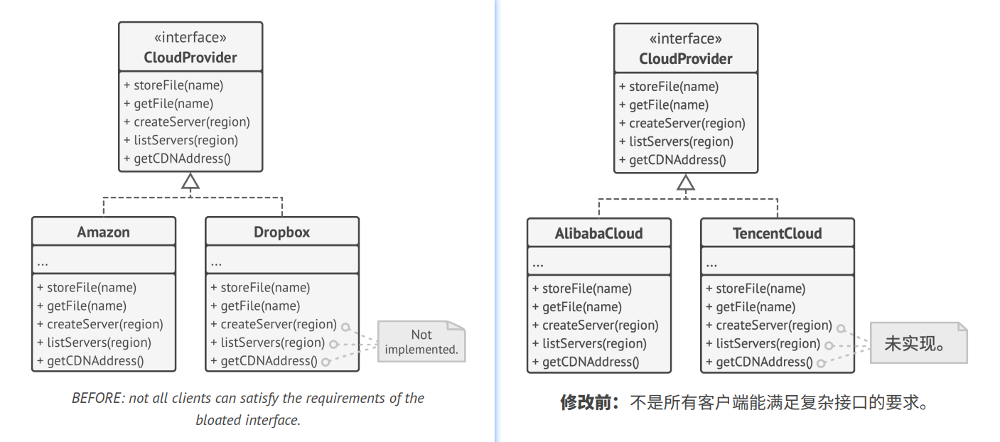
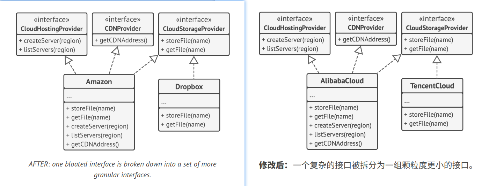

## `I`nterface Segregation Principle 接口隔离原则

> Clients shouldn't be forced to depend on methods they do not use.
> 
> 译: 客户端不应被强迫依赖于其不使用的方法。

Try to make your interfaces narrow enough that client classes don't have to implement behaviors they don't need.   
译: 尽量缩小接口的范围，这样客户端侧的类就不必实现它们不需要的行为。

According to the interface segregation principle, you should break down "fat" interfaces into more granular and specific
ones. Clients should implement only those methods that they really need. Otherwise, a change to a "fat" interface would
break even clients that don't use the changed methods.   
译: 根据接口隔离原则，你应该将 "臃肿" 的接口拆分为多个颗粒度更小的特定接口。客户端应该只需实现其真正需要的方法。否则，一旦修改了 "臃肿" 的接口，
那么客户端就会受到影响，即使客户端根本用不到修改的方法。

Class inheritance lets a class have just one superclass, but it doesn't limit the number of interfaces that the class 
can implement at the same time. Hence, there's no need to cram tons of unrelated methods to a single interface. Break 
it down into several more refined interfaces—you can implement them all in a single class if needed. However, some 
classes may be fine with implementing just one of them.   
译: 类层次结构只允许类拥有一个超类，但是它并没有限制类可以同时实现接口的数量。因此，你不需要将大量无关的方法塞进单个接口。你可以将它拆分为多个
更精细的接口，如有需要可在单个类中实现所有这些接口。当然，某些类也可只实现其中的一个接口。

### Example 示例

Imagine that you created a library that makes it easy to integrate apps with various cloud computing providers. While in
the initial version it only supported Amazon Cloud, it covered the full set of cloud services and features.   
译: 假如你创建了一个依赖库，它能使应用方便地与各种云计算服务供应商进行整合。尽管最初版本只支持亚马逊云服务，但它也覆盖了一套完整的云服务和功能。

At the time, you assumed that all cloud providers have the same broad spectrum of features as Amazon. But when it came 
to implementing support for another provider, it turned out that most of the interfaces of the library are too wide.
Some methods describe features that other cloud providers just don't have.   
译: 假设所有的云服务供应商都和亚马逊一样提供相同种类的功能。但是当你着手开始为其他供应商提供支持时，你会发现依赖库中绝大多数的接口会显得过于 "臃肿" 。
其他云服务供应商并没有提供某些方法所描述的功能。

While you can still implement these methods and put some stubs there, it wouldn't be a pretty solution. The better
approach is to break down the interface into parts. Classes that are able to implement the original interface can now 
just implement several refined interfaces. Other classes can implement only those interfaces which have methods that 
make sense for them.   
译: 尽管你仍然可以去实现这些方法并放入一些桩代码，但这并不是一个完美的解决方案。更好的方法是将单个 "臃肿" 的接口拆分为多个特定的接口。原来的类
现在只需要实现多个特定的接口即可。而其他的类则只需要实现对自己有意义的接口。

As with the other principles, you can go too far with this one. Don't further divide an interface which is already 
quite specific. Remember that the more interfaces you create, the more complex your code becomes. Keep the balance.   
译: 与其他原则一样，你可能会过度使用这条原则。不要进一步拆分已经非常特定(专一)的接口。记住，创建的接口越多，你的代码就越复杂。因此要保持平衡。
