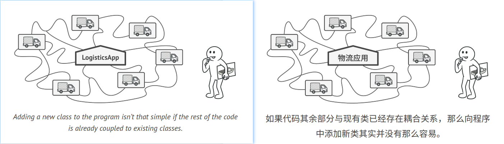
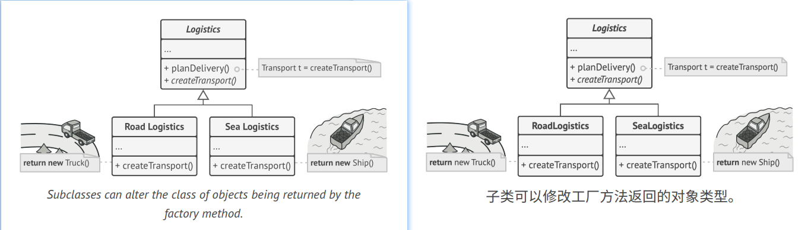
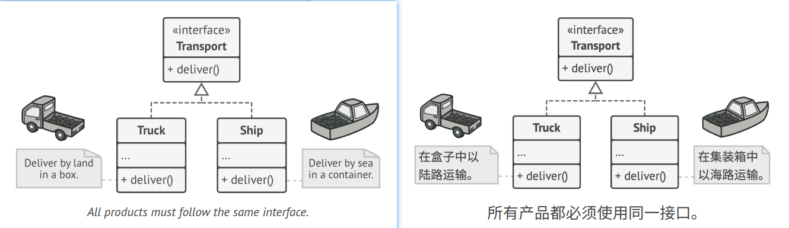
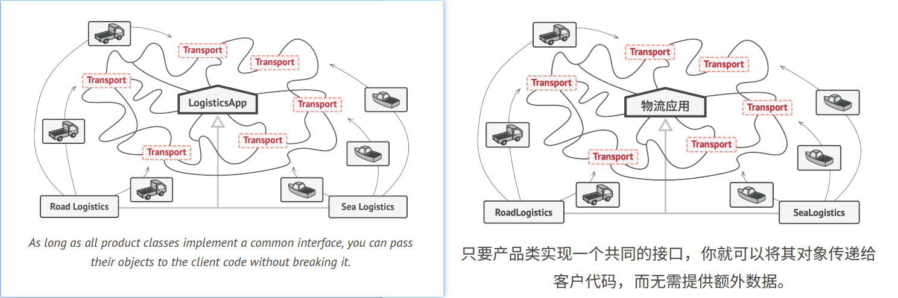
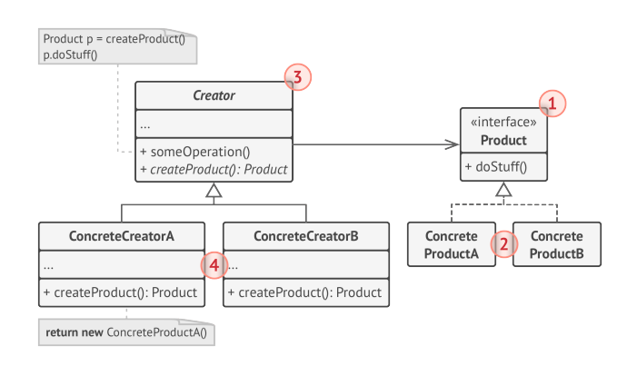
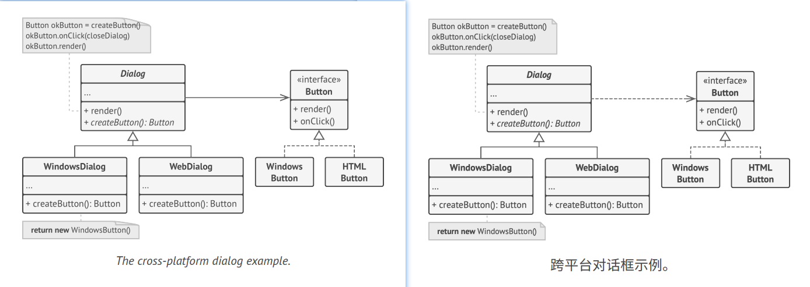

## FACTORY METHOD 
**Also known as:** Virtual Constructor

### :snowflake: Intent
**Factory Method** is a creational design pattern that provides an interface for creating objects in a superclass, but 
allows subclasses to alter the type of objects that will be created.   
译: 


### :worried: Problem
Imagine that you're creating a logistics management application. The first version of your app can only handle 
transportation by trucks, so the bulk of your code lives inside the `Truck` class.  
译: 

After a while, your app becomes pretty popular. Each day you receive dozens of requests from sea transportation companies
to incorporate sea logistics into the app.  
译: 



Great news, right? But how about the code? At present, most of your code is coupled to the `Truck` class. Adding `Ships` 
into the app would require making changes to the entire codebase. Moreover, if later you decide to add another type of 
transportation to the app, you will probably need to make all of these changes again.  
译: 

As a result, you will end up with pretty nasty code, riddled with conditionals that switch the app's behavior depending 
on the class of transportation objects.  
译: 

### :smile: Solution
The Factory Method pattern suggests that you replace direct object construction calls (using the `new` operator) with 
calls to a special *factory* method. Don't worry: the objects are still created via the `new` operator, but it's being 
called from within the factory method. Objects returned by a factory method are often referred to as *products*.   
译: 



At first glance, this change may look pointless: we just moved the constructor call from one part of the program to 
another. However, consider this: now you can override the factory method in a subclass and change the class of products 
being created by the method.  
译: 

There's a slight limitation though: subclasses may return different types of products only if these products have a 
common base class or interface. Also, the factory method in the base class should have its return type declared as this 
interface.  
译: 



For example, both `Truck` and `Ship` classes should implement the `Transport` interface, which declares a method called 
`deliver`. Each class implements this method differently: trucks deliver cargo by land, ships deliver cargo by sea.
The factory method in the `RoadLogistics` class returns truck objects, whereas the factory method in the `SeaLogistics`
class returns ships.  
译:



The code that uses the factory method (often called the *client* code) doesn't see a difference between the actual 
products returned by various subclasses. The client treats all the products as abstract `Transport`. The client knows 
that all transport objects are supposed to have the `deliver` method, but exactly how it works isn't important to the 
client.  
译: 

### :lollipop: Structure


1. The **Product** declares the interface, which is common to all objects that can be produced by the creator and its 
subclasses.  
译: 
2. **Concrete Products** are different implementations of the product interface.  
译: 
3. The **Creator** class declares the factory method that returns new product objects. It's important that the return 
   type of this method matches the product interface.  
译: 

   You can declare the factory method as abstract to force all subclasses to implement their own versions of the method. 
   As an alternative, the base factory method can return some default product type.  
译: 

   Note, despite its name, product creation is **not** the primary responsibility of the creator. Usually, the creator 
   class already has some core business logic related to products. The factory method helps to decouple this logic from 
   the concrete product classes. Here is an analogy: a large software development company can have a training department 
   for programmers. However, the primary function of the company as a whole is still writing code, not producing programmers.  
译: 

4. **Concrete Creators** override the base factory method so it returns a different type of product.  
译: 

Note that the factory method doesn't have to create new instances all the time. It can also return existing objects from
a cache, an object pool, or another source.  
译: 

### :hash: Pseudocode
This example illustrates how the **Factory Method** can be used for creating cross-platform UI elements without coupling 
the client code to concrete UI classes.  
译: 



The base `Dialog` class uses different UI elements to render its window. Under various operating systems, these elements 
may look a little bit different, but they should still behave consistently. A button in Windows is still a button in 
Linux.  
译:

When the factory method comes into play, you don't need to rewrite the logic of the `Dialog` for each operating system. 
If we declare a factory method that produces buttons inside the base `Dialog` class, we can later create a dialog subclass 
that returns Windows-styled buttons from the factory method. The subclass then inherits most of the code from the base 
class, but, thanks to the factory method, can render Windows looking buttons on the screen.  
译: 

For this pattern to work, the base `Dialog` class must work with abstract buttons: a base class or an interface that all 
concrete buttons follow. This way the code within `Dialog` remains functional, whichever type of buttons it works with.  
译: 

Of course, you can apply this approach to other UI elements as well. However, with each new factory method you add to 
the `Dialog`, you get closer to the [Abstract Factory][Abstract Factory] pattern. Fear not, we'll talk about this 
pattern later.  
译: 

```c++
 1 // The creator class declares the factory method that must
 2 // return an object of a product class. The creator's subclasses
 3 // usually provide the implementation of this method.
 4 class Dialog is
 5     // The creator may also provide some default implementation
 6     // of the factory method.
 7     abstract method createButton()
 8
 9     // Note that, despite its name, the creator's primary
10     // responsibility isn't creating products. It usually
11     // contains some core business logic that relies on product
12     // objects returned by the factory method. Subclasses can
13     // indirectly change that business logic by overriding the
14     // factory method and returning a different type of product
15     // from it.
16     method render() is
17         // Call the factory method to create a product object.
18         Button okButton = createButton()
19         // Now use the product.
20         okButton.onClick(closeDialog)
21         okButton.render()
22
23
24 // Concrete creators override the factory method to change the
25 // resulting product's type.
26 class WindowsDialog extends Dialog is
27     method createButton():Button is
28         return new WindowsButton()
29
30 class WebDialog extends Dialog is
31     method createButton():Button is
32         return new HTMLButton()
33
34
35 // The product interface declares the operations that all
36 // concrete products must implement.
37 interface Button is
38     method render()
39     method onClick(f)
40
41 // Concrete products provide various implementations of the
42 // product interface.
43 class WindowsButton implements Button is
44     method render(a, b) is
45         // Render a button in Windows style.
46     method onClick(f) is
47         // Bind a native OS click event.
48
49 class HTMLButton implements Button is
50     method render(a, b) is
51         // Return an HTML representation of a button.
52     method onClick(f) is
53         // Bind a web browser click event.
54
55
56 class Application is
57     field dialog: Dialog
58
59     // The application picks a creator's type depending on the
60     // current configuration or environment settings.
61     method initialize() is
62         config = readApplicationConfigFile()
63
64         if (config.OS == "Windows") then
65             dialog = new WindowsDialog()
66         else if (config.OS == "Web") then
67             dialog = new WebDialog()
68         else
69             throw new Exception("Error! Unknown operating system.")
70
71     // The client code works with an instance of a concrete
72     // creator, albeit through its base interface. As long as
73     // the client keeps working with the creator via the base
74     // interface, you can pass it any creator's subclass.
75     method main() is
76         this.initialize()
77         dialog.render()
```

### :apple: Applicability
:bug: **Use the Factory Method when you don't know beforehand the exact types and dependencies of the objects your 
code should work with.**  
译: 

:zap: The Factory Method separates product construction code from the code that actually uses the product. Therefore 
it's easier to extend the product construction code independently of the rest of the code.  
译: 

For example, to add a new product type to the app, you'll only need to create a new creator subclass and override the 
factory method in it.  
译: 

:bug: **Use the Factory Method when you want to provide users of your library or framework with a way to extend its 
internal components.**  
译: 

:zap: Inheritance is probably the easiest way to extend the default behavior of a library or framework. But how would 
the framework recognize that your subclass should be used instead of a standard component?  
译: 

The solution is to reduce the code that constructs components across the framework into a single factory method and let 
anyone override this method in addition to extending the component itself.  
译: 

Let's see how that would work. Imagine that you write an app using an open source UI framework. Your app should have 
round buttons, but the framework only provides square ones. You extend the standard `Button` class with a glorious
`RoundButton` subclass. But now you need to tell the main `UIFramework` class to use the new button subclass instead of
a default one.  
译: 

To achieve this, you create a subclass `UIWithRoundButtons` from a base framework class and override its `createButton`
method. While this method returns `Button` objects in the base class, you make your subclass return `RoundButton` objects.
Now use the `UIWithRoundButtons` class instead of `UIFramework`. And that's about it!  
译: 

:bug: **Use the Factory Method when you want to save system resources by reusing existing objects instead of 
rebuilding them each time.**  
译: 

:zap: You often experience this need when dealing with large, resource-intensive objects such as database connections, 
file systems, and network resources.  
译: 

Let's think about what has to be done to reuse an existing object:
1. First, you need to create some storage to keep track of all the created objects.
2. When someone requests an object, the program should look for a free object inside that pool.
3. ... and then return it to the client code.
4. If there are no free objects, the program should create a new one (and add it to the pool).

译: 

That's a lot of code! And it must all be put into a single place so that you don't pollute the program with duplicate 
code.  
译: 

Probably the most obvious and convenient place where this code could be placed is the constructor of the class whose
objects we're trying to reuse. However, a constructor must always return **new objects** by definition. It can't return 
existing instances.  
译: 

Therefore, you need to have a regular method capable of creating new objects as well as reusing existing ones. That
sounds very much like a factory method.  
译: 

### :book: How to Implement
1. Make all products follow the same interface. This interface should declare methods that make sense in every product.  
2. Add an empty factory method inside the creator class. The return type of the method should match the common product
   interface.
3. In the creator's code find all references to product constructors. One by one, replace them with calls to the factory 
   method, while extracting the product creation code into the factory method.

   You might need to add a temporary parameter to the factory method to control the type of returned product.

   At this point, the code of the factory method may look pretty ugly. It may have a large `switch` statement that picks 
   which product class to instantiate. But don't worry, we'll fix it soon enough.

4. Now, create a set of creator subclasses for each type of product listed in the factory method. Override the factory 
   method in the subclasses and extract the appropriate bits of construction code from the base method.
5. If there are too many product types and it doesn't make sense to create subclasses for all of them, you can reuse the 
   control parameter from the base class in subclasses.

   For instance, imagine that you have the following hierarchy of classes: the base `Mail` class with a couple of 
   subclasses: `AirMail` and `GroundMail`; the `Transport` classes are `Plane`, `Truck` and `Train`. While the `AirMail` 
   class only uses `Plane` objects, `GroundMail` may work with both `Truck` and `Train` objects. You can create a new 
   subclass (say `TrainMail`) to handle both cases, but there's another option. The client code can pass an argument to 
   the factory method of the `GroundMail` class to control which product it wants to receive.

6. If, after all the extractions, the base factory method has become empty, you can make it abstract. If there's 
   something left, you can make it a default behavior of the method.


### :notes: Pros and Cons

:heavy_check_mark: You avoid tight coupling between the creator and the concrete products.  
译: 

:heavy_check_mark: *Single Responsibility Principle*. You can move the product creation code into one place in the 
program, making the code easier to support.  
译: 

:heavy_check_mark: *Open/Closed Principle*. You can introduce new types of products into the program without breaking 
existing client code.  
译: 

:x: The code may become more complicated since you need to introduce a lot of new subclasses to implement the pattern.
The best case scenario is when you're introducing the pattern into an existing hierarchy of creator classes.  
译: 


### :repeat: Relations with Other Patterns
- Many designs start by using [**Factory Method**][Factory Method] (less complicated and more customizable via subclasses) 
  and evolve toward [**Abstract Factory**][Abstract Factory], [**Prototype**][Prototype], or [**Builder**][Builder] (more 
  flexible, but more complicated).
- [**Abstract Factory**][Abstract Factory] classes are often based on a set of [**Factory Methods**][Factory Method], 
  but you can also use [**Prototype**][Prototype] to compose the methods on these classes.
- You can use [**Factory Method**][Factory Method] along with [**Iterator**][Iterator] to let collection subclasses 
  return different types of iterators that are compatible with the collections.
- [**Prototype**][Prototype] isn't based on inheritance, so it doesn't have its drawbacks. On the other hand, *Prototype* 
  requires a complicated initialization of the cloned object. [**Factory Method**][Factory Method] is based on 
  inheritance but doesn't require an initialization step.
- [**Factory Method**][Factory Method] is a specialization of [**Template Method**][Template Method]. At the same time, 
  a *Factory Method* may serve as a step in a large *Template Method*.


[Factory Method]:../1_factory_method/

[Abstract Factory]:../2_abstract_factory/

[Prototype]:../4_prototype/

[Builder]:../3_builder/

[Iterator]:../../3_behavioral_design_patterns/3_iterator/

[Template Method]:../../3_behavioral_design_patterns/9_template_method/