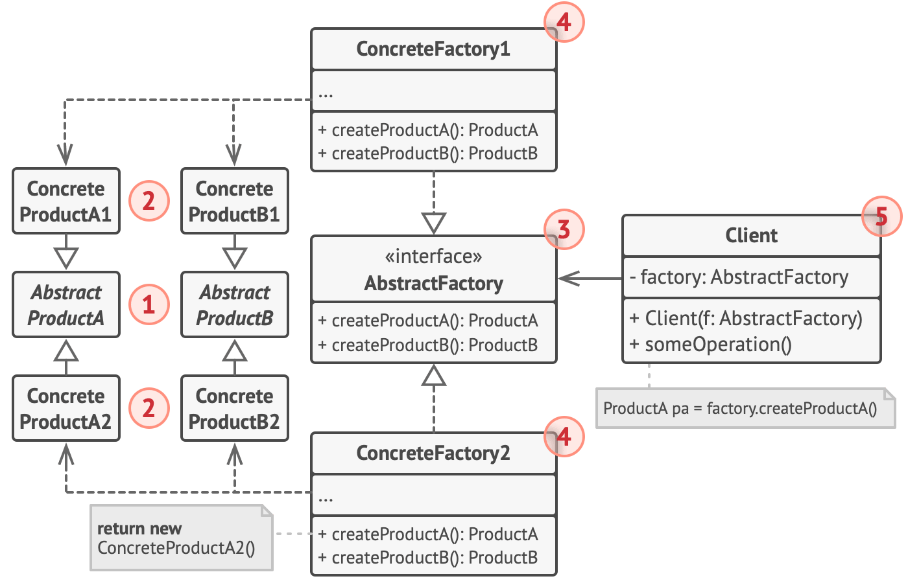

## ABSTRACT FACTORY


### :snowflake: Intent
**Abstract Factory** is a creational design pattern that lets you produce families of related objects without specifying 
their concrete classes.  
译: 


### :worried: Problem
Imagine that you’re creating a furniture shop simulator. Your code consists of classes that represent:
1. A family of related products, say: `Chair` + `Sofa` + `CoffeeTable`.
2. Several variants of this family. For example, products `Chair` + `Sofa` + `CoffeeTable` are available in these variants: 
   `Modern`, `Victorian`, `ArtDeco`.

译:


You need a way to create individual furniture objects so that they match other objects of the same family. Customers get
quite mad when they receive non-matching furniture.  
译: 


Also, you don’t want to change existing code when adding new products or families of products to the program. Furniture 
vendors update their catalogs very often, and you wouldn’t want to change the core code each time it happens.  
译:


### :smile: Solution
The first thing the Abstract Factory pattern suggests is to explicitly declare interfaces for each distinct product of 
the product family (e.g., chair, sofa or coffee table). Then you can make all variants of products follow those 
interfaces. For example, all chair variants can implement the `Chair` interface; all coffee table variants can implement 
the `CoffeeTable` interface, and so on.  
译: 


The next move is to declare the *Abstract Factory*—an interface with a list of creation methods for all products that 
are part of the product family (for example, `createChair`, `createSofa` and `createCoffeeTable`). These methods must 
return **abstract** product types represented by the interfaces we extracted previously: `Chair` , `Sofa` , `CoffeeTable` 
and so on.  
译: 


Now, how about the product variants? For each variant of a product family, we create a separate factory class based on
the `AbstractFactory` interface. A factory is a class that returns products of a particular kind. For example, the 
`ModernFurnitureFactory` can only create `ModernChair`, `ModernSofa` and `ModernCoffeeTable` objects.  
译: 

The client code has to work with both factories and products via their respective abstract interfaces. This lets you 
change the type of a factory that you pass to the client code, as well as the product variant that the client code 
receives, without breaking the actual client code.  
译: 


Say the client wants a factory to produce a chair. The client doesn’t have to be aware of the factory’s class, nor does 
it matter what kind of chair it gets. Whether it’s a Modern model or a Victorian-style chair, the client must treat all 
chairs in the same manner, using the abstract `Chair` interface. With this approach, the only thing that the client 
knows about the chair is that it implements the `sitOn` method in some way. Also, whichever variant of the chair is 
returned, it’ll always match the type of sofa or coffee table produced by the same factory object.  
译: 

There's one more thing left to clarify: if the client is only exposed to the abstract interfaces, what creates the actual 
factory objects? Usually, the application creates a concrete factory object at the initialization stage. Just before 
that, the app must select the factory type depending on the configuration or the environment settings.  
译: 


### :lollipop: Structure

1. **Abstract Products** declare interfaces for a set of distinct but related products which make up a product family.
2. **Concrete Products** are various implementations of abstract products, grouped by variants. Each abstract product 
   (chair/sofa) must be implemented in all given variants (Victorian/Modern).
3. The **Abstract Factory** interface declares a set of methods for creating each of the abstract products.
4. **Concrete Factories** implement creation methods of the abstract factory. Each concrete factory corresponds to a 
   specific variant of products and creates only those product variants.
5. Although concrete factories instantiate concrete products, signatures of their creation methods must return corresponding
   *abstract* products. This way the client code that uses a factory doesn’t get coupled to the specific variant of the 
   product it gets from a factory. The **Client** can work with any concrete factory/product variant, as long as it 
   communicates with their objects via abstract interfaces.
译:


### :hash: Pseudocode
This example illustrates how the **Abstract Factory** pattern can be used for creating cross-platform UI elements without 
coupling the client code to concrete UI classes, while keeping all created elements consistent with a selected operating 
system.  
译: 


The same UI elements in a cross-platform application are expected to behave similarly, but look a little bit different 
under different operating systems. Moreover, it’s your job to make sure that the UI elements match the style of the 
current operating system. You wouldn’t want your program to render macOS controls when it’s executed in Windows.  
译: 

The Abstract Factory interface declares a set of creation methods that the client code can use to produce different 
types of UI elements. Concrete factories correspond to specific operating systems and create the UI elements that match 
that particular OS.  
译: 

It works like this: when an application launches, it checks the type of the current operating system. The app uses this 
information to create a factory object from a class that matches the operating system. The rest of the code uses this 
factory to create UI elements. This prevents the wrong elements from being created.  
译: 

With this approach, the client code doesn’t depend on concrete classes of factories and UI elements as long as it works 
with these objects via their abstract interfaces. This also lets the client code support other factories or UI elements 
that you might add in the future.  
译: 

As a result, you don’t need to modify the client code each time you add a new variation of UI elements to your app. You 
just have to create a new factory class that produces these elements and slightly modify the app’s initialization code 
so it selects that class when appropriate.  
译: 

```c++
 1 // The abstract factory interface declares a set of methods that
 2 // return different abstract products. These products are called
 3 // a family and are related by a high-level theme or concept.
 4 // Products of one family are usually able to collaborate among
 5 // themselves. A family of products may have several variants,
 6 // but the products of one variant are incompatible with the
 7 // products of another variant.
 8 interface GUIFactory is
 9     method createButton():Button
10     method createCheckbox():Checkbox
11
12
13 // Concrete factories produce a family of products that belong
14 // to a single variant. The factory guarantees that the
15 // resulting products are compatible. Signatures of the concrete
16 // factory's methods return an abstract product, while inside
17 // the method a concrete product is instantiated.
18 class WinFactory implements GUIFactory is
19     method createButton():Button is
20         return new WinButton()
21     method createCheckbox():Checkbox is
22         return new WinCheckbox()
23
24 // Each concrete factory has a corresponding product variant.
25 class MacFactory implements GUIFactory is
26     method createButton():Button is
27         return new MacButton()
28     method createCheckbox():Checkbox is
29         return new MacCheckbox()
30
31
32 // Each distinct product of a product family should have a base
33 // interface. All variants of the product must implement this
34 // interface.
35 interface Button is
36     method paint()
37
38 // Concrete products are created by corresponding concrete
38 // factories.
39 class WinButton implements Button is
40     method paint() is
41         // Render a button in Windows style.
42
43 class MacButton implements Button is
44     method paint() is
45         // Render a button in macOS style.
46 
47 // Here's the base interface of another product. All products
48 // can interact with each other, but proper interaction is
49 // possible only between products of the same concrete variant.
50 interface Checkbox is
51     method paint()
52
53 class WinCheckbox implements Checkbox is
54     method paint() is
55         // Render a checkbox in Windows style.
56
57 class MacCheckbox implements Checkbox is
58     method paint() is
59         // Render a checkbox in macOS style.
60
61
62 // The client code works with factories and products only
63 // through abstract types: GUIFactory, Button and Checkbox. This
64 // lets you pass any factory or product subclass to the client
65 // code without breaking it.
66 class Application is
67     private field factory: GUIFactory
68     private field button: Button
69     constructor Application(factory: GUIFactory) is
70         this.factory = factory
71     method createUI() is
72         this.button = factory.createButton()
73     method paint() is
74         button.paint()
75
76
77 // The application picks the factory type depending on the
78 // current configuration or environment settings and creates it
79 // at runtime (usually at the initialization stage).
80 class ApplicationConfigurator is
81     method main() is
82         config = readApplicationConfigFile()
83
84         if (config.OS == "Windows") then
85             factory = new WinFactory()
86         else if (config.OS == "Mac") then
87             factory = new MacFactory()
88         else
89             throw new Exception("Error! Unknown operating system.")
90
91         Application app = new Application(factory)
```

### :apple: Applicability
:bug: **Use the Abstract Factory when your code needs to work with various families of related products, but you don’t 
want it to depend on the concrete classes of those products—they might be unknown beforehand or you simply want to allow
for future extensibility.**
:zap: The Abstract Factory provides you with an interface for creating objects from each class of the product family. 
As long as your code creates objects via this interface, you don’t have to worry about creating the wrong variant of a 
product which doesn’t match the products already created by your app.

:bug: **Consider implementing the Abstract Factory when you have a class with a set of [Factory Methods][Factory Method] 
that blur its primary responsibility.**
:zap: In a well-designed program *each class is responsible only for one thing*. When a class deals with multiple product 
types, it may be worth extracting its factory methods into a stand-alone factory class or a full-blown Abstract Factory 
implementation.


### :book: How to Implement
1. Map out a matrix of distinct product types versus variants of these products.
2. Declare abstract product interfaces for all product types. Then make all concrete product classes implement these interfaces.
3. Declare the abstract factory interface with a set of creation methods for all abstract products.
4. Implement a set of concrete factory classes, one for each product variant.
5. Create factory initialization code somewhere in the app. It should instantiate one of the concrete factory classes, 
   depending on the application configuration or the current environment. Pass this factory object to all classes that 
   construct products.
6. Scan through the code and find all direct calls to product constructors. Replace them with calls to the appropriate 
   creation method on the factory object.
译:


### :notes: Pros and Cons
:heavy_check_mark: You can be sure that the products you’re getting from a factory are compatible with each other.
:heavy_check_mark: You avoid tight coupling between concrete products and client code.
:heavy_check_mark: *Single Responsibility Principle*. You can extract the product creation code into one place, making 
the code easier to support.
:heavy_check_mark: *Open/Closed Principle*. You can introduce new variants of products without breaking existing client 
code.
:x: The code may become more complicated than it should be, since a lot of new interfaces and classes are introduced 
along with the pattern.
译:


### :repeat: Relations with Other Patterns
- Many designs start by using [**Factory Method**][Factory Method] (less complicated and more customizable via subclasses) 
  and evolve toward [**Abstract Factory**][Abstract Factory], [**Prototype**][Prototype], or [**Builder**][Builder] (more 
  flexible, but more complicated).
- [**Builder**][Builder] focuses on constructing complex objects step by step. [**Abstract Factory**][Abstract Factory] 
  specializes in creating families of related objects. *Abstract Factory* returns the product immediately, whereas 
  *Builder* lets you run some additional construction steps before fetching the product.
- [**Abstract Factory**][Abstract Factory] classes are often based on a set of [**Factory Methods**][Factory Method], 
  but you can also use [**Prototype**][Prototype] to compose the methods on these classes.
- [**Abstract Factory**][Abstract Factory] can serve as an alternative to [**Facade**][Facade] when you only want to hide 
  the way the subsystem objects are created from the client code.
- You can use [**Abstract Factory**][Abstract Factory] along with [**Bridge**][Bridge]. This pairing is useful when some 
  abstractions defined by *Bridge* can only work with specific implementations. In this case, *Abstract Factory* can 
  encapsulate these relations and hide the complexity from the client code.
- [**Abstract Factories**][Abstract Factory], [**Builders**][Builder] and [**Prototypes**][Prototype] can all be 
  implemented as [**Singletons**][Singleton].


[Factory Method]:../1_factory_method/

[Abstract Factory]:../2_abstract_factory/

[Prototype]:../4_prototype/

[Builder]:../3_builder/

[Facade]:../../2_structural_design_patterns/5_facade/

[Bridge]:../../2_structural_design_patterns/2_bridge/

[Singleton]:../../1_creational_design_patterns/5_singleton/