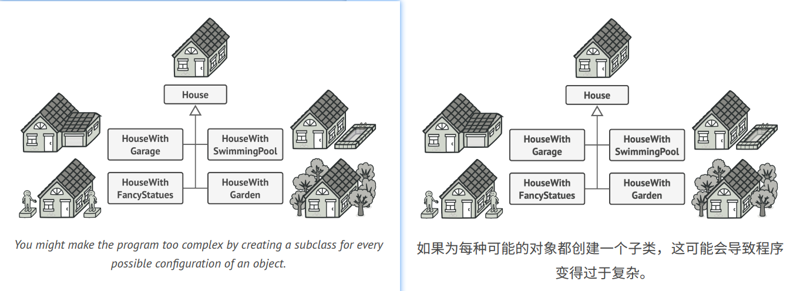
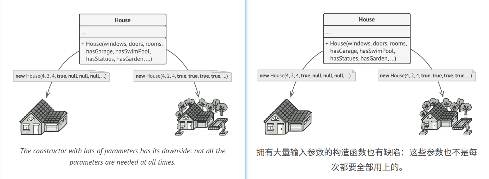
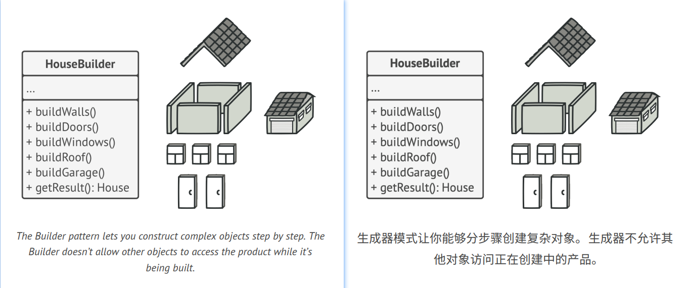
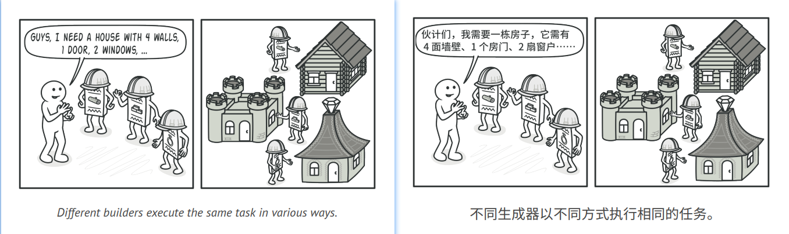
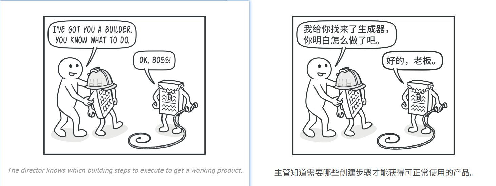
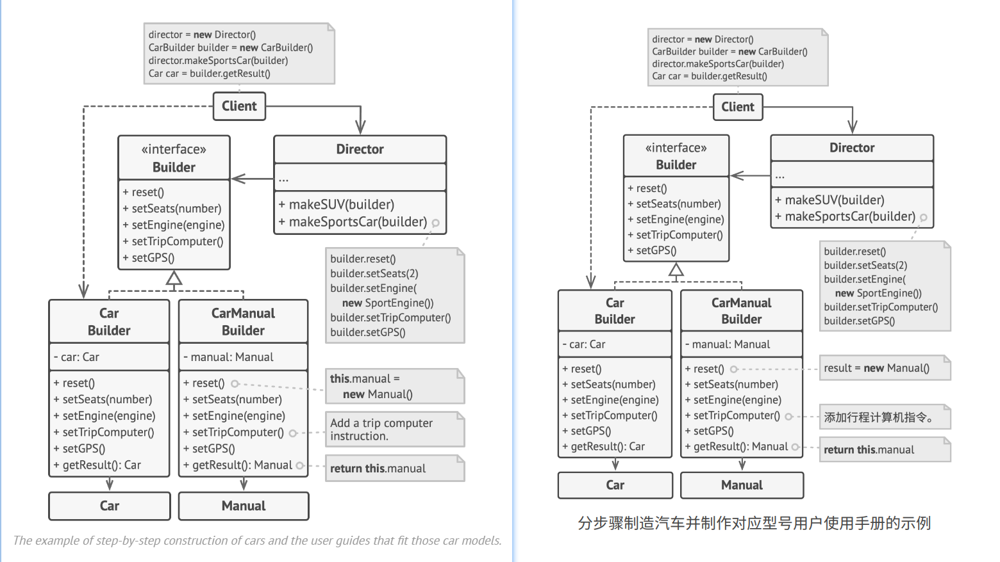

## Builder


### :snowflake: Intent
**Builder** is a creational design pattern that lets you construct complex objects step by step. The pattern allows you 
to produce different types and representations of an object using the same construction code.  
译:


### :worried: Problem
Imagine a complex object that requires laborious, step-by-step initialization of many fields and nested objects. Such 
initialization code is usually buried inside a monstrous constructor with lots of parameters. Or even worse: scattered 
all over the client code.  
译:



For example, let's think about how to create a `House` object. To build a simple house, you need to construct four walls 
and a floor, install a door, fit a pair of windows, and build a roof. But what if you want a bigger, brighter house, 
with a backyard and other goodies (like a heating system, plumbing, and electrical wiring)?  
译:

The simplest solution is to extend the base `House` class and create a set of subclasses to cover all combinations of 
the parameters. But eventually you'll end up with a considerable number of subclasses. Any new parameter, such as the 
porch style, will require growing this hierarchy even more.  
译:

There's another approach that doesn't involve breeding subclasses. You can create a giant constructor right in the base 
`House` class with all possible parameters that control the house object. While this approach indeed eliminates the need 
for subclasses, it creates another problem.  
译:



In most cases most of the parameters will be unused, making [**the constructor calls pretty ugly**][ref]. For instance, 
only a fraction of houses have swimming pools, so the parameters related to swimming pools will be useless nine times 
out of ten.  
译:


### :smile: Solution
The Builder pattern suggests that you extract the object construction code out of its own class and move it to separate 
objects called *builders*.  
译:



The pattern organizes object construction into a set of steps (`buildWalls`, `buildDoor`, etc.). To create an object, 
you execute a series of these steps on a builder object. The important part is that you don't need to call all the 
steps. You can call only those steps that are necessary for producing a particular configuration of an object.  
译:

Some of the construction steps might require different implementation when you need to build various representations of 
the product. For example, walls of a cabin may be built of wood, but the castle walls must be built with stone.  
译:

In this case, you can create several different builder classes that implement the same set of building steps, but in a 
different manner. Then you can use these builders in the construction process (i.e., an ordered set of calls to the 
building steps) to produce different kinds of objects.  
译:



For example, imagine a builder that builds everything from wood and glass, a second one that builds everything with 
stone and iron and a third one that uses gold and diamonds. By calling the same set of steps, you get a regular house 
from the first builder, a small castle from the second and a palace from the third. However, this would only work if the 
client code that calls the building steps is able to interact with builders using a common interface.  
译:

#### Director
You can go further and extract a series of calls to the builder steps you use to construct a product into a separate 
class called *director*. The director class defines the order in which to execute the building steps, while the builder 
provides the implementation for those steps.  
译:



Having a director class in your program isn't strictly necessary. You can always call the building steps in a specific 
order directly from the client code. However, the director class might be a good place to put various construction 
routines so you can reuse them across your program.  
译:

In addition, the director class completely hides the details of product construction from the client code. The client 
only needs to associate a builder with a director, launch the construction with the director, and get the result from 
the builder.  
译:


### :lollipop: Structure


1. The **Builder** interface declares product construction steps that are common to all types of builders.
2. **Concrete Builders** provide different implementations of the construction steps. Concrete builders may produce 
   products that don't follow the common interface.
3. **Products** are resulting objects. Products constructed by different builders don't have to belong to the same class 
   hierarchy or interface.
4. The **Director** class defines the order in which to call construction steps, so you can create and reuse specific 
   configurations of products.
5. The **Client** must associate one of the builder objects with the director. Usually, it's done just once, via 
   parameters of the director's constructor. Then the director uses that builder object for all further construction. 
   However, there's an alternative approach for when the client passes the builder object to the production method of 
   the director. In this case, you can use a different builder each time you produce something with the director.

译:


### :hash: Pseudocode
This example of the **Builder** pattern illustrates how you can reuse the same object construction code when building 
different types of products, such as cars, and create the corresponding manuals for them.  
译:



A car is a complex object that can be constructed in a hundred different ways. Instead of bloating the `Car` class with 
a huge constructor, we extracted the car assembly code into a separate car builder class. This class has a set of 
methods for configuring various parts of a car.  
译:

If the client code needs to assemble a special, fine-tuned model of a car, it can work with the builder directly. On 
the other hand, the client can delegate the assembly to the director class, which knows how to use a builder to construct 
several of the most popular models of cars.  
译:

You might be shocked, but every car needs a manual (seriously, who reads them?). The manual describes every feature of 
the car, so the details in the manuals vary across the different models. That's why it makes sense to reuse an existing 
construction process for both real cars and their respective manuals. Of course, building a manual isn't the same as 
building a car, and that's why we must provide another builder class that specializes in composing manuals. This class 
implements the same building methods as its car-building sibling, but instead of crafting car parts, it describes them. 
By passing these builders to the same director object, we can construct either a car or a manual.  
译:

The final part is fetching the resulting object. A metal car and a paper manual, although related, are still very 
different things. We can't place a method for fetching results in the director without coupling the director to concrete 
product classes. Hence, we obtain the result of the construction from the builder which performed the job.  
译:

```c++
  1 // Using the Builder pattern makes sense only when your products
  2 // are quite complex and require extensive configuration. The
  3 // following two products are related, although they don't have
  4 // a common interface.
  5 class Car is
  6     // A car can have a GPS, trip computer and some number of
  7     // seats. Different models of cars (sports car, SUV,
  8     // cabriolet) might have different features installed or
  9     // enabled.
 10
 11 class Manual is
 12     // Each car should have a user manual that corresponds to
 13     // the car's configuration and describes all its features.
 14
 15
 16 // The builder interface specifies methods for creating the
 17 // different parts of the product objects.
 18 interface Builder is
 19    method reset()
 20    method setSeats(...)
 21    method setEngine(...)
 22    method setTripComputer(...)
 23    method setGPS(...)
 24
 25 // The concrete builder classes follow the builder interface and
 26 // provide specific implementations of the building steps. Your
 27 // program may have several variations of builders, each
 28 // implemented differently.
 29 class CarBuilder implements Builder is
 30     private field car:Car
 31
 32     // A fresh builder instance should contain a blank product
 33     // object which it uses in further assembly.
 34     constructor CarBuilder() is
 35         this.reset()
 36
 37     // The reset method clears the object being built.
 38     method reset() is
 39         this.car = new Car()
 40
 41     // All production steps work with the same product instance.
 42     method setSeats(...) is
 43         // Set the number of seats in the car.
 44
 45     method setEngine(...) is
 46         // Install a given engine.
 47
 48     method setTripComputer(...) is
 49         // Install a trip computer.
 50
 51     method setGPS(...) is
 52         // Install a global positioning system.
 53
 54     // Concrete builders are supposed to provide their own
 55     // methods for retrieving results. That's because various
 56     // types of builders may create entirely different products
 57     // that don't all follow the same interface. Therefore such
 58     // methods can't be declared in the builder interface (at
 59     // least not in a statically-typed programming language).
 60     //
 61     // Usually, after returning the end result to the client, a
 62     // builder instance is expected to be ready to start
 63     // producing another product. That's why it's a usual
 64     // practice to call the reset method at the end of the
 65     // `getProduct` method body. However, this behavior isn't
 66     // mandatory, and you can make your builder wait for an
 67     // explicit reset call from the client code before disposing
 68     // of the previous result.
 69     method getProduct():Car is
 70         product = this.car
 71         this.reset()
 72         return product
 73
 74 // Unlike other creational patterns, builder lets you construct
 75 // products that don't follow the common interface.
 76 class CarManualBuilder implements Builder is
 77     private field manual:Manual
 78
 79     constructor CarManualBuilder() is
 80         this.reset()
 81
 82     method reset() is
 83         this.manual = new Manual()
 84
 85     method setSeats(...) is
 86         // Document car seat features.
 87
 88     method setEngine(...) is
 89         // Add engine instructions.
 90
 91     method setTripComputer(...) is
 92         // Add trip computer instructions.
 93
 94     method setGPS(...) is
 95         // Add GPS instructions.
 96
 97     method getProduct():Manual is
 98         // Return the manual and reset the builder.
 99
100
101 // The director is only responsible for executing the building
102 // steps in a particular sequence. It's helpful when producing
103 // products according to a specific order or configuration.
104 // Strictly speaking, the director class is optional, since the
105 // client can control builders directly.
106 class Director is
107     // The director works with any builder instance that the
108     // client code passes to it. This way, the client code may
109     // alter the final type of the newly assembled product.
110     // The director can construct several product variations
111     // using the same building steps.
112     method constructSportsCar(builder: Builder) is
113         builder.reset()
114         builder.setSeats(2)
115         builder.setEngine(new SportEngine())
116         builder.setTripComputer(true)
117         builder.setGPS(true)
118
119     method constructSUV(builder: Builder) is
120         // ...
121
122
123 // The client code creates a builder object, passes it to the
124 // director and then initiates the construction process. The end
125 // result is retrieved from the builder object.
126 class Application is
127
128     method makeCar() is
129         director = new Director()
130
131         CarBuilder builder = new CarBuilder()
132         director.constructSportsCar(builder)
133         Car car = builder.getProduct()
134
135         CarManualBuilder builder = new CarManualBuilder()
136         director.constructSportsCar(builder)
137
138         // The final product is often retrieved from a builder
139         // object since the director isn't aware of and not
140         // dependent on concrete builders and products.
141         Manual manual = builder.getProduct()
```

### :apple: Applicability
:bug: **Use the Builder pattern to get rid of a "telescoping constructor".**

:zap: Say you have a constructor with ten optional parameters. Calling such a beast is very inconvenient; therefore, 
you overload the constructor and create several shorter versions with fewer parameters. These constructors still refer 
to the main one, passing some default values into any omitted parameters.  

```c++
1 class Pizza {
2     Pizza(int size) { ... }
3     Pizza(int size, boolean cheese) { ... }
4     Pizza(int size, boolean cheese, boolean pepperoni) { ... }
5     // ...
```
Creating such a monster is only possible in languages that support method overloading, such as C# or Java.  
译:

The Builder pattern lets you build objects step by step, using only those steps that you really need. After implementing 
the pattern, you don't have to cram dozens of parameters into your constructors anymore.  
译:


:bug: **Use the Builder pattern when you want your code to be able to create different representations of some product 
(for example, stone and wooden houses).**

:zap: The Builder pattern can be applied when construction of various representations of the product involves similar 
steps that differ only in the details.

The base builder interface defines all possible construction steps, and concrete builders implement these steps to 
construct particular representations of the product. Meanwhile, the director class guides the order of construction.  
译:

:bug: **Use the Builder to construct [Composite][Composite] trees or other complex objects.**

:zap: The Builder pattern lets you construct products step-by-step. You could defer execution of some steps without 
breaking the final product. You can even call steps recursively, which comes in handy when you need to build an object 
tree.

A builder doesn't expose the unfinished product while running construction steps. This prevents the client code from 
fetching an incomplete result.  
译:


### :book: How to Implement
1. Make sure that you can clearly define the common construction steps for building all available product representations. 
   Otherwise, you won't be able to proceed with implementing the pattern.
2. Declare these steps in the base builder interface.
3. Create a concrete builder class for each of the product representations and implement their construction steps.

   Don't forget about implementing a method for fetching the result of the construction. The reason why this method 
   can't be declared inside the builder interface is that various builders may construct products that don't have a 
   common interface. Therefore, you don't know what would be the return type for such a method. However, if you're 
   dealing with products from a single hierarchy, the fetching method can be safely added to the base interface.

4. Think about creating a director class. It may encapsulate various ways to construct a product using the same builder 
   object.
5. The client code creates both the builder and the director objects. Before construction starts, the client must pass 
   a builder object to the director. Usually, the client does this only once, via parameters of the director's class 
   constructor. The director uses the builder object in all further construction. There's an alternative approach, where 
   the builder is passed to a specific product construction method of the director.
6. The construction result can be obtained directly from the director only if all products follow the same interface. 
   Otherwise, the client should fetch the result from the builder.


### :notes: Pros and Cons
:heavy_check_mark: You can construct objects step-by-step, defer construction steps or run steps recursively.

:heavy_check_mark: You can reuse the same construction code when building various representations of products.

:heavy_check_mark: *Single Responsibility Principle*. You can isolate complex construction code from the business logic 
of the product.

:x: The overall complexity of the code increases since the pattern requires creating multiple new classes.


### :repeat: Relations with Other Patterns
- Many designs start by using [**Factory Method**][Factory Method] (less complicated and more customizable via subclasses) 
  and evolve toward [**Abstract Factory**][Abstract Factory], [**Prototype**][Prototype], or [**Builder**][Builder] 
  (more flexible, but more complicated).
- [**Builder**][Builder] focuses on constructing complex objects step by step. [**Abstract Factory**][Abstract Factory] 
  specializes in creating families of related objects. *Abstract Factory* returns the product immediately, whereas 
  *Builder* lets you run some additional construction steps before fetching the product.
- You can use [**Builder**][Builder] when creating complex [**Composite**][Composite] trees because you can program its 
  construction steps to work recursively.
- You can combine [**Builder**][Builder] with [**Bridge**][Bridge]: the director class plays the role of the abstraction, 
  while different builders act as implementations.
- [**Abstract Factories**][Abstract Factory], [**Builders**][Builder] and [**Prototypes**][Prototype] can all be 
  implemented as [**Singletons**][Singleton].

[ref]:https://refactoring.guru/smells/long-parameter-list

[Factory Method]:../1_factory_method/

[Abstract Factory]:../2_abstract_factory/

[Prototype]:../4_prototype/

[Builder]:../3_builder/

[Bridge]:../../2_structural_design_patterns/2_bridge/

[Singleton]:../../1_creational_design_patterns/5_singleton/

[Composite]:../../2_structural_design_patterns/3_composite/