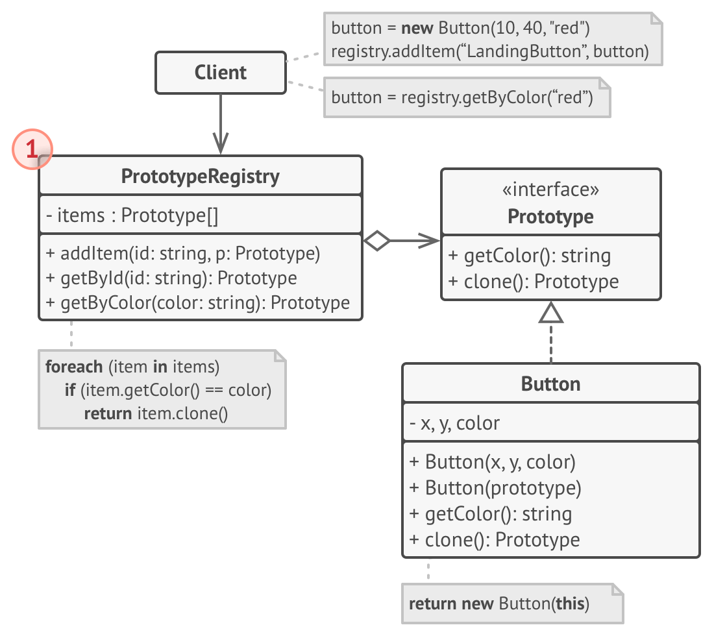

## Prototype
**Also known as:** Clone


### :snowflake: Intent
**Prototype** is a creational design pattern that lets you copy existing objects without making your code dependent on 
their classes.  
译:


### :worried: Problem
Say you have an object, and you want to create an exact copy of it. How would you do it? First, you have to create a new 
object of the same class. Then you have to go through all the fields of the original object and copy their values over 
to the new object.  
译:

Nice! But there's a catch. Not all objects can be copied that way because some of the object's fields may be private 
and not visible from outside of the object itself.  
译:


There's one more problem with the direct approach. Since you have to know the object's class to create a duplicate, 
your code becomes dependent on that class. If the extra dependency doesn't scare you, there's another catch. Sometimes 
you only know the interface that the object follows, but not its concrete class, when, for example, a parameter in a 
method accepts any objects that follow some interface.  
译:


### :smile: Solution
The Prototype pattern delegates the cloning process to the actual objects that are being cloned. The pattern declares a 
common interface for all objects that support cloning. This interface lets you clone an object without coupling your 
code to the class of that object. Usually, such an interface contains just a single `clone` method.  
译:

The implementation of the `clone` method is very similar in all classes. The method creates an object of the current 
class and carries over all the field values of the old object into the new one. You can even copy private fields because 
most programming languages let objects access private fields of other objects that belong to the same class.  
译:

An object that supports cloning is called a *prototype*. When your objects have dozens of fields and hundreds of 
possible configurations, cloning them might serve as an alternative to subclassing.  
译:


Here's how it works: you create a set of objects, configured in various ways. When you need an object like the one 
you've configured, you just clone a prototype instead of constructing a new object from scratch.  
译:


### :car: Real-World Analogy
In real life, prototypes are used for performing various tests before starting mass production of a product. However, 
in this case, prototypes don't participate in any actual production, playing a passive role instead.  
译:


Since industrial prototypes don't really copy themselves, a much closer analogy to the pattern is the process of mitotic 
cell division (biology, remember?). After mitotic division, a pair of identical cells is formed. The original cell acts 
as a prototype and takes an active role in creating the copy.  
译:


### :lollipop: Structure
#### Basic implementation

1. The **Prototype** interface declares the cloning methods. In most cases, it's a single `clone` method.
2. The **Concrete Prototype** class implements the cloning method. In addition to copying the original object's data to 
   the clone, this method may also handle some edge cases of the cloning process related to cloning linked objects, 
   untangling recursive dependencies, etc.
3. The **Client** can produce a copy of any object that follows the prototype interface.

#### Prototype registry implementation

1. The **Prototype Registry** provides an easy way to access frequently-used prototypes. It stores a set of pre-built 
   objects that are ready to be copied. The simplest prototype registry is a `name -> prototype` hash map. However, if 
   you need better search criteria than a simple name, you can build a much more robust version of the registry.


### :hash: Pseudocode
In this example, the **Prototype** pattern lets you produce exact copies of geometric objects, without coupling the 
code to their classes.  
译:


All shape classes follow the same interface, which provides a cloning method. A subclass may call the parent's cloning 
method before copying its own field values to the resulting object.  
译:

```c++
 1 // Base prototype.
 2 abstract class Shape is
 3     field X: int
 4     field Y: int
 5     field color: string
 6
 7     // A regular constructor.
 8     constructor Shape() is
 9         // ...
10
11     // The prototype constructor. A fresh object is initialized
12     // with values from the existing object.
13     constructor Shape(source: Shape) is
14         this()
15         this.X = source.X
16         this.Y = source.Y
17         this.color = source.color
18
19     // The clone operation returns one of the Shape subclasses.
20     abstract method clone():Shape
21
22
23 // Concrete prototype. The cloning method creates a new object
24 // in one go by calling the constructor of the current class and
25 // passing the current object as the constructor's argument.
26 // Performing all the actual copying in the constructor helps to
27 // keep the result consistent: the constructor will not return a
28 // result until the new object is fully built; thus, no object
29 // can have a reference to a partially-built clone.
30 class Rectangle extends Shape is
31     field width: int
32     field height: int
33
34     constructor Rectangle(source: Rectangle) is
35         // A parent constructor call is needed to copy private
36         // fields defined in the parent class.
37         super(source)
38         this.width = source.width
39         this.height = source.height
40
41     method clone():Shape is
42         return new Rectangle(this)
43
44
45 class Circle extends Shape is
46     field radius: int
47
48     constructor Circle(source: Circle) is
49         super(source)
50         this.radius = source.radius
51
52     method clone():Shape is
53         return new Circle(this)
54
55
56 // Somewhere in the client code.
57 class Application is
58     field shapes: array of Shape
59
60     constructor Application() is
61         Circle circle = new Circle()
62         circle.X = 10
63         circle.Y = 10
64         circle.radius = 20
65         shapes.add(circle)
66
67         Circle anotherCircle = circle.clone()
68         shapes.add(anotherCircle)
69         // The `anotherCircle` variable contains an exact copy
70         // of the `circle` object.
71
72         Rectangle rectangle = new Rectangle()
73         rectangle.width = 10
74         rectangle.height = 20
75         shapes.add(rectangle)
76
77     method businessLogic() is
78         // Prototype rocks because it lets you produce a copy of
79         // an object without knowing anything about its type.
80         Array shapesCopy = new Array of Shapes.
81
82         // For instance, we don't know the exact elements in the
83         // shapes array. All we know is that they are all
84         // shapes. But thanks to polymorphism, when we call the
85         // `clone` method on a shape the program checks its real
86         // class and runs the appropriate clone method defined
87         // in that class. That's why we get proper clones
88         // instead of a set of simple Shape objects.
89         foreach (s in shapes) do
90             shapesCopy.add(s.clone())
91
92         // The `shapesCopy` array contains exact copies of the
93         // `shape` array's children.
```

### :apple: Applicability
:bug: **Use the Prototype pattern when your code shouldn't depend on the concrete classes of objects that you need to 
copy.**
:zap: This happens a lot when your code works with objects passed to you from 3rd-party code via some interface. The 
concrete classes of these objects are unknown, and you couldn't depend on them even if you wanted to.

The Prototype pattern provides the client code with a general interface for working with all objects that support 
cloning. This interface makes the client code independent from the concrete classes of objects that it clones.

:bug: **Use the pattern when you want to reduce the number of subclasses that only differ in the way they initialize 
their respective objects.**
:zap: Suppose you have a complex class that requires a laborious configuration before it can be used. There are several 
common ways to configure this class, and this code is scattered through your app. To reduce the duplication, you create 
several subclasses and put every common configuration code into their constructors. You solved the duplication problem, 
but now you have lots of dummy subclasses.

The Prototype pattern lets you use a set of pre-built objects configured in various ways as prototypes. Instead of 
instantiating a subclass that matches some configuration, the client can simply look for an appropriate prototype and 
clone it.


### :book: How to Implement
1. Create the prototype interface and declare the `clone` method in it. Or just add the method to all classes of an 
   existing class hierarchy if you have one.
2. A prototype class must define the alternative constructor that accepts an object of that class as an argument. The 
   constructor must copy the values of all fields defined in the class from the passed object into the newly created 
   instance. If you're changing a subclass, you must call the parent constructor to let the superclass handle the 
   cloning of its private fields.

   If your programming language doesn't support method overloading, you won't be able to create a separate "prototype" 
   constructor. Thus, copying the object's data into the newly created clone will have to be performed within the `clone` 
   method. Still, having this code in a regular constructor is safer because the resulting object is returned fully 
   configured right after you call the `new` operator.
3. The cloning method usually consists of just one line: running a `new` operator with the prototypical version of the 
   constructor. Note, that every class must explicitly override the cloning method and use its own class name along 
   with the `new` operator. Otherwise, the cloning method may produce an object of a parent class.
4. Optionally, create a centralized prototype registry to store a catalog of frequently used prototypes.

   You can implement the registry as a new factory class or put it in the base prototype class with a static method for 
   fetching the prototype. This method should search for a prototype based on search criteria that the client code 
   passes to the method. The criteria might either be a simple string tag or a complex set of search parameters. After 
   the appropriate prototype is found, the registry should clone it and return the copy to the client.

   Finally, replace the direct calls to the subclasses' constructors with calls to the factory method of the prototype 
   registry.

### :notes: Pros and Cons
:heavy_check_mark: You can clone objects without coupling to their concrete classes.
:heavy_check_mark: You can get rid of repeated initialization code in favor of cloning pre-built prototypes.
:heavy_check_mark: You can produce complex objects more conveniently.
:heavy_check_mark: You get an alternative to inheritance when dealing with configuration presets for complex objects.
:x: Cloning complex objects that have circular references might be very tricky.


### :repeat: Relations with Other Patterns
- Many designs start by using [**Factory Method**][Factory Method] (less complicated and more customizable via subclasses) 
  and evolve toward [**Abstract Factory**][Abstract Factory], [**Prototype**][Prototype], or [**Builder**][Builder] (more 
  flexible, but more complicated).
- [**Abstract Factory**][Abstract Factory] classes are often based on a set of [**Factory Methods**][Factory Method], 
  but you can also use [**Prototype**][Prototype] to compose the methods on these classes.
- [**Prototype**][Prototype] can help when you need to save copies of [**Commands**][Command] into history.
- Designs that make heavy use of [**Composite**][Composite] and [**Decorator**][Decorator] can often benefit from using
  [**Prototype**][Prototype]. Applying the pattern lets you clone complex structures instead of re-constructing them 
  from scratch.
- [**Prototype**][Prototype] isn't based on inheritance, so it doesn't have its drawbacks. On the other hand, *Prototype* 
  requires a complicated initialization of the cloned object. [**Factory Method**][Factory Method] is based on 
  inheritance but doesn't require an initialization step.
- Sometimes [**Prototype**][Prototype] can be a simpler alternative to [**Memento**][Memento]. This works if the object, 
  the state of which you want to store in the history, is fairly straightforward and doesn't have links to external 
  resources, or the links are easy to re-establish.
- [**Abstract Factories**][Abstract Factory], [**Builders**][Builder] and [**Prototypes**][Prototype] can all be 
  implemented as [**Singletons**][Singleton].


[Factory Method]:../1_factory_method/

[Abstract Factory]:../2_abstract_factory/

[Prototype]:../4_prototype/

[Builder]:../3_builder/

[Singleton]:../../1_creational_design_patterns/5_singleton/

[Composite]:../../2_structural_design_patterns/3_composite/

[Command]:../../3_behavioral_design_patterns/2_command/

[Decorator]:../../2_structural_design_patterns/4_decorator/

[Memento]:../../3_behavioral_design_patterns/5_memento/
