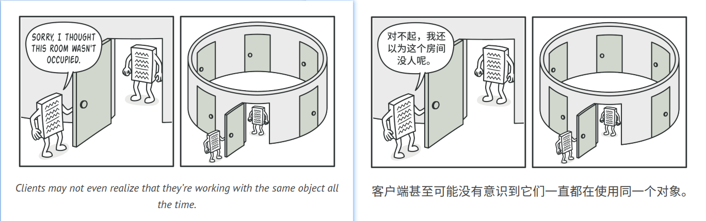
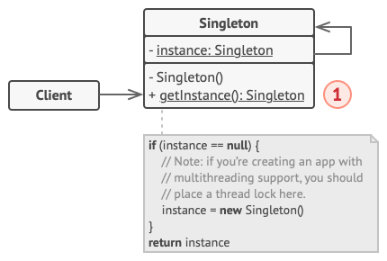

## Singleton

### :snowflake: Intent
**Singleton** is a creational design pattern that lets you ensure that a class has only one instance, while providing a 
global access point to this instance.  
译:


### :worried: Problem
The Singleton pattern solves two problems at the same time, violating the *Single Responsibility Principle*:
1. **Ensure that a class has just a single instance.** Why would anyone want to control how many instances a class has? 
   The most common reason for this is to control access to some shared resource—for example, a database or a file.

   Here's how it works: imagine that you created an object, but after a while decided to create a new one. Instead of 
   receiving a fresh object, you'll get the one you already created.

   Note that this behavior is impossible to implement with a regular constructor since a constructor call must always 
   return a new object by design.

   

2. **Provide a global access point to that instance.** Remember those global variables that you (all right, me) used to 
   store some essential objects? While they're very handy, they're also very unsafe since any code can potentially 
   overwrite the contents of those variables and crash the app.

   Just like a global variable, the Singleton pattern lets you access some object from anywhere in the program. However, 
   it also protects that instance from being overwritten by other code.

   There's another side to this problem: you don't want the code that solves problem #1 to be scattered all over your 
   program. It's much better to have it within one class, especially if the rest of your code already depends on it.


Nowadays, the Singleton pattern has become so popular that people may call something a singleton even if it solves just 
one of the listed problems.  
译:


### :smile: Solution
All implementations of the Singleton have these two steps in common:
- Make the default constructor private, to prevent other objects from using the `new` operator with the Singleton class.
- Create a static creation method that acts as a constructor. Under the hood, this method calls the private constructor 
  to create an object and saves it in a static field. All following calls to this method return the cached object.

译:

If your code has access to the Singleton class, then it's able to call the Singleton's static method. So whenever that 
method is called, the same object is always returned.
译:


### :car: Real-World Analogy
The government is an excellent example of the Singleton pattern. A country can have only one official government. 
Regardless of the personal identities of the individuals who form governments, the title, "The Government of X", is a 
global point of access that identifies the group of people in charge.  
译:


### :lollipop: Structure

1. The **Singleton** class declares the static method `getInstance` that returns the same instance of its own class.

   The Singleton's constructor should be hidden from the client code. Calling the `getInstance` method should be the 
   only way of getting the Singleton object.


### :hash: Pseudocode
In this example, the database connection class acts as a **Singleton**. This class doesn't have a public constructor, 
so the only way to get its object is to call the `getInstance` method. This method caches the first created object and 
returns it in all subsequent calls.  
译:

```c++
 1 // The Database class defines the `getInstance` method that lets
 2 // clients access the same instance of a database connection
 3 // throughout the program.
 4 class Database is
 5     // The field for storing the singleton instance should be
 6     // declared static.
 7     private static field instance: Database
 8
 9     // The singleton's constructor should always be private to
10     // prevent direct construction calls with the `new`
11     // operator.
12     private constructor Database() is
13         // Some initialization code, such as the actual
14         // connection to a database server.
15         // ...
16
17     // The static method that controls access to the singleton
18     // instance.
19     public static method getInstance() is
20         if (Database.instance == null) then
21             acquireThreadLock() and then
22                 // Ensure that the instance hasn't yet been
23                 // initialized by another thread while this one
24                 // has been waiting for the lock's release.
25                 if (Database.instance == null) then
26                     Database.instance = new Database()
27         return Database.instance
28
29     // Finally, any singleton should define some business logic
30     // which can be executed on its instance.
31     public method query(sql) is
32         // For instance, all database queries of an app go
33         // through this method. Therefore, you can place
34         // throttling or caching logic here.
35         // ...
36 
37 class Application is
38     method main() is
39         Database foo = Database.getInstance()
40         foo.query("SELECT ...")
41         // ...
42         Database bar = Database.getInstance()
43         bar.query("SELECT ...")
44         // The variable `bar` will contain the same object as
45         // the variable `foo`.
```


### :apple: Applicability
:bug: **Use the Singleton pattern when a class in your program should have just a single instance available to all clients; 
for example, a single database object shared by different parts of the program.**

:zap: The Singleton pattern disables all other means of creating objects of a class except for the special creation method. 
This method either creates a new object or returns an existing one if it has already been created.

:bug: **Use the Singleton pattern when you need stricter control over global variables.**

:zap: Unlike global variables, the Singleton pattern guarantees that there's just one instance of a class. Nothing, 
except for the Singleton class itself, can replace the cached instance.

Note that you can always adjust this limitation and allow creating any number of Singleton instances. The only piece of 
code that needs changing is the body of the `getInstance` method.


### :book: How to Implement
1. Add a private static field to the class for storing the singleton instance.
2. Declare a public static creation method for getting the singleton instance.
3. Implement "lazy initialization" inside the static method. It should create a new object on its first call and put it 
   into the static field. The method should always return that instance on all subsequent calls.
4. Make the constructor of the class private. The static method of the class will still be able to call the constructor, 
   but not the other objects.
5. Go over the client code and replace all direct calls to the singleton's constructor with calls to its static creation 
   method.


### :notes: Pros and Cons
:heavy_check_mark: You can be sure that a class has only a single instance.

:heavy_check_mark: You gain a global access point to that instance.

:heavy_check_mark: The singleton object is initialized only when it's requested for the first time.

:x: Violates the *Single Responsibility Principle*. The pattern solves two problems at the time.

:x: The Singleton pattern can mask bad design, for instance, when the components of the program know too much about each other.

:x: The pattern requires special treatment in a multithreaded environment so that multiple threads won't create a 
singleton object several times.

:x: It may be difficult to unit test the client code of the Singleton because many test frameworks rely on inheritance 
when producing mock objects. Since the constructor of the singleton class is private and overriding static methods is 
impossible in most languages, you will need to think of a creative way to mock the singleton. Or just don't write the tests. Or don't use the Singleton pattern.


### :repeat: Relations with Other Patterns
- A [**Facade**][Facade] class can often be transformed into a [**Singleton**][Singleton] since a single facade object 
  is sufficient in most cases.
- [**Flyweight**][Flyweight] would resemble [**Singleton**][Singleton] if you somehow managed to reduce all shared states 
  of the objects to just one flyweight object. But there are two fundamental differences between these patterns:
  
  1. There should be only one Singleton instance, whereas a *Flyweight* class can have multiple instances with different intrinsic states.
  
  2. The *Singleton* object can be mutable. Flyweight objects are immutable.
  
- [**Abstract Factories**][Abstract Factory], [**Builders**][Builder] and [**Prototypes**][Prototype] can all be
  implemented as [**Singletons**][Singleton].


  


[Abstract Factory]:../2_abstract_factory/

[Prototype]:../4_prototype/

[Builder]:../3_builder/

[Singleton]:../../1_creational_design_patterns/5_singleton/

[Facade]:../../2_structural_design_patterns/5_facade/

[Flyweight]:../../2_structural_design_patterns/6_flyweight/

