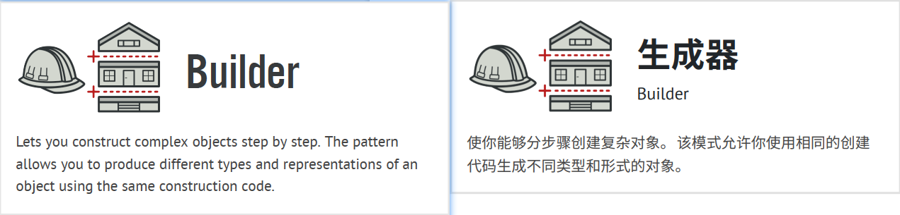

## Creational Design Patterns 创建型设计模式

Creational patterns provide various object creation mechanisms, which increase flexibility and reuse of existing code.  
译: 创建型模式提供了各种创建对象的机制，这能提升已有代码的灵活性和可复用性。

- [**Factory Method 工厂方法**](../1_creational_design_patterns/1_factory_method/)

- [**Abstract Factory 抽象工厂**](../1_creational_design_patterns/2_abstract_factory/)

- [**Builder 构建者**](../1_creational_design_patterns/3_builder/)

- [**Prototype 原型**](../1_creational_design_patterns/4_prototype/)

- [**Singleton 单例**](../1_creational_design_patterns/5_singleton/)

