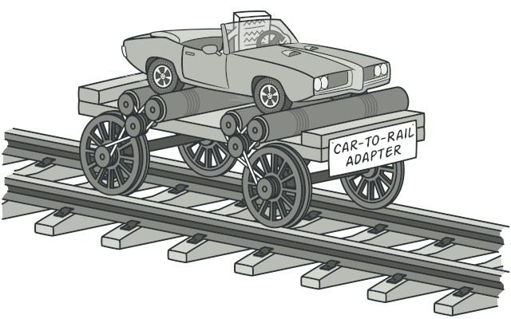

## Adapter
**Also known as:** Wrapper


### :snowflake: Intent
**Adapter** is a structural design pattern that allows objects with incompatible interfaces to collaborate.




### :worried: Problem
Imagine that you're creating a stock market monitoring app. The app downloads the stock data from multiple sources in 
XML format and then displays nice-looking charts and diagrams for the user.  
译:

At some point, you decide to improve the app by integrating a smart 3rd-party analytics library. But there's a catch: 
the analytics library only works with data in JSON format.  
译:


You could change the library to work with XML. However, this might break some existing code that relies on the library. 
And worse, you might not have access to the library's source code in the first place, making this approach impossible.  
译:


### :smile: Solution
You can create an *adapter*. This is a special object that converts the interface of one object so that another object 
can understand it.  
译:

An adapter wraps one of the objects to hide the complexity of conversion happening behind the scenes. The wrapped object 
isn't even aware of the adapter. For example, you can wrap an object that operates in meters and kilometers with an 
adapter that converts all of the data to imperial units such as feet and miles.  
译:

Adapters can not only convert data into various formats but can also help objects with different interfaces collaborate. 
Here's how it works:
1. The adapter gets an interface, compatible with one of the existing objects.
2. Using this interface, the existing object can safely call the adapter's methods.
3. Upon receiving a call, the adapter passes the request to the second object, but in a format and order that the 
   second object expects.


Sometimes it's even possible to create a two-way adapter that can convert the calls in both directions.  
译:


Let's get back to our stock market app. To solve the dilemma of incompatible formats, you can create XML-to-JSON adapters 
for every class of the analytics library that your code works with directly. Then you adjust your code to communicate 
with the library only via these adapters. When an adapter receives a call, it translates the incoming XML data into a 
JSON structure and passes the call to the appropriate methods of a wrapped analytics object.  
译:


### :car: Real-World Analogy


When you travel from the US to Europe for the first time, you may get a surprise when trying to charge your laptop. The 
power plug and sockets standards are different in different countries. That's why your US plug won't fit a German socket. 
The problem can be solved by using a power plug adapter that has the American-style socket and the European-style plug.  
译:


### :lollipop: Structure
#### Object adapter
This implementation uses the object composition principle: the adapter implements the interface of one object and wraps 
the other one. It can be implemented in all popular programming languages.  
译:


1. The **Client** is a class that contains the existing business logic of the program.
2. The **Client Interface** describes a protocol that other classes must follow to be able to collaborate with the 
   client code.
3. The **Service** is some useful class (usually 3rd-party or legacy). The client can't use this class directly because 
   it has an incompatible interface.
4. The **Adapter** is a class that's able to work with both the client and the service: it implements the client 
   interface, while wrapping the service object. The adapter receives calls from the client via the adapter interface 
   and translates them into calls to the wrapped service object in a format it can understand.
5. The client code doesn't get coupled to the concrete adapter class as long as it works with the adapter via the client 
   interface. Thanks to this, you can introduce new types of adapters into the program without breaking the existing 
   client code. This can be useful when the interface of the service class gets changed or replaced: you can just create 
   a new adapter class without changing the client code.

#### Class adapter
This implementation uses inheritance: the adapter inherits interfaces from both objects at the same time. Note that 
this approach can only be implemented in programming languages that support multiple inheritance, such as C++.  
译:


1. The **Class Adapter** doesn't need to wrap any objects because it inherits behaviors from both the client and the 
   service. The adaptation happens within the overridden methods. The resulting adapter can be used in place of an 
   existing client class.


### :hash: Pseudocode
This example of the **Adapter** pattern is based on the classic conflict between square pegs and round holes.  
译:


The Adapter pretends to be a round peg, with a radius equal to a half of the square's diameter (in other words, the 
radius of the smallest circle that can accommodate the square peg).  
译:

```c++
 1 // Say you have two classes with compatible interfaces:
 2 // RoundHole and RoundPeg.
 3 class RoundHole is
 4     constructor RoundHole(radius) { ... }
 5
 6     method getRadius() is
 7         // Return the radius of the hole.
 8
 9     method fits(peg: RoundPeg) is
10         return this.getRadius() >= peg.getRadius()
11
12 class RoundPeg is
13     constructor RoundPeg(radius) { ... }
14
15     method getRadius() is
16         // Return the radius of the peg.
17
18
19 // But there's an incompatible class: SquarePeg.
20 class SquarePeg is
21     constructor SquarePeg(width) { ... }
22
23     method getWidth() is
24         // Return the square peg width.
25
26
27 // An adapter class lets you fit square pegs into round holes.
28 // It extends the RoundPeg class to let the adapter objects act
29 // as round pegs.
30 class SquarePegAdapter extends RoundPeg is
31     // In reality, the adapter contains an instance of the
32     // SquarePeg class.
33     private field peg: SquarePeg
34
35     constructor SquarePegAdapter(peg: SquarePeg) is
36         this.peg = peg
37
38     method getRadius() is
39         // The adapter pretends that it's a round peg with a
40         // radius that could fit the square peg that the adapter
41         // actually wraps.
42         return peg.getWidth() * Math.sqrt(2) / 2
43
44
45 // Somewhere in client code.
46 hole = new RoundHole(5)
47 rpeg = new RoundPeg(5)
48 hole.fits(rpeg) // true
49
50 small_sqpeg = new SquarePeg(5)
51 large_sqpeg = new SquarePeg(10)
52 hole.fits(small_sqpeg) // this won't compile (incompatible types)
53
54 small_sqpeg_adapter = new SquarePegAdapter(small_sqpeg)
55 large_sqpeg_adapter = new SquarePegAdapter(large_sqpeg)
56 hole.fits(small_sqpeg_adapter) // true
57 hole.fits(large_sqpeg_adapter) // false
```

### :apple: Applicability
:bug: **Use the Adapter class when you want to use some existing class, but its interface isn't compatible with the 
rest of your code.**

:zap: The Adapter pattern lets you create a middle-layer class that serves as a translator between your code and a 
legacy class, a 3rd-party class or any other class with a weird interface.

:bug: **Use the pattern when you want to reuse several existing subclasses that lack some common functionality that 
can't be added to the superclass.**

:zap: You could extend each subclass and put the missing functionality into new child classes. However, you'll need to 
duplicate the code across all of these new classes, which **smells really bad**.

The much more elegant solution would be to put the missing functionality into an adapter class. Then you would wrap 
objects with missing features inside the adapter, gaining needed features dynamically. For this to work, the target 
classes must have a common interface, and the adapter's field should follow that interface. This approach looks very 
similar to the [**Decorator**][Decorator] pattern.  
译:


### :book: How to Implement
1. Make sure that you have at least two classes with incompatible interfaces:
   - A useful *service* class, which you can't change (often 3rd-party, legacy or with lots of existing dependencies).
   - One or several *client* classes that would benefit from using the service class.
2. Declare the client interface and describe how clients communicate with the service.
3. Create the adapter class and make it follow the client interface. Leave all the methods empty for now.
4. Add a field to the adapter class to store a reference to the service object. The common practice is to initialize 
   this field via the constructor, but sometimes it's more convenient to pass it to the adapter when calling its methods.
5. One by one, implement all methods of the client interface in the adapter class. The adapter should delegate most of 
   the real work to the service object, handling only the interface or data format conversion.
6. Clients should use the adapter via the client interface. This will let you change or extend the adapters without 
   affecting the client code.


### :notes: Pros and Cons
:heavy_check_mark: *Single Responsibility Principle*. You can separate the interface or data conversion code from the 
primary business logic of the program.

:heavy_check_mark: *Open/Closed Principle*. You can introduce new types of adapters into the program without breaking 
the existing client code, as long as they work with the adapters through the client interface.

:x: The overall complexity of the code increases because you need to introduce a set of new interfaces and classes. 
Sometimes it's simpler just to change the service class so that it matches the rest of your code.


### :repeat: Relations with Other Patterns
- [**Bridge**][Bridge] is usually designed up-front, letting you develop parts of an application independently of each 
  other. On the other hand, [**Adapter**][Adapter] is commonly used with an existing app to make some 
  otherwise-incompatible classes work together nicely.
- [**Adapter**][Adapter] changes the interface of an existing object, while [**Decorator**][Decorator] enhances an 
  object without changing its interface. In addition, *Decorator* supports recursive composition, which isn't possible 
  when you use *Adapter*.
- [**Adapter**][Adapter] provides a different interface to the wrapped object, [**Proxy**][Proxy] provides it with the 
  same interface, and [**Decorator**][Decorator] provides it with an enhanced interface.
- [**Facade**][Facade] defines a new interface for existing objects, whereas [**Adapter**][Adapter] tries to make the 
  existing interface usable. *Adapter* usually wraps just one object, while *Facade* works with an entire subsystem of 
  objects.
- [**Bridge**][Bridge], [**State**][State], [**Strategy**][Strategy] (and to some degree [**Adapter**][Adapter]) have 
  very similar structures. Indeed, all of these patterns are based on composition, which is delegating work to other 
  objects. However, they all solve different problems. A pattern isn't just a recipe for structuring your code in a 
  specific way. It can also communicate to other developers the problem the pattern solves.


[Adapter]:../1_adapter/

[Bridge]:../2_bridge/

[Decorator]:../4_decorator/

[Facade]:../5_facade/

[Proxy]:../7_proxy/

[State]:../../3_behavioral_design_patterns/7_state/

[Strategy]:../../3_behavioral_design_patterns/8_strategy/

