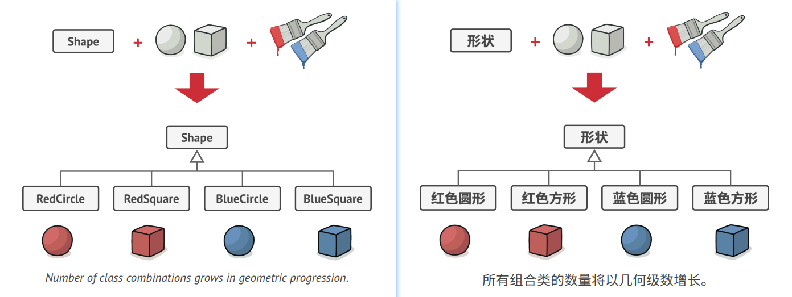
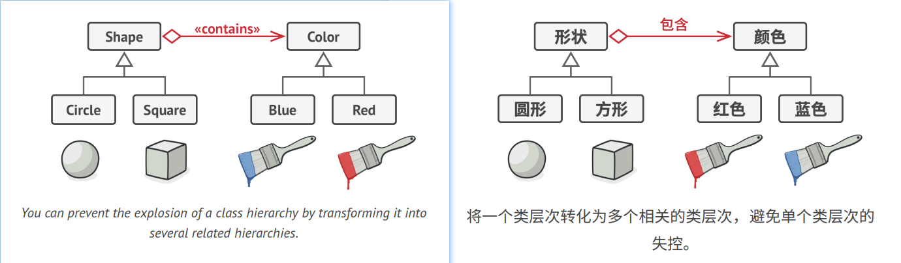
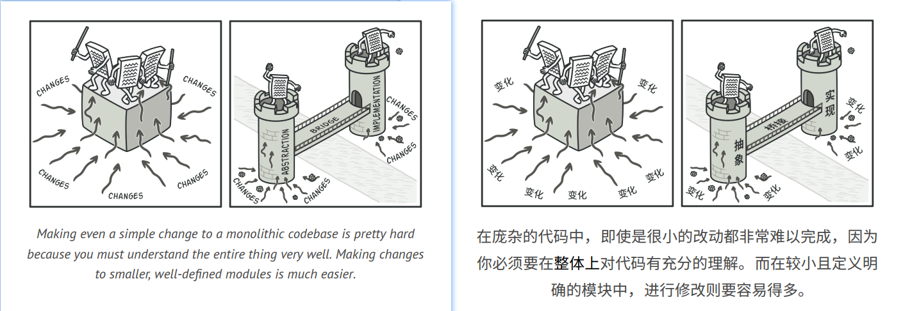
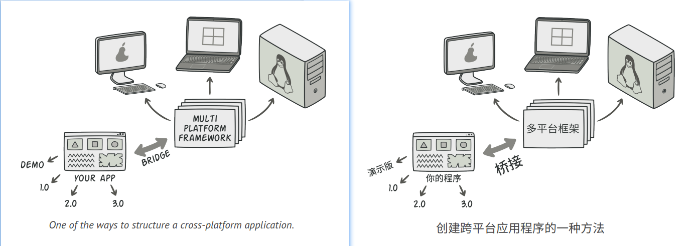
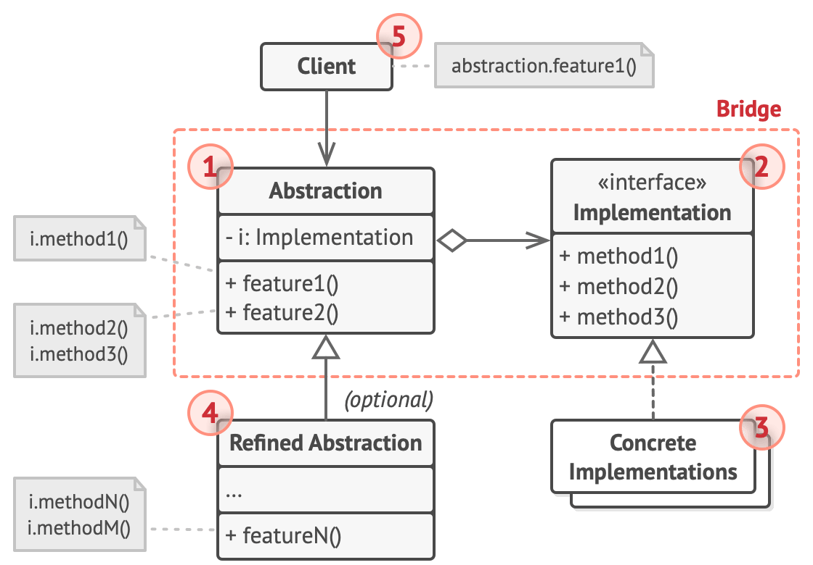
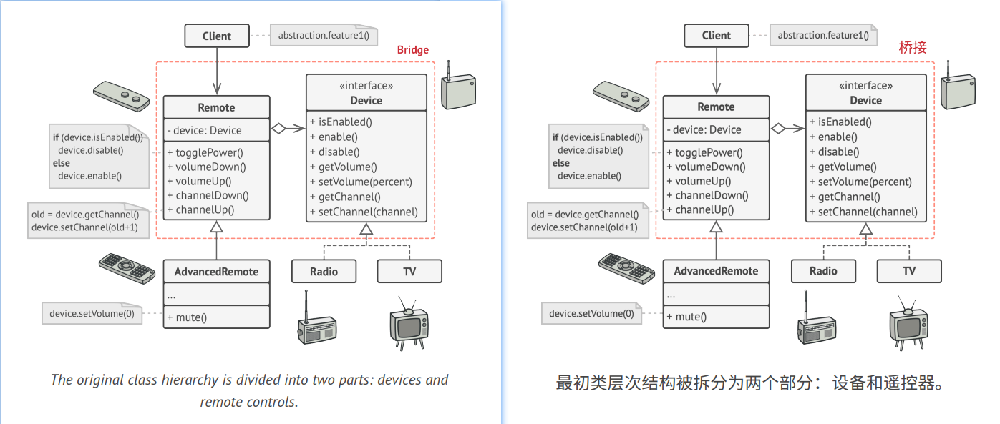

## Bridge

### :snowflake: Intent
**Bridge** is a structural design pattern that lets you split a large class or a set of closely related classes into two 
separate hierarchies—abstraction and implementation—which can be developed independently of each other.  
译:


### :worried: Problem
*Abstraction*? *Implementation*? Sound scary? Stay calm and let's consider a simple example.  
译:

Say you have a geometric `Shape` class with a pair of subclasses: `Circle` and `Square`. You want to extend this class 
hierarchy to incorporate colors, so you plan to create `Red` and `Blue` shape subclasses. However, since you already 
have two subclasses, you'll need to create four class combinations such as `BlueCircle` and `RedSquare`.  
译:



Adding new shape types and colors to the hierarchy will grow it exponentially. For example, to add a triangle shape 
you'd need to introduce two subclasses, one for each color. And after that, adding a new color would require creating 
three subclasses, one for each shape type. The further we go, the worse it becomes.  
译:


### :smile: Solution
This problem occurs because we're trying to extend the shape classes in two independent dimensions: by form and by 
color. That's a very common issue with class inheritance.  
译:

The Bridge pattern attempts to solve this problem by switching from inheritance to the object composition. What this 
means is that you extract one of the dimensions into a separate class hierarchy, so that the original classes will 
reference an object of the new hierarchy, instead of having all of its state and behaviors within one class.  
译:



Following this approach, we can extract the color-related code into its own class with two subclasses: `Red` and `Blue`. 
The `Shape` class then gets a reference field pointing to one of the color objects. Now the shape can delegate any 
color-related work to the linked color object. That reference will act as a bridge between the `Shape` and `Color` classes. 
From now on, adding new colors won't require changing the shape hierarchy, and vice versa.  
译:

#### Abstraction and Implementation
The [GoF book][GoF book] introduces the terms *Abstraction* and *Implementation* as part of the Bridge definition. In 
my opinion, the terms sound too academic and make the pattern seem more complicated than it really is. Having read the 
simple example with shapes and colors, let's decipher the meaning behind the GoF book's scary words.  
译:

*Abstraction* (also called *interface*) is a high-level control layer for some entity. This layer isn't supposed to do 
any real work on its own. It should delegate the work to the *implementation* layer (also called *platform*).  
译:

Note that we're not talking about *interfaces* or *abstract classes* from your programming language. These aren't the 
same things.  
译:

When talking about real applications, the abstraction can be represented by a graphical user interface (GUI), and the 
implementation could be the underlying operating system code (API) which the GUI layer calls in response to user 
interactions.  
译:

Generally speaking, you can extend such an app in two independent directions:
- Have several different GUIs (for instance, tailored for regular customers or admins).
- Support several different APIs (for example, to be able to launch the app under Windows, Linux, and macOS).

译:

In a worst-case scenario, this app might look like a giant spaghetti bowl, where hundreds of conditionals connect 
different types of GUI with various APIs all over the code.  
译:



You can bring order to this chaos by extracting the code related to specific interface-platform combinations into 
separate classes. However, soon you'll discover that there are *lots* of these classes. The class hierarchy will grow 
exponentially because adding a new GUI or supporting a different API would require creating more and more classes.  
译:

Let's try to solve this issue with the Bridge pattern. It suggests that we divide the classes into two hierarchies:
- Abstraction: the GUI layer of the app.
- Implementation: the operating systems' APIs.

译:



The abstraction object controls the appearance of the app, delegating the actual work to the linked implementation 
object. Different implementations are interchangeable as long as they follow a common interface, enabling the same GUI 
to work under Windows and Linux.  
译:

As a result, you can change the GUI classes without touching the API-related classes. Moreover, adding support for 
another operating system only requires creating a subclass in the implementation hierarchy.  
译:


### :lollipop: Structure


1. The **Abstraction** provides high-level control logic. It relies on the implementation object to do the actual 
   low-level work.
2. The **Implementation** declares the interface that's common for all concrete implementations. An abstraction can 
   only communicate with an implementation object via methods that are declared here.

   The abstraction may list the same methods as the implementation, but usually the abstraction declares some complex 
   behaviors that rely on a wide variety of primitive operations declared by the implementation.

3. **Concrete Implementations** contain platform-specific code.
4. **Refined Abstractions** provide variants of control logic. Like their parent, they work with different 
   implementations via the general implementation interface.
5. Usually, the **Client** is only interested in working with the abstraction. However, it's the client's job to link 
   the abstraction object with one of the implementation objects.


### :hash: Pseudocode
This example illustrates how the **Bridge** pattern can help divide the monolithic code of an app that manages devices 
and their remote controls. The `Device` classes act as the implementation, whereas the `Remote`s act as the abstraction.  
译:



The base remote control class declares a reference field that links it with a device object. All remotes work with the 
devices via the general device interface, which lets the same remote support multiple device types.  
译:

You can develop the remote control classes independently of the device classes. All that's needed is to create a new 
remote subclass. For example, a basic remote control might only have two buttons, but you could extend it with 
additional features, such as an extra battery or a touchscreen.  
译:

The client code links the desired type of remote control with a specific device object via the remote's constructor.  
译:

```c++
 1 // The "abstraction" defines the interface for the "control"
 2 // part of the two class hierarchies. It maintains a reference
 3 // to an object of the "implementation" hierarchy and delegates
 4 // all the real work to this object.
 5 class RemoteControl is
 6     protected field device: Device
 7     constructor RemoteControl(device: Device) is
 8         this.device = device
 9     method togglePower() is
10         if (device.isEnabled()) then
11             device.disable()
12         else
13             device.enable()
14     method volumeDown() is
15         device.setVolume(device.getVolume() - 10)
16     method volumeUp() is
17         device.setVolume(device.getVolume() + 10)
18     method channelDown() is
19         device.setChannel(device.getChannel() - 1)
20     method channelUp() is
21         device.setChannel(device.getChannel() + 1)
22
23
24 // You can extend classes from the abstraction hierarchy
25 // independently from device classes.
26 class AdvancedRemoteControl extends RemoteControl is
27     method mute() is
28         device.setVolume(0)
29
30
31 // The "implementation" interface declares methods common to all
32 // concrete implementation classes. It doesn't have to match the
33 // abstraction's interface. In fact, the two interfaces can be
34 // entirely different. Typically the implementation interface
35 // provides only primitive operations, while the abstraction
36 // defines higher-level operations based on those primitives.
37 interface Device is
38     method isEnabled()
39     method enable()
40     method disable()
41     method getVolume()
42     method setVolume(percent)
43     method getChannel()
44     method setChannel(channel)
45
46
47 // All devices follow the same interface.
48 class Tv implements Device is
49     // ...
50
51 class Radio implements Device is
52     // ...
53
54
55 // Somewhere in client code.
56 tv = new Tv()
57 remote = new RemoteControl(tv)
58 remote.togglePower()
59
60 radio = new Radio()
61 remote = new AdvancedRemoteControl(radio)
```


### :apple: Applicability
> :bug: **Use the Bridge pattern when you want to divide and organize a monolithic class that has several variants of
some functionality (for example, if the class can work with various database servers).**
>
> :zap: The bigger a class becomes, the harder it is to figure out how it works, and the longer it takes to make a change.
The changes made to one of the variations of functionality may require making changes across the whole class, which
often results in making errors or not addressing some critical side effects.
> 
> The Bridge pattern lets you split the monolithic class into several class hierarchies. After this, you can change the
classes in each hierarchy independently of the classes in the others. This approach simplifies code maintenance and
minimizes the risk of breaking existing code.


> :bug: **Use the pattern when you need to extend a class in several orthogonal (independent) dimensions.**
> 
> :zap: The Bridge suggests that you extract a separate class hierarchy for each of the dimensions. The original class
delegates the related work to the objects belonging to those hierarchies instead of doing everything on its own.


> :bug: **Use the Bridge if you need to be able to switch implementations at runtime.**
> 
> :zap: Although it's optional, the Bridge pattern lets you replace the implementation object inside the abstraction. 
It's as easy as assigning a new value to a field.  
>
> By the way, this last item is the main reason why so many people confuse the Bridge with the [**Strategy**][Strategy] 
pattern. Remember that a pattern is more than just a certain way to structure your classes. It may also communicate 
intent and a problem being addressed.  


### :book: How to Implement
1. Identify the orthogonal dimensions in your classes. These independent concepts could be: abstraction/platform, 
   domain/infrastructure, front-end/back-end, or interface/implementation.
2. See what operations the client needs and define them in the base abstraction class.
3. Determine the operations available on all platforms. Declare the ones that the abstraction needs in the general 
   implementation interface.
4. For all platforms in your domain create concrete implementation classes, but make sure they all follow the 
   implementation interface.
5. Inside the abstraction class, add a reference field for the implementation type. The abstraction delegates most of 
   the work to the implementation object that's referenced in that field.
6. If you have several variants of high-level logic, create refined abstractions for each variant by extending the base 
   abstraction class.
7. The client code should pass an implementation object to the abstraction's constructor to associate one with the other. 
   After that, the client can forget about the implementation and work only with the abstraction object.


### :notes: Pros and Cons
:heavy_check_mark: You can create platform-independent classes and apps.  
:heavy_check_mark: The client code works with high-level abstractions. It isn't exposed to the platform details.  
:heavy_check_mark: *Open/Closed Principle*. You can introduce new abstractions and implementations independently from 
each other.  
:heavy_check_mark: *Single Responsibility Principle*. You can focus on high-level logic in the abstraction and on 
platform details in the implementation.  
:x: You might make the code more complicated by applying the pattern to a highly cohesive class.  


### :repeat: Relations with Other Patterns
- [**Bridge**][Bridge] is usually designed up-front, letting you develop parts of an application independently of each 
  other. On the other hand, [**Adapter**][Adapter] is commonly used with an existing app to make some 
  otherwise-incompatible classes work together nicely.
- [**Bridge**][Bridge], [**State**][State], [**Strategy**][Strategy] (and to some degree [**Adapter**][Adapter]) have 
  very similar structures. Indeed, all of these patterns are based on composition, which is delegating work to other 
  objects. However, they all solve different problems. A pattern isn't just a recipe for structuring your code in a 
  specific way. It can also communicate to other developers the problem the pattern solves.
- You can use [**Abstract Factory**][Abstract Factory] along with [**Bridge**][Bridge]. This pairing is useful when some 
  abstractions defined by *Bridge* can only work with specific implementations. In this case, *Abstract Factory* can 
  encapsulate these relations and hide the complexity from the client code.
- You can combine [**Builder**][Builder] with [**Bridge**][Bridge]: the director class plays the role of the abstraction, 
  while different builders act as implementations.


[Adapter]:../1_adapter/

[Bridge]:../2_bridge/

[Abstract Factory]:../../1_creational_design_patterns/2_abstract_factory/

[Builder]:../../1_creational_design_patterns/3_builder/

[State]:../../3_behavioral_design_patterns/7_state/

[Strategy]:../../3_behavioral_design_patterns/8_strategy/

[GoF book]: https://refactoring.guru/gof-book