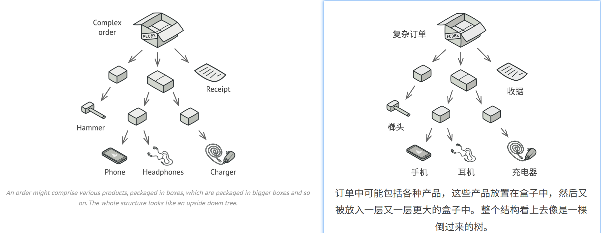
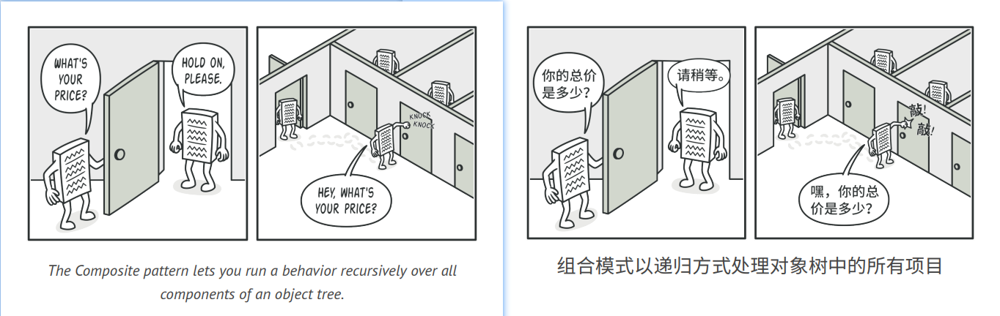
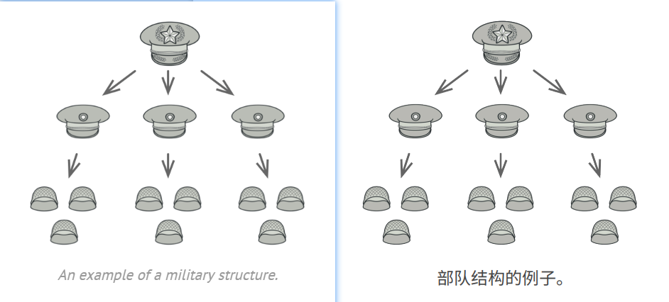
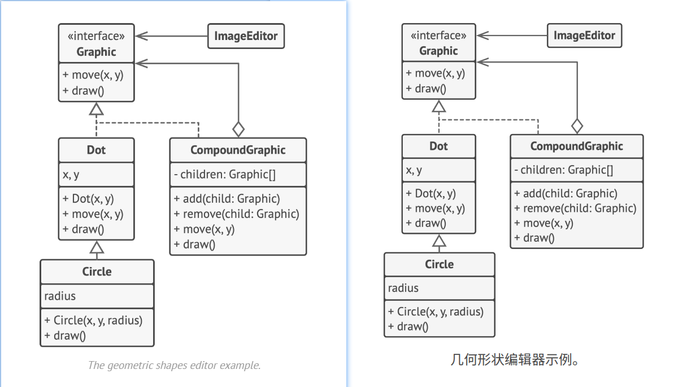

## Composite
**Also known as:** Object Tree


### :snowflake: Intent
**Composite** is a structural design pattern that lets you compose objects into tree structures and then work with these 
structures as if they were individual objects.  
译:


### :worried: Problem
Using the Composite pattern makes sense only when the core model of your app can be represented as a tree.  
译:

For example, imagine that you have two types of objects: `Products` and `Boxes`. A `Box` can contain several `Products` 
as well as a number of smaller `Boxes`. These little `Boxes` can also hold some `Products` or even smaller `Boxes`, and 
so on.  
译:

Say you decide to create an ordering system that uses these classes. Orders could contain simple products without any 
wrapping, as well as boxes stuffed with products...and other boxes. How would you determine the total price of such an 
order?  
译:



You could try the direct approach: unwrap all the boxes, go over all the products and then calculate the total. That 
would be doable in the real world; but in a program, it's not as simple as running a loop. You have to know the classes 
of `Products` and `Boxes` you're going through, the nesting level of the boxes and other nasty details beforehand. All 
of this makes the direct approach either too awkward or even impossible.  
译:


### :smile: Solution
The Composite pattern suggests that you work with `Products` and `Boxes` through a common interface which declares a 
method for calculating the total price.  
译:

How would this method work? For a product, it'd simply return the product's price. For a box, it'd go over each item 
the box contains, ask its price and then return a total for this box. If one of these items were a smaller box, that 
box would also start going over its contents and so on, until the prices of all inner components were calculated. A box 
could even add some extra cost to the final price, such as packaging cost.  
译:



The greatest benefit of this approach is that you don't need to care about the concrete classes of objects that compose 
the tree. You don't need to know whether an object is a simple product or a sophisticated box. You can treat them all 
the same via the common interface. When you call a method, the objects themselves pass the request down the tree.  
译:


### :car: Real-World Analogy


Armies of most countries are structured as hierarchies. An army consists of several divisions; a division is a set of 
brigades, and a brigade consists of platoons, which can be broken down into squads. Finally, a squad is a small group 
of real soldiers. Orders are given at the top of the hierarchy and passed down onto each level until every soldier knows 
what needs to be done.  
译:


### :lollipop: Structure


1. The **Component** interface describes operations that are common to both simple and complex elements of the tree.
2. The **Leaf** is a basic element of a tree that doesn't have sub-elements.

   Usually, leaf components end up doing most of the real work, since they don't have anyone to delegate the work to.

3. The **Container** (aka *composite*) is an element that has sub-elements: leaves or other containers. A container 
   doesn't know the concrete classes of its children. It works with all sub-elements only via the component interface.

   Upon receiving a request, a container delegates the work to its sub-elements, processes intermediate results and then 
   returns the final result to the client.

4. The **Client** works with all elements through the component interface. As a result, the client can work in the same 
   way with both simple or complex elements of the tree.


### :hash: Pseudocode
In this example, the **Composite** pattern lets you implement stacking of geometric shapes in a graphical editor.  
译:



The `CompoundGraphic` class is a container that can comprise any number of sub-shapes, including other compound shapes. 
A compound shape has the same methods as a simple shape. However, instead of doing something on its own, a compound 
shape passes the request recursively to all its children and "sums up" the result.  
译:

The client code works with all shapes through the single interface common to all shape classes. Thus, the client doesn't 
know whether it's working with a simple shape or a compound one. The client can work with very complex object structures 
without being coupled to concrete classes that form that structure.  
译:

```c++
 1 // The component interface declares common operations for both
 2 // simple and complex objects of a composition.
 3 interface Graphic is
 4     method move(x, y)
 5     method draw()
 6
 7 // The leaf class represents end objects of a composition. A
 8 // leaf object can't have any sub-objects. Usually, it's leaf
 9 // objects that do the actual work, while composite objects only
10 // delegate to their sub-components.
11 class Dot implements Graphic is
12     field x, y
13
14     constructor Dot(x, y) { ... }
15
16     method move(x, y) is
17         this.x += x, this.y += y
18
19     method draw() is
20         // Draw a dot at X and Y.
21
22 // All component classes can extend other components.
23 class Circle extends Dot is
24     field radius
25
26     constructor Circle(x, y, radius) { ... }
27
28     method draw() is
29         // Draw a circle at X and Y with radius R.
30
31 // The composite class represents complex components that may
32 // have children. Composite objects usually delegate the actual
33 // work to their children and then "sum up" the result.
34 class CompoundGraphic implements Graphic is
35     field children: array of Graphic
36
37     // A composite object can add or remove other components
38     // (both simple or complex) to or from its child list.
39     method add(child: Graphic) is
40         // Add a child to the array of children.
41
42     method remove(child: Graphic) is
43         // Remove a child from the array of children.
44
45     method move(x, y) is
46         foreach (child in children) do
47             child.move(x, y)
48
49     // A composite executes its primary logic in a particular
50     // way. It traverses recursively through all its children,
51     // collecting and summing up their results. Since the
52     // composite's children pass these calls to their own
53     // children and so forth, the whole object tree is traversed
54     // as a result.
55     method draw() is
56         // 1. For each child component:
57         //     - Draw the component.
58         //     - Update the bounding rectangle.
59         // 2. Draw a dashed rectangle using the bounding
60         // coordinates.
61
62
63 // The client code works with all the components via their base
64 // interface. This way the client code can support simple leaf
65 // components as well as complex composites.
66 class ImageEditor is
67     field all: CompoundGraphic
68
69     method load() is
70         all = new CompoundGraphic()
71         all.add(new Dot(1, 2))
72         all.add(new Circle(5, 3, 10))
73         // ...
74
75     // Combine selected components into one complex composite
76     // component.
77     method groupSelected(components: array of Graphic) is
78         group = new CompoundGraphic()
79         foreach (component in components) do
80             group.add(component)
81             all.remove(component)
82         all.add(group)
83         // All components will be drawn.
84         all.draw()
```

### :apple: Applicability
> :bug: **Use the Composite pattern when you have to implement a tree-like object structure.**
> 
> :zap: The Composite pattern provides you with two basic element types that share a common interface: simple leaves 
> and complex containers. A container can be composed of both leaves and other containers. This lets you construct a 
> nested recursive object structure that resembles a tree.

> :bug: **Use the pattern when you want the client code to treat both simple and complex elements uniformly.**
> 
> :zap: All elements defined by the Composite pattern share a common interface. Using this interface, the client doesn't 
> have to worry about the concrete class of the objects it works with.


### :book: How to Implement
1. Make sure that the core model of your app can be represented as a tree structure. Try to break it down into simple 
   elements and containers. Remember that containers must be able to contain both simple elements and other containers.
2. Declare the component interface with a list of methods that make sense for both simple and complex components.
3. Create a leaf class to represent simple elements. A program may have multiple different leaf classes.
4. Create a container class to represent complex elements. In this class, provide an array field for storing references 
   to sub-elements. The array must be able to store both leaves and containers, so make sure it's declared with the 
   component interface type.

   While implementing the methods of the component interface, remember that a container is supposed to be delegating 
   most of the work to sub-elements.

5. Finally, define the methods for adding and removal of child elements in the container.

   Keep in mind that these operations can be declared in the component interface. This would violate the *Interface 
   Segregation Principle* because the methods will be empty in the leaf class. However, the client will be able to treat 
   all the elements equally, even when composing the tree.


### :notes: Pros and Cons
:heavy_check_mark: You can work with complex tree structures more conveniently: use polymorphism and recursion to your 
advantage.

:heavy_check_mark: *Open/Closed Principle*. You can introduce new element types into the app without breaking the 
existing code, which now works with the object tree.

:x: It might be difficult to provide a common interface for classes whose functionality differs too much. In certain 
scenarios, you'd need to overgeneralize the component interface, making it harder to comprehend.


### :repeat: Relations with Other Patterns
- You can use [**Builder**][Builder] when creating complex [**Composite**][Composite] trees because you can program its 
  construction steps to work recursively.
- [**Chain of Responsibility**][Chain of Responsibility] is often used in conjunction with [**Composite**][Composite]. 
  In this case, when a leaf component gets a request, it may pass it through the chain of all the parent components down 
  to the root of the object tree.
- You can use [**Iterators**][Iterator] to traverse [**Composite**][Composite] trees.
- You can use [**Visitor**][Visitor] to execute an operation over an entire [**Composite**][Composite] tree.
- You can implement shared leaf nodes of the [**Composite**][Composite] tree as [**Flyweights**][Flyweight] to save some RAM.
- [**Composite**][Composite] and [**Decorator**][Decorator] have similar structure diagrams since both rely on recursive 
  composition to organize an open-ended number of objects.

  A *Decorator* is like a *Composite* but only has one child component. There's another significant difference: *Decorator* 
  adds additional responsibilities to the wrapped object, while *Composite* just "sums up" its children's results.

  However, the patterns can also cooperate: you can use *Decorator* to extend the behavior of a specific object in the 
  *Composite* tree.

- Designs that make heavy use of [**Composite**][Composite] and [**Decorator**][Decorator] can often benefit from using 
  [**Prototype**][Prototype]. Applying the pattern lets you clone complex structures instead of re-constructing them 
  from scratch.


  
[Composite]:../3_composite/

[Decorator]:../4_decorator/

[Flyweight]:../6_flyweight/

[Builder]:../../1_creational_design_patterns/3_builder/

[Prototype]:../../1_creational_design_patterns/4_prototype/

[Chain of Responsibility]:../../3_behavioral_design_patterns/1_chain_of_responsibility/

[Iterator]:../../3_behavioral_design_patterns/3_iterator/

[Visitor]:../../3_behavioral_design_patterns/10_visitor/
