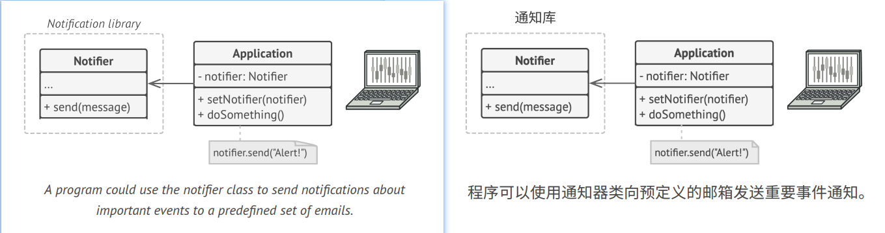
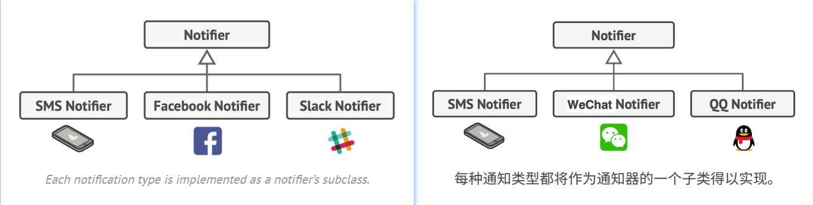
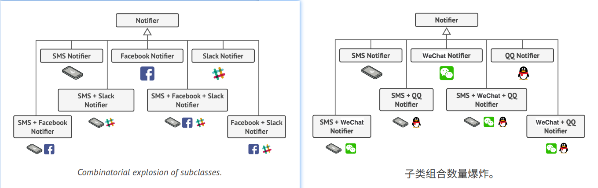
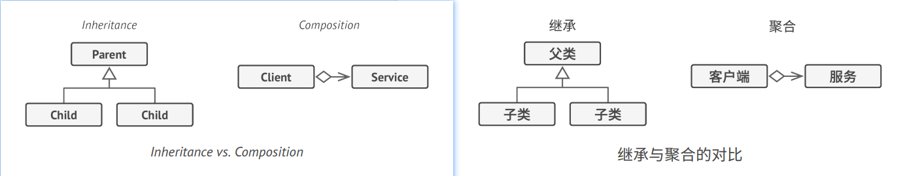
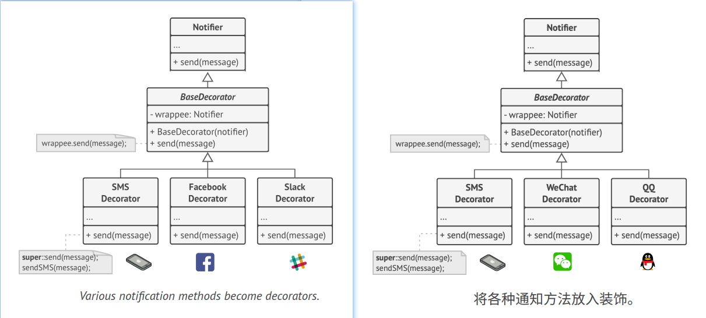
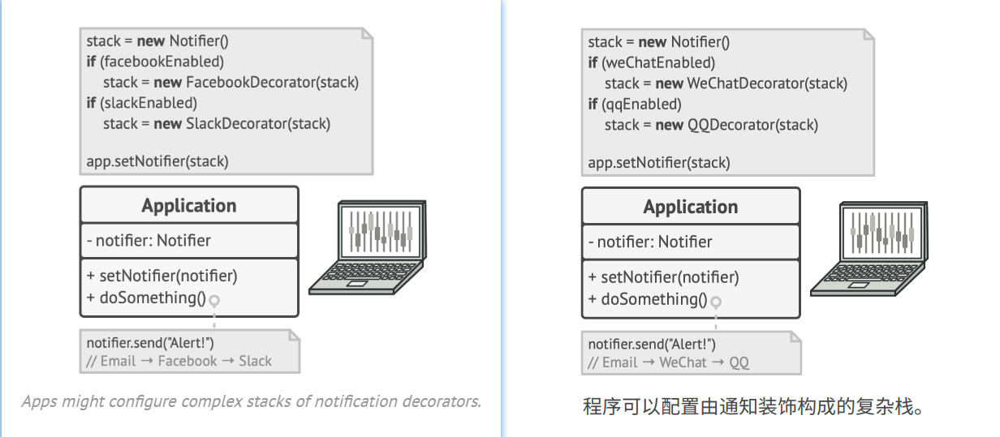
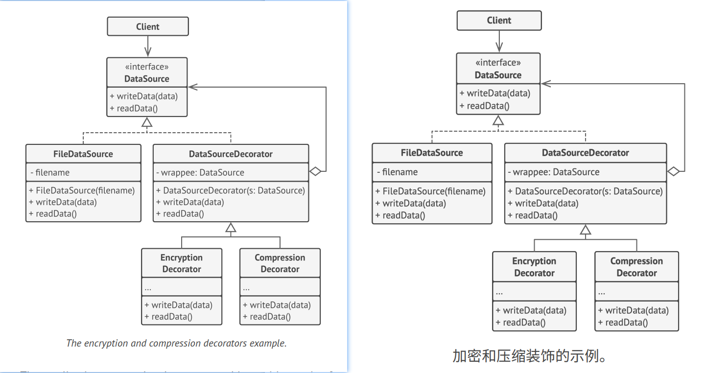

## Decorator
**Also known as:** Wrapper


### :snowflake: Intent
**Decorator** is a structural design pattern that lets you attach new behaviors to objects by placing these objects inside 
special wrapper objects that contain the behaviors.  
译:


### :worried: Problem
Imagine that you're working on a notification library which lets other programs notify their users about important events.  
译:

The initial version of the library was based on the `Notifier` class that had only a few fields, a constructor and a 
single `send` method. The method could accept a message argument from a client and send the message to a list of emails 
that were passed to the notifier via its constructor. A third-party app which acted as a client was supposed to create 
and configure the notifier object once, and then use it each time something important happened.  
译:




At some point, you realize that users of the library expect more than just email notifications. Many of them would like 
to receive an SMS about critical issues. Others would like to be notified on Facebook and, of course, the corporate 
users would love to get Slack notifications.  
译:



How hard can that be? You extended the `Notifier` class and put the additional notification methods into new subclasses. 
Now the client was supposed to instantiate the desired notification class and use it for all further notifications.  
译:

But then someone reasonably asked you, "Why can't you use several notification types at once? If your house is on fire, 
you'd probably want to be informed through every channel."  
译:

You tried to address that problem by creating special subclasses which combined several notification methods within one 
class. However, it quickly became apparent that this approach would bloat the code immensely, not only the library code 
but the client code as well.  
译:



You have to find some other way to structure notifications classes so that their number won't accidentally break some 
Guinness record.  
译:


### :smile: Solution
Extending a class is the first thing that comes to mind when you need to alter an object's behavior. However, 
inheritance has several serious caveats that you need to be aware of.
- Inheritance is static. You can't alter the behavior of an existing object at runtime. You can only replace the whole 
  object with another one that's created from a different subclass.
- Subclasses can have just one parent class. In most languages, inheritance doesn't let a class inherit behaviors of 
  multiple classes at the same time.

译:

One of the ways to overcome these caveats is by using *Aggregation* or *Composition* instead of *Inheritance*. Both of 
the alternatives work almost the same way: one object *has a* reference to another and delegates it some work, whereas 
with inheritance, the object itself *is* able to do that work, inheriting the behavior from its superclass.  
译:

With this new approach you can easily substitute the linked "helper" object with another, changing the behavior of the 
container at runtime. An object can use the behavior of various classes, having references to multiple objects and 
delegating them all kinds of work. Aggregation/composition is the key principle behind many design patterns, including 
Decorator. On that note, let's return to the pattern discussion.  
译:



"Wrapper" is the alternative nickname for the Decorator pattern that clearly expresses the main idea of the pattern. A 
*wrapper* is an object that can be linked with some *target* object. The wrapper contains the same set of methods as 
the target and delegates to it all requests it receives. However, the wrapper may alter the result by doing something 
either before or after it passes the request to the target.  
译:

When does a simple wrapper become the real decorator? As I mentioned, the wrapper implements the same interface as the 
wrapped object. That's why from the client's perspective these objects are identical. Make the wrapper's reference 
field accept any object that follows that interface. This will let you cover an object in multiple wrappers, adding the 
combined behavior of all the wrappers to it.  
译:

In our notifications example, let's leave the simple email notification behavior inside the base `Notifier` class, but 
turn all other notification methods into decorators.  
译:



The client code would need to wrap a basic notifier object into a set of decorators that match the client's preferences. 
The resulting objects will be structured as a stack.  
译:



The last decorator in the stack would be the object that the client actually works with. Since all decorators implement 
the same interface as the base notifier, the rest of the client code won't care whether it works with the "pure" 
notifier object or the decorated one.  
译:

We could apply the same approach to other behaviors such as formatting messages or composing the recipient list. The 
client can decorate the object with any custom decorators, as long as they follow the same interface as the others.  
译:


### :car: Real-World Analogy


Wearing clothes is an example of using decorators. When you're cold, you wrap yourself in a sweater. If you're still 
cold with a sweater, you can wear a jacket on top. If it's raining, you can put on a raincoat. All of these garments 
"extend" your basic behavior but aren't part of you, and you can easily take off any piece of clothing whenever you 
don't need it.  
译:


### :lollipop: Structure


1. The **Component** declares the common interface for both wrappers and wrapped objects.
2. **Concrete Component** is a class of objects being wrapped. It defines the basic behavior, which can be altered by 
   decorators.
3. The **Base Decorator** class has a field for referencing a wrapped object. The field's type should be declared as 
   the component interface so it can contain both concrete components and decorators. The base decorator delegates all 
   operations to the wrapped object.
4. **Concrete Decorators** define extra behaviors that can be added to components dynamically. Concrete decorators 
   override methods of the base decorator and execute their behavior either before or after calling the parent method.
5. The **Client** can wrap components in multiple layers of decorators, as long as it works with all objects via the 
   component interface.


### :hash: Pseudocode
In this example, the **Decorator** pattern lets you compress and encrypt sensitive data independently from the code 
that actually uses this data.  
译:



The application wraps the data source object with a pair of decorators. Both wrappers change the way the data is written 
to and read from the disk:
- Just before the data is **written to disk**, the decorators encrypt and compress it. The original class writes the 
  encrypted and protected data to the file without knowing about the change.
- Right after the data is **read from disk**, it goes through the same decorators, which decompress and decode it.

译:

The decorators and the data source class implement the same interface, which makes them all interchangeable in the 
client code.  
译:

```c++
  1 // The component interface defines operations that can be
  2 // altered by decorators.
  3 interface DataSource is
  4     method writeData(data)
  5     method readData():data
  6
  7 // Concrete components provide default implementations for the
  8 // operations. There might be several variations of these
  9 // classes in a program.
 10 class FileDataSource implements DataSource is
 11     constructor FileDataSource(filename) { ... }
 12
 13     method writeData(data) is
 14         // Write data to file.
 15
 16     method readData():data is
 17         // Read data from file.
 18
 19 // The base decorator class follows the same interface as the
 20 // other components. The primary purpose of this class is to
 21 // define the wrapping interface for all concrete decorators.
 22 // The default implementation of the wrapping code might include
 23 // a field for storing a wrapped component and the means to
 24 // initialize it.
 25 class DataSourceDecorator implements DataSource is
 26     protected field wrappee: DataSource
 27
 28     constructor DataSourceDecorator(source: DataSource) is
 29         wrappee = source
 30
 31     // The base decorator simply delegates all work to the
 32     // wrapped component. Extra behaviors can be added in
 33     // concrete decorators.
 34     method writeData(data) is
 35         wrappee.writeData(data)
 36
 37     // Concrete decorators may call the parent implementation of
 38     // the operation instead of calling the wrapped object
 39     // directly. This approach simplifies extension of decorator
 40     // classes.
 41     method readData():data is
 42         return wrappee.readData()
 43
 44 // Concrete decorators must call methods on the wrapped object,
 45 // but may add something of their own to the result. Decorators
 46 // can execute the added behavior either before or after the
 47 // call to a wrapped object.
 48 class EncryptionDecorator extends DataSourceDecorator is
 49     method writeData(data) is
 50         // 1. Encrypt passed data.
 51         // 2. Pass encrypted data to the wrappee's writeData
 52         // method.
 53
 54     method readData():data is
 55         // 1. Get data from the wrappee's readData method.
 56         // 2. Try to decrypt it if it's encrypted.
 57         // 3. Return the result.
 58
 59 // You can wrap objects in several layers of decorators.
 60 class CompressionDecorator extends DataSourceDecorator is
 61     method writeData(data) is
 62         // 1. Compress passed data.
 63         // 2. Pass compressed data to the wrappee's writeData
 64         // method.
 65
 66     method readData():data is
 67         // 1. Get data from the wrappee's readData method.
 68         // 2. Try to decompress it if it's compressed.
 69         // 3. Return the result.
 70
 71
 72 // Option 1. A simple example of a decorator assembly.
 73 class Application is
 74     method dumbUsageExample() is
 75         source = new FileDataSource("somefile.dat")
 76         source.writeData(salaryRecords)
 77         // The target file has been written with plain data.
 78
 79         source = new CompressionDecorator(source)
 80         source.writeData(salaryRecords)
 81         // The target file has been written with compressed
 82         // data.
 83
 84         source = new EncryptionDecorator(source)
 85         // The source variable now contains this:
 86         // Encryption > Compression > FileDataSource
 87         source.writeData(salaryRecords)
 88         // The file has been written with compressed and
 89         // encrypted data.
 90
 91
 92 // Option 2. Client code that uses an external data source.
 93 // SalaryManager objects neither know nor care about data
 94 // storage specifics. They work with a pre-configured data
 95 // source received from the app configurator.
 96 class SalaryManager is
 97     field source: DataSource
 98
 99     constructor SalaryManager(source: DataSource) { ... }
100
101     method load() is
102         return source.readData()
103
104     method save() is
105         source.writeData(salaryRecords)
106     // ...Other useful methods...
107
108
109 // The app can assemble different stacks of decorators at
110 // runtime, depending on the configuration or environment.
111 class ApplicationConfigurator is
112     method configurationExample() is
113         source = new FileDataSource("salary.dat")
114         if (enabledEncryption)
115             source = new EncryptionDecorator(source)
116         if (enabledCompression)
117             source = new CompressionDecorator(source)
118
119         logger = new SalaryManager(source)
120         salary = logger.load()
121     // ...
```


### :apple: Applicability
> :bug: **Use the Decorator pattern when you need to be able to assign extra behaviors to objects at runtime without 
> breaking the code that uses these objects.**
> 
> :zap: The Decorator lets you structure your business logic into layers, create a decorator for each layer and compose 
> objects with various combinations of this logic at runtime. The client code can treat all these objects in the same 
> way, since they all follow a common interface.

> :bug: **Use the pattern when it's awkward or not possible to extend an object's behavior using inheritance.**
> 
> :zap: Many programming languages have the `final` keyword that can be used to prevent further extension of a class. 
> For a final class, the only way to reuse the existing behavior would be to wrap the class with your own wrapper, 
> using the Decorator pattern.


### :book: How to Implement
1. Make sure your business domain can be represented as a primary component with multiple optional layers over it.
2. Figure out what methods are common to both the primary component and the optional layers. Create a component 
   interface and declare those methods there.
3. Create a concrete component class and define the base behavior in it.
4. Create a base decorator class. It should have a field for storing a reference to a wrapped object. The field should 
   be declared with the component interface type to allow linking to concrete components as well as decorators. The 
   base decorator must delegate all work to the wrapped object.
5. Make sure all classes implement the component interface.
6. Create concrete decorators by extending them from the base decorator. A concrete decorator must execute its behavior 
   before or after the call to the parent method (which always delegates to the wrapped object).
7. The client code must be responsible for creating decorators and composing them in the way the client needs.


### :notes: Pros and Cons
:heavy_check_mark: You can extend an object's behavior without making a new subclass.

:heavy_check_mark: You can add or remove responsibilities from an object at runtime.

:heavy_check_mark: You can combine several behaviors by wrapping an object into multiple decorators.

:heavy_check_mark: *Single Responsibility Principle*. You can divide a monolithic class that implements many possible 
variants of behavior into several smaller classes.

:x: It's hard to remove a specific wrapper from the wrappers stack.

:x: It's hard to implement a decorator in such a way that its behavior doesn't depend on the order in the decorators stack.

:x: The initial configuration code of layers might look pretty ugly.


### :repeat: Relations with Other Patterns
- [**Adapter**][Adapter] changes the interface of an existing object, while [**Decorator**][Decorator] enhances an 
  object without changing its interface. In addition, *Decorator* supports recursive composition, which isn't possible 
  when you use *Adapter*.
- [**Adapter**][Adapter] provides a different interface to the wrapped object, [**Proxy**][Proxy] provides it with the 
  same interface, and [**Decorator**][Decorator] provides it with an enhanced interface.
- [**Chain of Responsibility**][Chain of Responsibility] and [**Decorator**][Decorator] have very similar class 
  structures. Both patterns rely on recursive composition to pass the execution through a series of objects. However, 
  there are several crucial differences.

  The *CoR* handlers can execute arbitrary operations independently of each other. They can also stop passing the 
  request further at any point. On the other hand, various *Decorators* can extend the object's behavior while keeping 
  it consistent with the base interface. In addition, decorators aren't allowed to break the flow of the request.

- [**Composite**][Composite] and [**Decorator**][Decorator] have similar structure diagrams since both rely on recursive 
  composition to organize an open-ended number of objects.

  A *Decorator* is like a *Composite* but only has one child component. There's another significant difference: 
  *Decorator* adds additional responsibilities to the wrapped object, while *Composite* just "sums up" its children's 
  results.

  However, the patterns can also cooperate: you can use *Decorator* to extend the behavior of a specific object in the 
  *Composite* tree.

- Designs that make heavy use of [**Composite**][Composite] and [**Decorator**][Decorator] can often benefit from using 
  [**Prototype**][Prototype]. Applying the pattern lets you clone complex structures instead of re-constructing them 
  from scratch.
- [**Decorator**][Decorator] lets you change the skin of an object, while [**Strategy**][Strategy] lets you change the 
  guts.
- [**Decorator**][Decorator] and [**Proxy**][Proxy] have similar structures, but very different intents. Both patterns 
  are built on the composition principle, where one object is supposed to delegate some work to another. The difference 
  is that a *Proxy* usually manages the life cycle of its service object on its own, whereas the composition of 
  *Decorators* is always controlled by the client.


[Adapter]:../1_adapter/

[Composite]:../3_composite/

[Decorator]:../4_decorator/

[Proxy]:../7_proxy/

[Prototype]:../../1_creational_design_patterns/4_prototype/

[Chain of Responsibility]:../../3_behavioral_design_patterns/1_chain_of_responsibility/

[Strategy]:../../3_behavioral_design_patterns/8_strategy/

