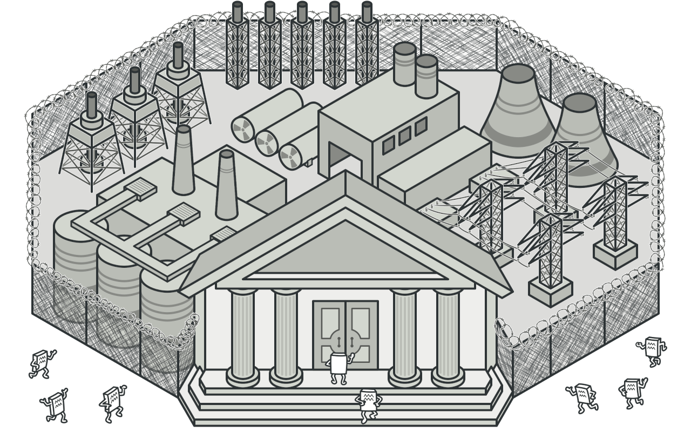
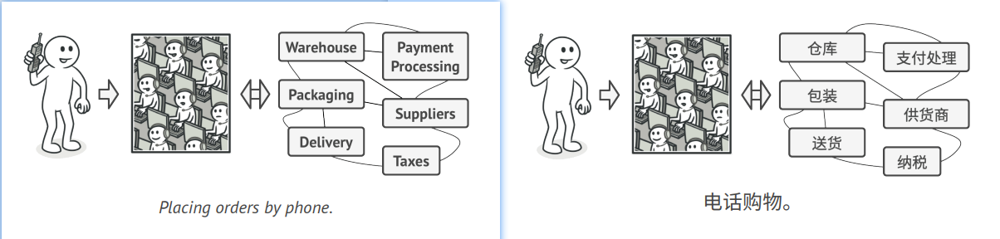
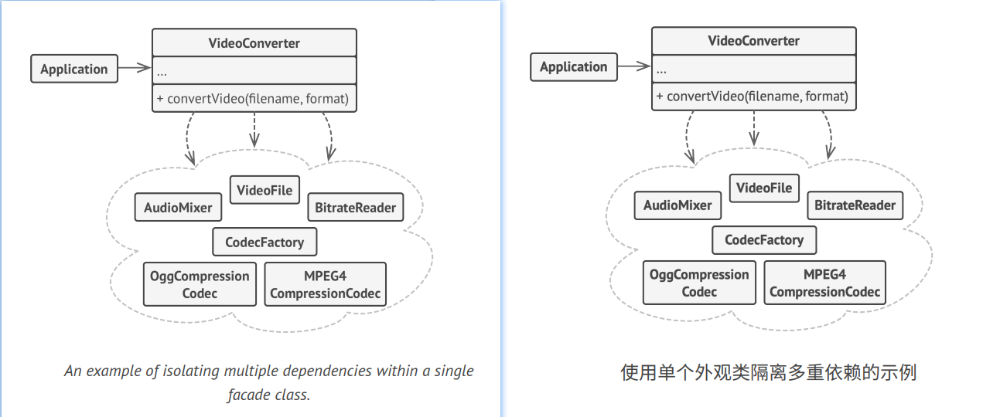

## Facade

### :snowflake: Intent
**Facade** is a structural design pattern that provides a simplified interface to a library, a framework, or any other 
complex set of classes.  
译:




### :worried: Problem
Imagine that you must make your code work with a broad set of objects that belong to a sophisticated library or 
framework. Ordinarily, you'd need to initialize all of those objects, keep track of dependencies, execute methods in 
the correct order, and so on.  
译:

As a result, the business logic of your classes would become tightly coupled to the implementation details of 3rd-party 
classes, making it hard to comprehend and maintain.  
译:


### :smile: Solution
A facade is a class that provides a simple interface to a complex subsystem which contains lots of moving parts. A 
facade might provide limited functionality in comparison to working with the subsystem directly. However, it includes 
only those features that clients really care about.  
译:

Having a facade is handy when you need to integrate your app with a sophisticated library that has dozens of features, 
but you just need a tiny bit of its functionality.  
译:

For instance, an app that uploads short funny videos with cats to social media could potentially use a professional 
video conversion library. However, all that it really needs is a class with the single method `encode(filename, format)`. 
After creating such a class and connecting it with the video conversion library, you'll have your first facade.  
译:


### :car: Real-World Analogy


When you call a shop to place a phone order, an operator is your facade to all services and departments of the shop. 
The operator provides you with a simple voice interface to the ordering system, payment gateways, and various delivery 
services.  
译:


### :lollipop: Structure


1. The **Facade** provides convenient access to a particular part of the subsystem's functionality. It knows where to 
   direct the client's request and how to operate all the moving parts.
2. An **Additional Facade** class can be created to prevent polluting a single facade with unrelated features that 
   might make it yet another complex structure. Additional facades can be used by both clients and other facades.
3. The **Complex Subsystem** consists of dozens of various objects. To make them all do something meaningful, you have 
   to dive deep into the subsystem's implementation details, such as initializing objects in the correct order and 
   supplying them with data in the proper format.

   Subsystem classes aren't aware of the facade's existence. They operate within the system and work with each other 
   directly.

4. The **Client** uses the facade instead of calling the subsystem objects directly.


### :hash: Pseudocode
In this example, the **Facade** pattern simplifies interaction with a complex video conversion framework.  
译:



Instead of making your code work with dozens of the framework classes directly, you create a facade class which 
encapsulates that functionality and hides it from the rest of the code. This structure also helps you to minimize the 
effort of upgrading to future versions of the framework or replacing it with another one. The only thing you'd need to 
change in your app would be the implementation of the facade's methods.  
译:

```c++
 1 // These are some of the classes of a complex 3rd-party video
 2 // conversion framework. We don't control that code, therefore
 3 // can't simplify it.
 4
 5 class VideoFile
 6 // ...
 7
 8 class OggCompressionCodec
 9 // ...
10
11 class MPEG4CompressionCodec
12 // ...
13 
14 class CodecFactory
15 // ...
16 
17 class BitrateReader
18 // ...
19 
20 class AudioMixer
21 // ...
22 
23 
24 // We create a facade class to hide the framework's complexity
25 // behind a simple interface. It's a trade-off between
26 // functionality and simplicity.
27 class VideoConverter is
28     method convert(filename, format):File is
29         file = new VideoFile(filename)
30         sourceCodec = (new CodecFactory).extract(file)
31         if (format == "mp4")
32             destinationCodec = new MPEG4CompressionCodec()
33         else
34             destinationCodec = new OggCompressionCodec()
35         buffer = BitrateReader.read(filename, sourceCodec)
36         result = BitrateReader.convert(buffer, destinationCodec)
37         result = (new AudioMixer()).fix(result)
38         return new File(result)
39 
40 // Application classes don't depend on a billion classes
41 // provided by the complex framework. Also, if you decide to
42 // switch frameworks, you only need to rewrite the facade class.
43 class Application is
44     method main() is
45         convertor = new VideoConverter()
46         mp4 = convertor.convert("funny-cats-video.ogg", "mp4")
47         mp4.save()
```


### :apple: Applicability
> :bug: **Use the Facade pattern when you need to have a limited but straightforward interface to a complex subsystem.**
> 
> :zap: Often, subsystems get more complex over time. Even applying design patterns typically leads to creating more 
> classes. A subsystem may become more flexible and easier to reuse in various contexts, but the amount of configuration 
> and boilerplate code it demands from a client grows ever larger. The Facade attempts to fix this problem by providing 
> a shortcut to the most-used features of the subsystem which fit most client requirements.

> :bug: **Use the Facade when you want to structure a subsystem into layers.**
> 
> :zap: Create facades to define entry points to each level of a subsystem. You can reduce coupling between multiple 
> subsystems by requiring them to communicate only through facades.
> 
> For example, let's return to our video conversion framework. It can be broken down into two layers: video- and 
> audio-related. For each layer, you can create a facade and then make the classes of each layer communicate with each 
> other via those facades. This approach looks very similar to the [**Mediator**][Mediator] pattern.


### :book: How to Implement
1. Check whether it's possible to provide a simpler interface than what an existing subsystem already provides. You're 
   on the right track if this interface makes the client code independent from many of the subsystem's classes.
2. Declare and implement this interface in a new facade class. The facade should redirect the calls from the client 
   code to appropriate objects of the subsystem. The facade should be responsible for initializing the subsystem and 
   managing its further life cycle unless the client code already does this.
3. To get the full benefit from the pattern, make all the client code communicate with the subsystem only via the 
   facade. Now the client code is protected from any changes in the subsystem code. For example, when a subsystem gets 
   upgraded to a new version, you will only need to modify the code in the facade.
4. If the facade becomes too big, consider extracting part of its behavior to a new, refined facade class.


### :notes: Pros and Cons
:heavy_check_mark: You can isolate your code from the complexity of a subsystem.

:x: A facade can become a god object coupled to all classes of an app.


### :repeat: Relations with Other Patterns
- [**Facade**][Facade] defines a new interface for existing objects, whereas [**Adapter**][Adapter] tries to make the 
  existing interface usable. *Adapter* usually wraps just one object, while *Facade* works with an entire subsystem of 
  objects.
- [**Abstract Factory**][Abstract Factory] can serve as an alternative to [**Facade**][Facade] when you only want to 
  hide the way the subsystem objects are created from the client code.
- [**Flyweight**][Flyweight] shows how to make lots of little objects, whereas [**Facade**][Facade] shows how to make a 
  single object that represents an entire subsystem.
- [**Facade**][Facade] and [**Mediator**][Mediator] have similar jobs: they try to organize collaboration between lots 
  of tightly coupled classes.

  - *Facade* defines a simplified interface to a subsystem of objects, but it doesn't introduce any new functionality. 
    The subsystem itself is unaware of the facade. Objects within the subsystem can communicate directly.
  - *Mediator* centralizes communication between components of the system. The components only know about the mediator 
    object and don't communicate directly.

- A [**Facade**][Facade] class can often be transformed into a [**Singleton**][Singleton] since a single facade object 
  is sufficient in most cases.
- [**Facade**][Facade] is similar to [**Proxy**][Proxy] in that both buffer a complex entity and initialize it on its 
  own. Unlike *Facade*, *Proxy* has the same interface as its service object, which makes them interchangeable.


[Adapter]:../1_adapter/

[Facade]:../5_facade/

[Flyweight]:../6_flyweight/

[Proxy]:../7_proxy/

[Abstract Factory]:../../1_creational_design_patterns/2_abstract_factory/

[Singleton]:../../1_creational_design_patterns/5_singleton/

[Mediator]:../../3_behavioral_design_patterns/4_mediator/

