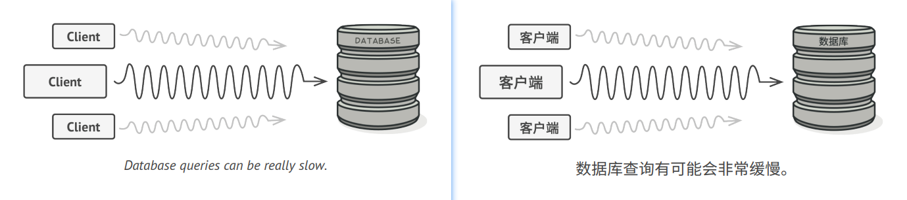
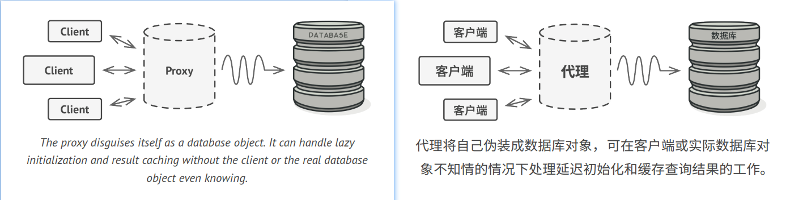
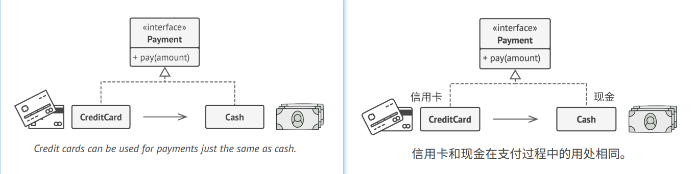
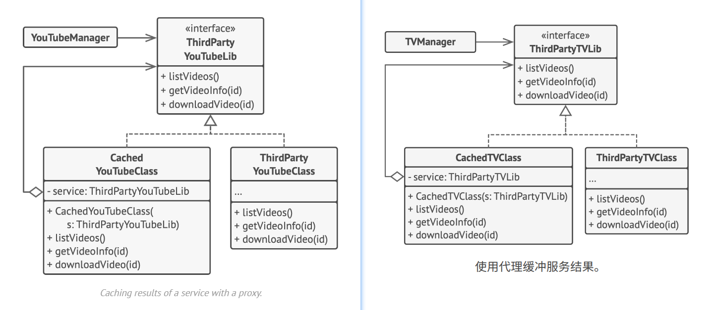

## Proxy

### :snowflake: Intent
**Proxy** is a structural design pattern that lets you provide a substitute or placeholder for another object. A proxy 
controls access to the original object, allowing you to perform something either before or after the request gets 
through to the original object.  
译:


### :worried: Problem
Why would you want to control access to an object? Here is an example: you have a massive object that consumes a vast 
amount of system resources. You need it from time to time, but not always.  
译:



You could implement lazy initialization: create this object only when it's actually needed. All the object's clients 
would need to execute some deferred initialization code. Unfortunately, this would probably cause a lot of code 
duplication.  
译:

In an ideal world, we'd want to put this code directly into our object's class, but that isn't always possible. 
For instance, the class may be part of a closed 3rd-party library.  
译:


### :smile: Solution
The Proxy pattern suggests that you create a new proxy class with the same interface as an original service object. 
Then you update your app so that it passes the proxy object to all the original object's clients. Upon receiving a 
request from a client, the proxy creates a real service object and delegates all the work to it.  
译:



But what's the benefit? If you need to execute something either before or after the primary logic of the class, the 
proxy lets you do this without changing that class. Since the proxy implements the same interface as the original class, 
it can be passed to any client that expects a real service object.  
译:


### :car: Real-World Analogy


A credit card is a proxy for a bank account, which is a proxy for a bundle of cash. Both implement the same interface: 
they can be used for making a payment. A consumer feels great because there's no need to carry loads of cash around. 
A shop owner is also happy since the income from a transaction gets added electronically to the shop's bank account 
without the risk of losing the deposit or getting robbed on the way to the bank.  
译:


### :lollipop: Structure


1. The **Service Interface** declares the interface of the Service. The proxy must follow this interface to be able to 
   disguise itself as a service object.
2. The **Service** is a class that provides some useful business logic.
3. The **Proxy** class has a reference field that points to a service object. After the proxy finishes its processing 
   (e.g., lazy initialization, logging, access control, caching, etc.), it passes the request to the service object.

   Usually, proxies manage the full lifecycle of their service objects.

4. The **Client** should work with both services and proxies via the same interface. This way you can pass a proxy into 
   any code that expects a service object.


### :hash: Pseudocode
This example illustrates how the **Proxy** pattern can help to introduce lazy initialization and caching to a 3rd-party 
YouTube integration library.  
译:



The library provides us with the video downloading class. However, it's very inefficient. If the client application 
requests the same video multiple times, the library just downloads it over and over, instead of caching and reusing the 
first downloaded file.  
译:

The proxy class implements the same interface as the original downloader and delegates it all the work. However, it 
keeps track of the downloaded files and returns the cached result when the app requests the same video multiple times.  
译:

```c++
 1 // The interface of a remote service.
 2 interface ThirdPartyYouTubeLib is
 3     method listVideos()
 4     method getVideoInfo(id)
 5     method downloadVideo(id)
 6 
 7 // The concrete implementation of a service connector. Methods
 8 // of this class can request information from YouTube. The speed
 9 // of the request depends on a user's internet connection as
10 // well as YouTube's. The application will slow down if a lot of
11 // requests are fired at the same time, even if they all request
12 // the same information.
13 class ThirdPartyYouTubeClass implements ThirdPartyYouTubeLib is
14     method listVideos() is
15         // Send an API request to YouTube.
16 
17     method getVideoInfo(id) is
18         // Get metadata about some video.
19 
20     method downloadVideo(id) is
21         // Download a video file from YouTube.
22 
23 // To save some bandwidth, we can cache request results and keep
24 // them for some time. But it may be impossible to put such code
25 // directly into the service class. For example, it could have
26 // been provided as part of a third party library and/or defined
27 // as `final`. That's why we put the caching code into a new
28 // proxy class which implements the same interface as the
29 // service class. It delegates to the service object only when
30 // the real requests have to be sent.
31 class CachedYouTubeClass implements ThirdPartyYouTubeLib is
32     private field service: ThirdPartyYouTubeLib
33     private field listCache, videoCache
34     field needReset
35 
36     constructor CachedYouTubeClass(service: ThirdPartyYouTubeLib) is
37         this.service = service
38 
39     method listVideos() is
40         if (listCache == null || needReset)
41             listCache = service.listVideos()
42         return listCache
43 
44     method getVideoInfo(id) is
45         if (videoCache == null || needReset)
46             videoCache = service.getVideoInfo(id)
47         return videoCache
48 
49     method downloadVideo(id) is
50         if (!downloadExists(id) || needReset)
51             service.downloadVideo(id)
52 
53 // The GUI class, which used to work directly with a service
54 // object, stays unchanged as long as it works with the service
55 // object through an interface. We can safely pass a proxy
56 // object instead of a real service object since they both
57 // implement the same interface.
58 class YouTubeManager is
59     protected field service: ThirdPartyYouTubeLib
60 
61     constructor YouTubeManager(service: ThirdPartyYouTubeLib) is
62         this.service = service
63 
64     method renderVideoPage(id) is
65         info = service.getVideoInfo(id)
66         // Render the video page.
67 
68     method renderListPanel() is
69         list = service.listVideos()
70         // Render the list of video thumbnails.
71 
72     method reactOnUserInput() is
73         renderVideoPage()
74         renderListPanel()
75 
76 // The application can configure proxies on the fly.
77 class Application is
78     method init() is
79         aYouTubeService = new ThirdPartyYouTubeClass()
80         aYouTubeProxy = new CachedYouTubeClass(aYouTubeService)
81         manager = new YouTubeManager(aYouTubeProxy)
82         manager.reactOnUserInput()
```


### :apple: Applicability
> There are dozens of ways to utilize the Proxy pattern. Let's go over the most popular uses.

> :bug: **Lazy initialization (virtual proxy). This is when you have a heavyweight service object that wastes system 
> resources by being always up, even though you only need it from time to time.**
> 
> :zap: Instead of creating the object when the app launches, you can delay the object's initialization to a time when 
> it's really needed.

> :bug: **Access control (protection proxy). This is when you want only specific clients to be able to use the service 
> object; for instance, when your objects are crucial parts of an operating system and clients are various launched 
> applications (including malicious ones).**
> 
> :zap: The proxy can pass the request to the service object only if the client's credentials match some criteria.

> :bug: **Local execution of a remote service (remote proxy). This is when the service object is located on a remote server.**
> 
> :zap: In this case, the proxy passes the client request over the network, handling all the nasty details of working 
> with the network.

> :bug: **Logging requests (logging proxy). This is when you want to keep a history of requests to the service object.**
> 
> :zap: The proxy can log each request before passing it to the service.

> :bug: **Caching request results (caching proxy). This is when you need to cache results of client requests and manage 
> the life cycle of this cache, especially if results are quite large.**
> 
> :zap: The proxy can implement caching for recurring requests that always yield the same results. The proxy may use the 
> parameters of requests as the cache keys.

> :bug: **Smart reference. This is when you need to be able to dismiss a heavyweight object once there are no clients 
> that use it.**
> 
> :zap: The proxy can keep track of clients that obtained a reference to the service object or its results. From time 
> to time, the proxy may go over the clients and check whether they are still active. If the client list gets empty, 
> the proxy might dismiss the service object and free the underlying system resources.
> 
> The proxy can also track whether the client had modified the service object. Then the unchanged objects may be reused 
> by other clients.


### :book: How to Implement
1. If there's no pre-existing service interface, create one to make proxy and service objects interchangeable. 
   Extracting the interface from the service class isn't always possible, because you'd need to change all the service's 
   clients to use that interface. Plan B is to make the proxy a subclass of the service class, and this way it'll 
   inherit the interface of the service.
2. Create the proxy class. It should have a field for storing a reference to the service. Usually, proxies create and 
   manage the whole life cycle of their services. On rare occasions, a service is passed to the proxy via a constructor 
   by the client.
3. Implement the proxy methods according to their purposes. In most cases, after doing some work, the proxy should 
   delegate the work to the service object.
4. Consider introducing a creation method that decides whether the client gets a proxy or a real service. This can be a 
   simple static method in the proxy class or a full-blown factory method.
5. Consider implementing lazy initialization for the service object.


### :notes: Pros and Cons
:heavy_check_mark: You can control the service object without clients knowing about it.
:heavy_check_mark: You can manage the lifecycle of the service object when clients don't care about it.
:heavy_check_mark: The proxy works even if the service object isn't ready or is not available.
:heavy_check_mark: *Open/Closed Principle*. You can introduce new proxies without changing the service or clients.
:x: The code may become more complicated since you need to introduce a lot of new classes.
:x: The response from the service might get delayed.


### :repeat: Relations with Other Patterns
- [**Adapter**][Adapter] provides a different interface to the wrapped object, [**Proxy**][Proxy] provides it with the 
  same interface, and [**Decorator**][Decorator] provides it with an enhanced interface.
- [**Facade**][Facade] is similar to [**Proxy**][Proxy] in that both buffer a complex entity and initialize it on its 
  own. Unlike *Facade*, *Proxy* has the same interface as its service object, which makes them interchangeable.
- [**Decorator**][Decorator] and [**Proxy**][Proxy] have similar structures, but very different intents. Both patterns 
  are built on the composition principle, where one object is supposed to delegate some work to another. The difference 
  is that a *Proxy* usually manages the life cycle of its service object on its own, whereas the composition of 
  *Decorators* is always controlled by the client.


  
  


[Adapter]:../1_adapter/

[Decorator]:../4_decorator/

[Facade]:../5_facade/

[Proxy]:../7_proxy/

