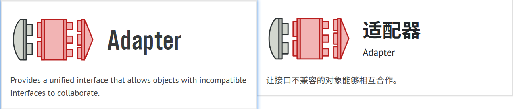
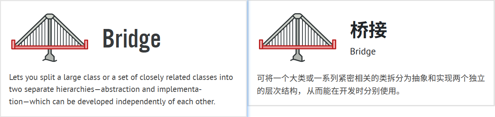
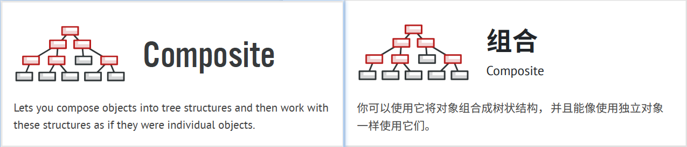
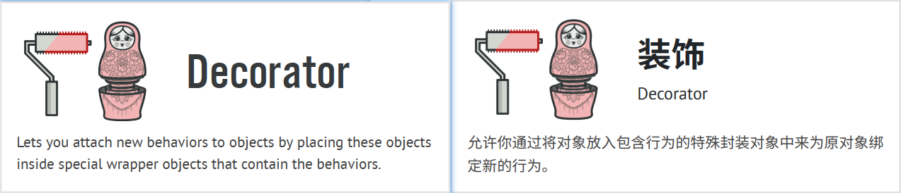
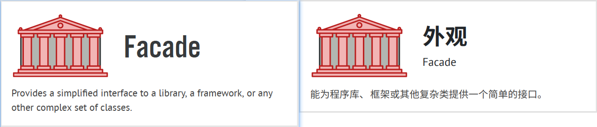
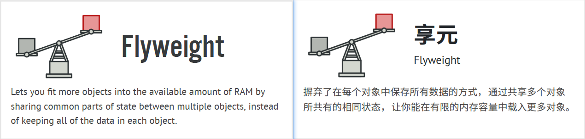
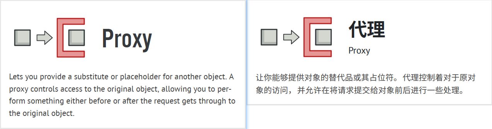

## Structural Design Patterns 结构型设计模式

Structural design patterns explain how to assemble objects and classes into larger structures, while keeping these 
structures flexible and efficient.  
译: 结构型设计模式介绍了如何将对象和类组装成较大的结构体，并同时保持结构体的灵活性和高效性。

- [**Adapter 适配器**](../2_structural_design_patterns/1_adapter/)

- [**Bridge 桥接**](../2_structural_design_patterns/2_bridge/)

- [**Composite 组合**](../2_structural_design_patterns/3_composite/)

- [**Decorator 装饰器**](../2_structural_design_patterns/4_decorator/)

- [**Facade 外观**](../2_structural_design_patterns/5_facade/)

- [**Flyweight 享元**](../2_structural_design_patterns/6_flyweight/)

- [**Proxy 代理**](../2_structural_design_patterns/7_proxy/)

