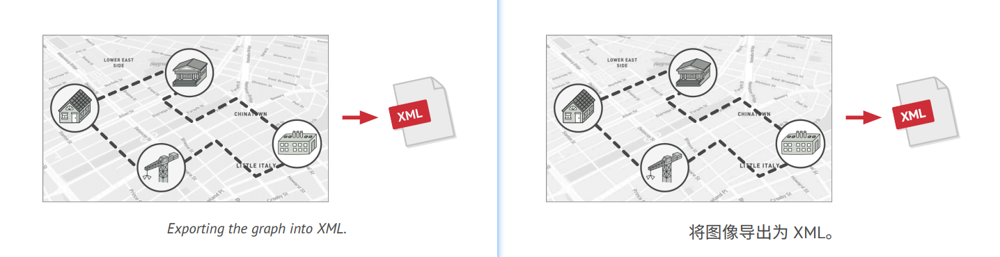
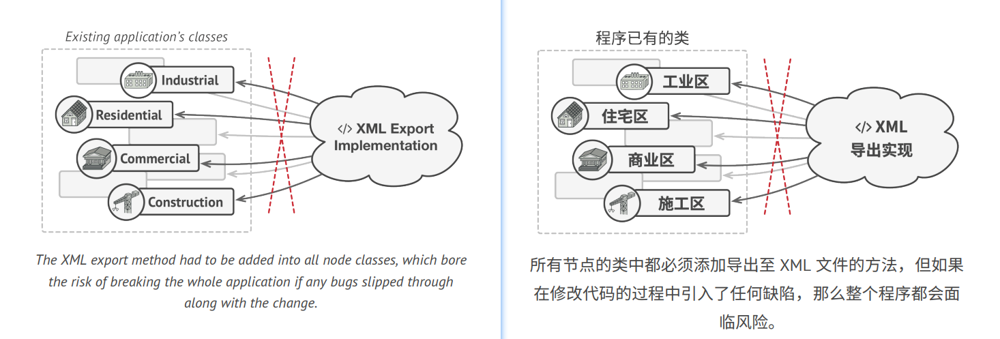
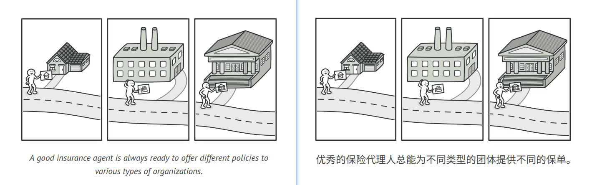
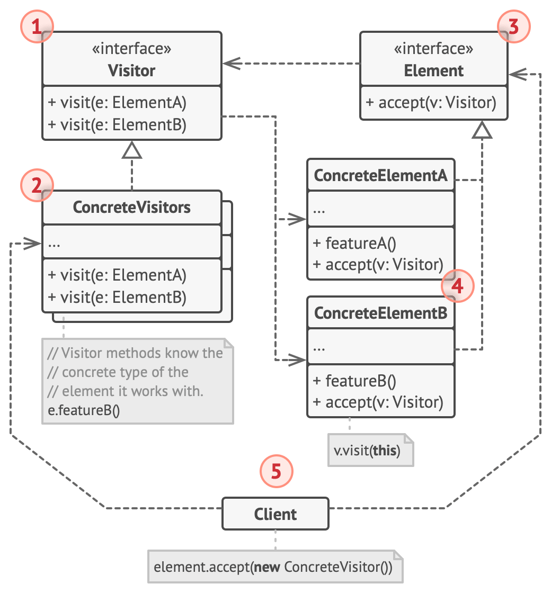
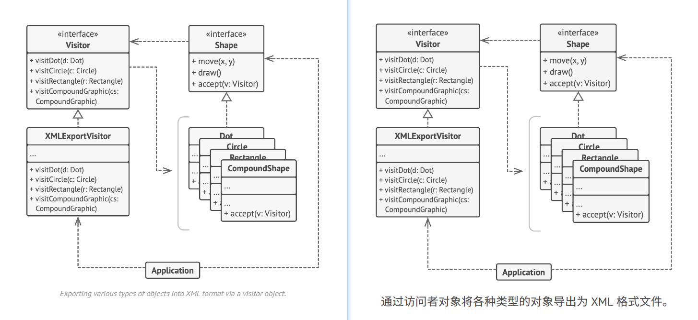

## Visitor

### :snowflake: Intent
Visitor is a behavioral design pattern that lets you separate algorithms from the objects on which they operate.  
译:


### :worried: Problem
Imagine that your team develops an app which works with geographic information structured as one colossal graph. Each 
node of the graph may represent a complex entity such as a city, but also more granular things like industries, 
sightseeing areas, etc. The nodes are connected with others if there's a road between the real objects that they 
represent. Under the hood, each node type is represented by its own class, while each specific node is an object.  
译:



At some point, you got a task to implement exporting the graph into XML format. At first, the job seemed pretty 
straightforward. You planned to add an export method to each node class and then leverage recursion to go over each 
node of the graph, executing the export method. The solution was simple and elegant: thanks to polymorphism, you 
weren't coupling the code which called the export method to concrete classes of nodes.  
译:

Unfortunately, the system architect refused to allow you to alter existing node classes. He said that the code was 
already in production, and he didn't want to risk breaking it because of a potential bug in your changes.  
译:



Besides, he questioned whether it makes sense to have the XML export code within the node classes. The primary job of 
these classes was to work with geo data. The XML export behavior would look alien there.  
译:

There was another reason for the refusal. It was highly likely that after this feature was implemented, someone from 
the marketing department would ask you to provide the ability to export into a different format, or request some other 
weird stuff. This would force you to change those precious and fragile classes again.  
译:


### :smile: Solution
The Visitor pattern suggests that you place the new behavior into a separate class called *visitor*, instead of trying 
to integrate it into existing classes. The original object that had to perform the behavior is now passed to one of 
the visitor's methods as an argument, providing the method access to all necessary data contained within the object.  
译:

Now, what if that behavior can be executed over objects of different classes? For example, in our case with XML export, 
the actual implementation will probably be a little bit different across various node classes. Thus, the visitor class 
may define not one, but a set of methods, each of which could take arguments of different types, like this:  
译:

```c++
1 class ExportVisitor implements Visitor is
2     method doForCity(City c) { ... }
3     method doForIndustry(Industry f) { ... }
4     method doForSightSeeing(SightSeeing ss) { ... }
5     // ...
```
But how exactly would we call these methods, especially when dealing with the whole graph? These methods have different 
signatures, so we can't use polymorphism. To pick a proper visitor method that's able to process a given object, we'd 
need to check its class. Doesn't this sound like a nightmare?  
译:

```c++
1 foreach (Node node in graph)
2     if (node instanceof City)
3         exportVisitor.doForCity((City) node)
4     if (node instanceof Industry)
5         exportVisitor.doForIndustry((Industry) node)
6     // ...
7 }
```

You might ask, why don't we use method overloading? That's when you give all methods the same name, even if they 
support different sets of parameters. Unfortunately, even assuming that our programming language supports it at all 
(as Java and C# do), it won't help us. Since the exact class of a node object is unknown in advance, the overloading 
mechanism won't be able to determine the correct method to execute. It'll default to the method that takes an object 
of the base `Node` class.  
译:

However, the Visitor pattern addresses this problem. It uses a technique called [**Double Dispatch**][Visitor], 
which helps to execute the proper method on an object without cumbersome conditionals. Instead of letting the client 
select a proper version of the method to call, how about we delegate this choice to objects we're passing to the 
visitor as an argument? Since the objects know their own classes, they'll be able to pick a proper method on the 
visitor less awkwardly. They "accept" a visitor and tell it what visiting method should be executed.  
译:

```c++
 1 // Client code
 2 foreach (Node node in graph)
 3     node.accept(exportVisitor)
 4 
 5 // City
 6 class City is
 7     method accept(Visitor v) is
 8         v.doForCity(this)
 9     // ...
10 
11 // Industry
12 class Industry is
13     method accept(Visitor v) is
14         v.doForIndustry(this)
15     // ...
```

I confess. We had to change the node classes after all. But at least the change is trivial, and it lets us add further 
behaviors without altering the code once again.  
译:

Now, if we extract a common interface for all visitors, all existing nodes can work with any visitor you introduce into 
the app. If you find yourself introducing a new behavior related to nodes, all you have to do is implement a new 
visitor class.  
译:


### :car: Real-World Analogy


Imagine a seasoned insurance agent who's eager to get new customers. He can visit every building in a neighborhood, 
trying to sell insurance to everyone he meets. Depending on the type of organization that occupies the building, 
he can offer specialized insurance policies:
- If it's a residential building, he sells medical insurance.
- If it's a bank, he sells theft insurance.
- If it's a coffee shop, he sells fire and flood insurance.


### :lollipop: Structure


1. The **Visitor** interface declares a set of visiting methods that can take concrete elements of an object structure 
   as arguments. These methods may have the same names if the program is written in a language that supports 
   overloading, but the type of their parameters must be different.

2. Each **Concrete Visitor** implements several versions of the same behaviors, tailored for different concrete 
   element classes.

3. The **Element** interface declares a method for "accepting" visitors. This method should have one parameter 
   declared with the type of the visitor interface.

4. Each **Concrete Element** must implement the acceptance method. The purpose of this method is to redirect the call 
   to the proper visitor's method corresponding to the current element class. Be aware that even if a base element 
   class implements this method, all subclasses must still override this method in their own classes and call the 
   appropriate method on the visitor object.

5. The **Client** usually represents a collection or some other complex object (for example, a [**Composite**][Composite] 
   tree). Usually, clients aren't aware of all the concrete element classes because they work with objects from that 
   collection via some abstract interface.


### :hash: Pseudocode
In this example, the **Visitor** pattern adds XML export support to the class hierarchy of geometric shapes.  
译:



```c++
 1 // The element interface declares an `accept` method that takes
 2 // the base visitor interface as an argument.
 3 interface Shape is
 4     method move(x, y)
 5     method draw()
 6     method accept(v: Visitor)
 7 
 8 // Each concrete element class must implement the `accept`
 9 // method in such a way that it calls the visitor's method that
10 // corresponds to the element's class.
11 class Dot implements Shape is
12     // ...
13 
14     // Note that we're calling `visitDot`, which matches the
15     // current class name. This way we let the visitor know the
16     // class of the element it works with.
17     method accept(v: Visitor) is
18         v.visitDot(this)
19 
20 class Circle implements Shape is
21     // ...
22     method accept(v: Visitor) is
23         v.visitCircle(this)
24 
25 class Rectangle implements Shape is
26     // ...
27     method accept(v: Visitor) is
28         v.visitRectangle(this)
29 
30 class CompoundShape implements Shape is
31     // ...
32     method accept(v: Visitor) is
33         v.visitCompoundShape(this)
34 
35 
36 // The Visitor interface declares a set of visiting methods that
37 // correspond to element classes. The signature of a visiting
38 // method lets the visitor identify the exact class of the
39 // element that it's dealing with.
40 interface Visitor is
41     method visitDot(d: Dot)
42     method visitCircle(c: Circle)
43     method visitRectangle(r: Rectangle)
44     method visitCompoundShape(cs: CompoundShape)
45 
46 // Concrete visitors implement several versions of the same
47 // algorithm, which can work with all concrete element classes.
48 //
49 // You can experience the biggest benefit of the Visitor pattern
50 // when using it with a complex object structure such as a
51 // Composite tree. In this case, it might be helpful to store
52 // some intermediate state of the algorithm while executing the
53 // visitor's methods over various objects of the structure.
54 class XMLExportVisitor implements Visitor is
55     method visitDot(d: Dot) is
56         // Export the dot's ID and center coordinates.
57 
58     method visitCircle(c: Circle) is
59         // Export the circle's ID, center coordinates and
60         // radius.
61 
62     method visitRectangle(r: Rectangle) is
63         // Export the rectangle's ID, left-top coordinates,
64         // width and height.
65 
66     method visitCompoundShape(cs: CompoundShape) is
67         // Export the shape's ID as well as the list of its
68         // children's IDs.
69 
70 
71 // The client code can run visitor operations over any set of
72 // elements without figuring out their concrete classes. The
73 // accept operation directs a call to the appropriate operation
74 // in the visitor object.
75 class Application is
76     field allShapes: array of Shapes
77 
78     method export() is
79         exportVisitor = new XMLExportVisitor()
80 
81         foreach (shape in allShapes) do
82             shape.accept(exportVisitor)
```
If you wonder why we need the `accept` method in this example, my article [**Visitor and Double Dispatch**][Visitor]
addresses this question in detail.  
译:


### :apple: Applicability
> :bug: **Use the Visitor when you need to perform an operation on all elements of a complex object structure 
> (for example, an object tree).**
> 
> :zap: The Visitor pattern lets you execute an operation over a set of objects with different classes by having a 
> visitor object implement several variants of the same operation, which correspond to all target classes.

> :bug: **Use the Visitor to clean up the business logic of auxiliary behaviors.**
> 
> :zap: The pattern lets you make the primary classes of your app more focused on their main jobs by extracting all 
> other behaviors into a set of visitor classes.

> :bug: **Use the pattern when a behavior makes sense only in some classes of a class hierarchy, but not in others.**
>
> :zap: You can extract this behavior into a separate visitor class and implement only those visiting methods that 
> accept objects of relevant classes, leaving the rest empty.


### :book: How to Implement
1. Declare the visitor interface with a set of "visiting" methods, one per each concrete element class that exists in 
   the program.

2. Declare the element interface. If you're working with an existing element class hierarchy, add the abstract 
   "acceptance" method to the base class of the hierarchy. This method should accept a visitor object as an argument.

3. Implement the acceptance methods in all concrete element classes. These methods must simply redirect the call to a 
   visiting method on the incoming visitor object which matches the class of the current element.

4. The element classes should only work with visitors via the visitor interface. Visitors, however, must be aware of 
   all concrete element classes, referenced as parameter types of the visiting methods.

5. For each behavior that can't be implemented inside the element hierarchy, create a new concrete visitor class and 
   implement all the visiting methods.

   You might encounter a situation where the visitor will need access to some private members of the element class. 
   In this case, you can either make these fields or methods public, violating the element's encapsulation, or nest 
   the visitor class in the element class. The latter is only possible if you're lucky to work with a programming 
   language that supports nested classes.

6. The client must create visitor objects and pass them into elements via "acceptance" methods.


### :notes: Pros and Cons
:heavy_check_mark: *Open/Closed Principle*. You can introduce a new behavior that can work with objects of different 
classes without changing these classes.

:heavy_check_mark: *Single Responsibility Principle*. You can move multiple versions of the same behavior into the same
class.

:heavy_check_mark: A visitor object can accumulate some useful information while working with various objects. 
This might be handy when you want to traverse some complex object structure, such as an object tree, and apply the 
visitor to each object of this structure.

:x: You need to update all visitors each time a class gets added to or removed from the element hierarchy.

:x: Visitors might lack the necessary access to the private fields and methods of the elements that they're supposed to
work with.


### :repeat: Relations with Other Patterns
- You can treat [**Visitor**][Visitor] as a powerful version of the [**Command**][Command] pattern. Its objects can 
  execute operations over various objects of different classes.

- You can use [**Visitor**][Visitor] to execute an operation over an entire [**Composite**][Composite] tree.

- You can use [**Visitor**][Visitor] along with [**Iterator**][Iterator] to traverse a complex data structure and 
  execute some operation over its elements, even if they all have different classes.

  


[Composite]:../../2_structural_design_patterns/3_composite/

[Command]:../2_command/

[Iterator]:../3_iterator/

[Visitor]:../10_visitor/