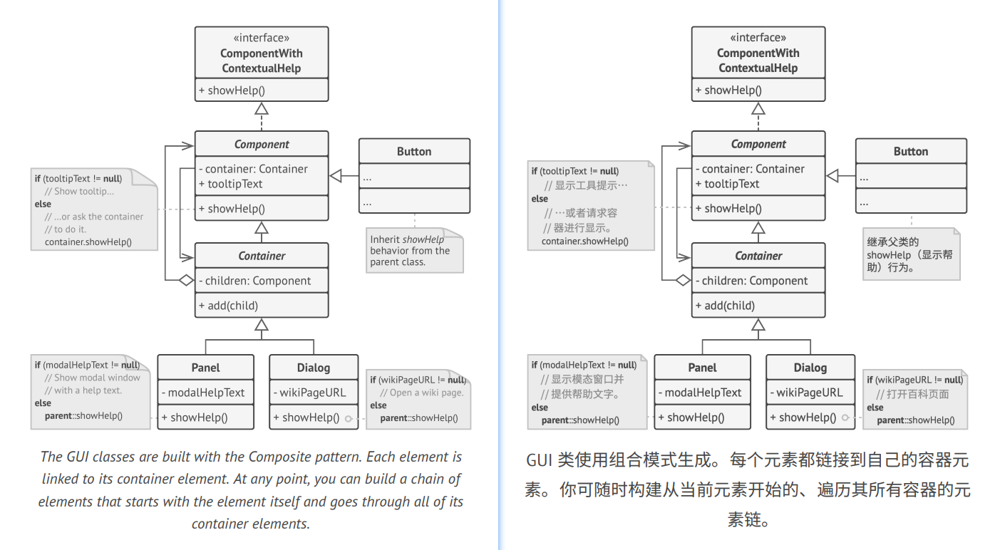

## Chain of Responsibility
**Also known as:** CoR, Chain of Command


### :snowflake: Intent
**Chain of Responsibility** is a behavioral design pattern that lets you pass requests along a chain of handlers. Upon 
receiving a request, each handler decides either to process the request or to pass it to the next handler in the chain.  
译:


### :worried: Problem
Imagine that you're working on an online ordering system. You want to restrict access to the system so only 
authenticated users can create orders. Also, users who have administrative permissions must have full access to all 
orders.  
译:

After a bit of planning, you realized that these checks must be performed sequentially. The application can attempt 
to authenticate a user to the system whenever it receives a request that contains the user's credentials. However, 
if those credentials aren't correct and authentication fails, there's no reason to proceed with any other checks.  
译:


During the next few months, you implemented several more of those sequential checks.
- One of your colleagues suggested that it's unsafe to pass raw data straight to the ordering system. So you added an 
  extra validation step to sanitize the data in a request.
- Later, somebody noticed that the system is vulnerable to brute force password cracking. To negate this, you promptly 
  added a check that filters repeated failed requests coming from the same IP address.
- Someone else suggested that you could speed up the system by returning cached results on repeated requests containing 
  the same data. Hence, you added another check which lets the request pass through to the system only if there's no 
  suitable cached response.


The code of the checks, which had already looked like a mess, became more and more bloated as you added each new 
feature. Changing one check sometimes affected the others. Worst of all, when you tried to reuse the checks to protect 
other components of the system, you had to duplicate some code since those components required some checks, but not all 
of them.  
译:

The system became very hard to comprehend and expensive to maintain. You struggled with the code for a while, 
until one day you decided to refactor the whole thing.  
译:


### :smile: Solution
Like many other behavioral design patterns, the **Chain of Responsibility** relies on transforming particular behaviors 
into stand-alone objects called *handlers*. In our case, each check should be extracted to its own class with a single 
method that performs the check. The request, along with its data, is passed to this method as an argument.  
译:

The pattern suggests that you link these handlers into a chain. Each linked handler has a field for storing a 
reference to the next handler in the chain. In addition to processing a request, handlers pass the request further 
along the chain. The request travels along the chain until all handlers have had a chance to process it.  
译:

Here's the best part: a handler can decide not to pass the request further down the chain and effectively stop any 
further processing.  
译:

In our example with ordering systems, a handler performs the processing and then decides whether to pass the request 
further down the chain. Assuming the request contains the right data, all the handlers can execute their primary 
behavior, whether it's authentication checks or caching.  
译:


However, there's a slightly different approach (and it's a bit more canonical) in which, upon receiving a request, a 
handler decides whether it can process it. If it can, it doesn't pass the request any further. So it's either only one 
handler that processes the request or none at all. This approach is very common when dealing with events in stacks of 
elements within a graphical user interface.  
译:

For instance, when a user clicks a button, the event propagates through the chain of GUI elements that starts with the 
button, goes along its containers (like forms or panels), and ends up with the main application window. The event is 
processed by the first element in the chain that's capable of handling it. This example is also noteworthy because it 
shows that a chain can always be extracted from an object tree.  
译:


It's crucial that all handler classes implement the same interface. Each concrete handler should only care about the 
following one having the `execute` method. This way you can compose chains at runtime, using various handlers without 
coupling your code to their concrete classes.  
译:


### :car: Real-World Analogy


You've just bought and installed a new piece of hardware on your computer. Since you're a geek, the computer has 
several operating systems installed. You try to boot all of them to see whether the hardware is supported. Windows 
detects and enables the hardware automatically. However, your beloved Linux refuses to work with the new hardware. 
With a small flicker of hope, you decide to call the tech-support phone number written on the box.  
译:

The first thing you hear is the robotic voice of the autoresponder. It suggests nine popular solutions to various 
problems, none of which are relevant to your case. After a while, the robot connects you to a live operator.  
译:

Alas, the operator isn't able to suggest anything specific either. He keeps quoting lengthy excerpts from the manual, 
refusing to listen to your comments. After hearing the phrase "have you tried turning the computer off and on again?" 
for the 10th time, you demand to be connected to a proper engineer.  
译:

Eventually, the operator passes your call to one of the engineers, who had probably longed for a live human chat for 
hours as he sat in his lonely server room in the dark basement of some office building. The engineer tells you where to 
download proper drivers for your new hardware and how to install them on Linux. Finally, the solution! You end the call, 
bursting with joy.  
译:


### :lollipop: Structure


1. The **Handler** declares the interface, common for all concrete handlers. It usually contains just a single method 
   for handling requests, but sometimes it may also have another method for setting the next handler on the chain.
2. The **Base Handler** is an optional class where you can put the boilerplate code that's common to all handler classes.

   Usually, this class defines a field for storing a reference to the next handler. The clients can build a chain by 
   passing a handler to the constructor or setter of the previous handler. The class may also implement the default 
   handling behavior: it can pass execution to the next handler after checking for its existence.

3. **Concrete Handlers** contain the actual code for processing requests. Upon receiving a request, each handler must 
   decide whether to process it and, additionally, whether to pass it along the chain.

   Handlers are usually self-contained and immutable, accepting all necessary data just once via the constructor.

4. The **Client** may compose chains just once or compose them dynamically, depending on the application's logic. Note 
   that a request can be sent to any handler in the chain—it doesn't have to be the first one.


### :hash: Pseudocode
In this example, the **Chain of Responsibility** pattern is responsible for displaying contextual help information for 
active GUI elements.  
译:



The application's GUI is usually structured as an object tree. For example, the `Dialog` class, which renders the main 
window of the app, would be the root of the object tree. The dialog contains `Panels`, which might contain other panels 
or simple low-level elements like `Buttons` and `TextFields`.  
译:

A simple component can show brief contextual tooltips, as long as the component has some help text assigned. But more 
complex components define their own way of showing contextual help, such as showing an excerpt from the manual or 
opening a page in a browser.  
译:


When a user points the mouse cursor at an element and presses the `F1` key, the application detects the component under 
the pointer and sends it a help request. The request bubbles up through all the element's containers until it reaches 
the element that's capable of displaying the help information.  
译:

```c++
 1 // The handler interface declares a method for executing a
 2 // request.
 3 interface ComponentWithContextualHelp is
 4     method showHelp()
 5 
 6 
 7 // The base class for simple components.
 8 abstract class Component implements ComponentWithContextualHelp is
 9     field tooltipText: string
10  
11     // The component's container acts as the next link in the
12     // chain of handlers.
13     protected field container: Container
14 
15     // The component shows a tooltip if there's help text
16     // assigned to it. Otherwise it forwards the call to the
17     // container, if it exists.
18     method showHelp() is
19         if (tooltipText != null)
20             // Show tooltip.
21         else
22             container.showHelp()
23 
24 
25 // Containers can contain both simple components and other
26 // containers as children. The chain relationships are
27 // established here. The class inherits showHelp behavior from
28 // its parent.
29 abstract class Container extends Component is
30     protected field children: array of Component
31 
32     method add(child) is
33         children.add(child)
34         child.container = this
35 
36 
37 // Primitive components may be fine with default help
38 // implementation...
39 class Button extends Component is
40     // ...
41 
42 // But complex components may override the default
43 // implementation. If the help text can't be provided in a new
44 // way, the component can always call the base implementation
45 // (see Component class).
46 class Panel extends Container is
47     field modalHelpText: string
48 
49     method showHelp() is
50         if (modalHelpText != null)
51             // Show a modal window with the help text.
52         else
53             super.showHelp()
54 
55 // ...same as above...
56 class Dialog extends Container is
57     field wikiPageURL: string
58 
59     method showHelp() is
60         if (wikiPageURL != null)
61             // Open the wiki help page.
62         else
63             super.showHelp()
64 
65 
66 // Client code.
67 class Application is
68     // Every application configures the chain differently.
69     method createUI() is
70         dialog = new Dialog("Budget Reports")
71         dialog.wikiPageURL = "http://..."
72         panel = new Panel(0, 0, 400, 800)
73         panel.modalHelpText = "This panel does..."
74         ok = new Button(250, 760, 50, 20, "OK")
75         ok.tooltipText = "This is an OK button that..."
76         cancel = new Button(320, 760, 50, 20, "Cancel")
77         // ...
78         panel.add(ok)
79         panel.add(cancel)
80         dialog.add(panel)
81 
82     // Imagine what happens here.
83     method onF1KeyPress() is
84         component = this.getComponentAtMouseCoords()
85         component.showHelp()
```


### :apple: Applicability
> :bug: **Use the Chain of Responsibility pattern when your program is expected to process different kinds of requests 
> in various ways, but the exact types of requests and their sequences are unknown beforehand.**
> 
> :zap: The pattern lets you link several handlers into one chain and, upon receiving a request, "ask" each handler 
> whether it can process it. This way all handlers get a chance to process the request.

> :bug: **Use the pattern when it's essential to execute several handlers in a particular order.**
> 
> :zap: Since you can link the handlers in the chain in any order, all requests will get through the chain exactly as 
> you planned.

> :bug: **Use the CoR pattern when the set of handlers and their order are supposed to change at runtime.**
> 
> :zap: If you provide setters for a reference field inside the handler classes, you'll be able to insert, remove or 
> reorder handlers dynamically.


### :book: How to Implement
1. Declare the handler interface and describe the signature of a method for handling requests.

   Decide how the client will pass the request data into the method. The most flexible way is to convert the request 
   into an object and pass it to the handling method as an argument.

2. To eliminate duplicate boilerplate code in concrete handlers, it might be worth creating an abstract base handler 
   class, derived from the handler interface.

   This class should have a field for storing a reference to the next handler in the chain. Consider making the class 
   immutable. However, if you plan to modify chains at runtime, you need to define a setter for altering the value of 
   the reference field.

   You can also implement the convenient default behavior for the handling method, which is to forward the request to 
   the next object unless there's none left. Concrete handlers will be able to use this behavior by calling the parent 
   method.

3. One by one create concrete handler subclasses and implement their handling methods. Each handler should make two 
   decisions when receiving a request:
   - Whether it'll process the request.
   - Whether it'll pass the request along the chain.
4. The client may either assemble chains on its own or receive pre-built chains from other objects. In the latter case, 
   you must implement some factory classes to build chains according to the configuration or environment settings.
5. The client may trigger any handler in the chain, not just the first one. The request will be passed along the chain 
   until some handler refuses to pass it further or until it reaches the end of the chain.
6. Due to the dynamic nature of the chain, the client should be ready to handle the following scenarios:
   - The chain may consist of a single link.
   - Some requests may not reach the end of the chain.
   - Others may reach the end of the chain unhandled.


### :notes: Pros and Cons
:heavy_check_mark: You can control the order of request handling.

:heavy_check_mark: *Single Responsibility Principle*. You can decouple classes that invoke operations from classes that 
perform operations.

:heavy_check_mark: *Open/Closed Principle*. You can introduce new handlers into the app without breaking the existing 
client code.

:x: Some requests may end up unhandled.


### :repeat: Relations with Other Patterns
- [**Chain of Responsibility**][Chain of Responsibility], [**Command**][Command], [**Mediator**][Mediator] and 
  [**Observer**][Observer] address various ways of connecting senders and receivers of requests:
  - *Chain of Responsibility* passes a request sequentially along a dynamic chain of potential receivers until one of them handles it.
  - *Command* establishes unidirectional connections between senders and receivers.
  - *Mediator* eliminates direct connections between senders and receivers, forcing them to communicate indirectly via a mediator object.
  - *Observer* lets receivers dynamically subscribe to and unsubscribe from receiving requests.

- [**Chain of Responsibility**][Chain of Responsibility] is often used in conjunction with [**Composite**][Composite]. 
  In this case, when a leaf component gets a request, it may pass it through the chain of all the parent components 
  down to the root of the object tree.

- Handlers in [**Chain of Responsibility**][Chain of Responsibility] can be implemented as [**Commands**][Command]. 
  In this case, you can execute a lot of different operations over the same context object, represented by a request.

  However, there's another approach, where the request itself is a *Command* object. In this case, you can execute the 
  same operation in a series of different contexts linked into a chain.

- [**Chain of Responsibility**][Chain of Responsibility] and [**Decorator**][Decorator] have very similar class 
  structures. Both patterns rely on recursive composition to pass the execution through a series of objects. However, 
  there are several crucial differences.

  The *CoR* handlers can execute arbitrary operations independently of each other. They can also stop passing the 
  request further at any point. On the other hand, various *Decorators* can extend the object's behavior while keeping 
  it consistent with the base interface. In addition, decorators aren't allowed to break the flow of the request.


  

[Composite]:../../2_structural_design_patterns/3_composite/

[Decorator]:../../2_structural_design_patterns/4_decorator/

[Chain of Responsibility]:../1_chain_of_responsibility/

[Command]:../2_command/

[Mediator]:../4_mediator/

[Observer]:../6_observer/

