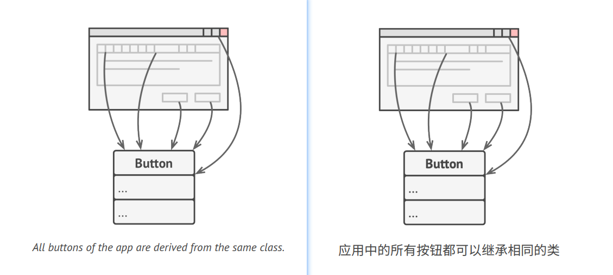
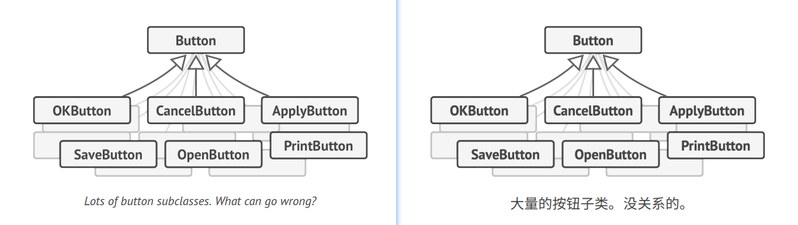
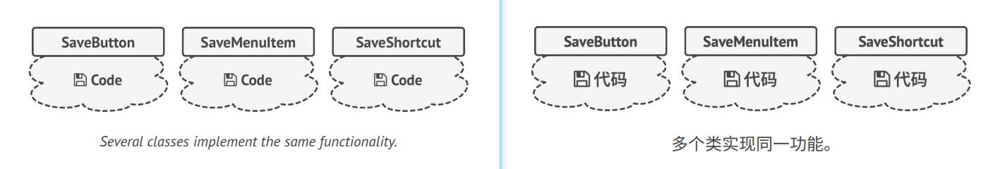
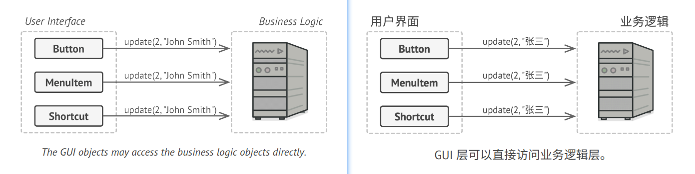
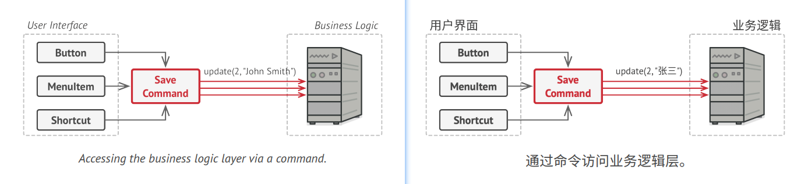
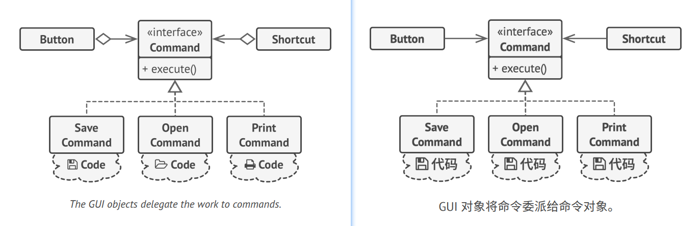
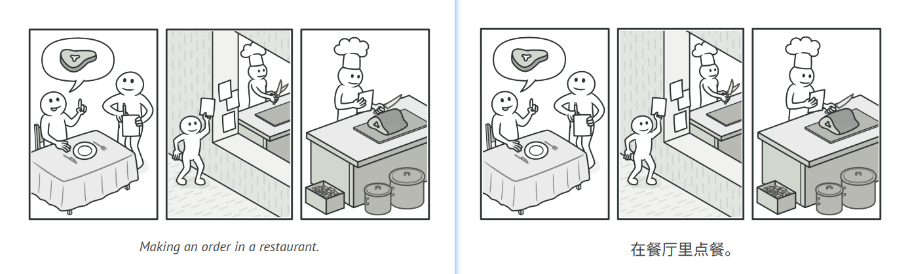
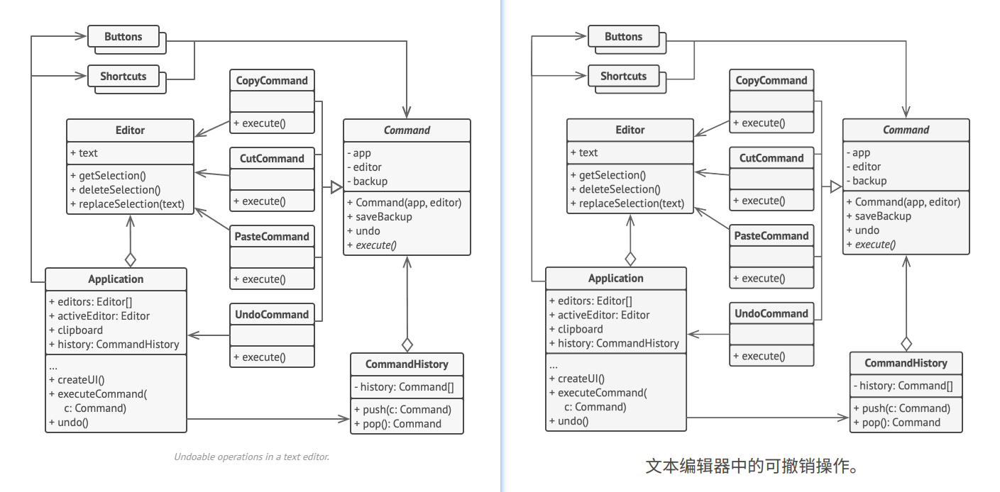

## Command
**Also known as:** Action, Transaction


### :snowflake: Intent
**Command** is a behavioral design pattern that turns a request into a stand-alone object that contains all information 
about the request. This transformation lets you pass requests as a method arguments, delay or queue a request's 
execution, and support undoable operations.  
译:


### :worried: Problem
Imagine that you're working on a new text-editor app. Your current task is to create a toolbar with a bunch of buttons 
for various operations of the editor. You created a very neat `Button` class that can be used for buttons on the 
toolbar, as well as for generic buttons in various dialogs.  
译:



While all of these buttons look similar, they're all supposed to do different things. Where would you put the code for 
the various click handlers of these buttons? The simplest solution is to create tons of subclasses for each place where 
the button is used. These subclasses would contain the code that would have to be executed on a button click.  
译:



Before long, you realize that this approach is deeply flawed. First, you have an enormous number of subclasses, and 
that would be okay if you weren't risking breaking the code in these subclasses each time you modify the base `Button` 
class. Put simply, your GUI code has become awkwardly dependent on the volatile code of the business logic.  
译:



And here's the ugliest part. Some operations, such as copying/pasting text, would need to be invoked from multiple 
places. For example, a user could click a small "Copy" button on the toolbar, or copy something via the context menu, 
or just hit `Ctrl+C` on the keyboard.  
译:

Initially, when our app only had the toolbar, it was okay to place the implementation of various operations into the 
button subclasses. In other words, having the code for copying text inside the `CopyButton` subclass was fine. 
But then, when you implement context menus, shortcuts, and other stuff, you have to either duplicate the operation's 
code in many classes or make menus dependent on buttons, which is an even worse option.  
译:


### :smile: Solution
Good software design is often based on the *principle of separation of concerns*, which usually results in breaking an 
app into layers. The most common example: a layer for the graphical user interface and another layer for the business 
logic. The GUI layer is responsible for rendering a beautiful picture on the screen, capturing any input and showing 
results of what the user and the app are doing. However, when it comes to doing something important, like calculating 
the trajectory of the moon or composing an annual report, the GUI layer delegates the work to the underlying layer of 
business logic.  
译:

In the code it might look like this: a GUI object calls a method of a business logic object, passing it some arguments. 
This process is usually described as one object sending another a *request*.  
译:



The Command pattern suggests that GUI objects shouldn't send these requests directly. Instead, you should extract all 
the request details, such as the object being called, the name of the method and the list of arguments into a separate 
*command* class with a single method that triggers this request.  
译:

Command objects serve as links between various GUI and business logic objects. From now on, the GUI object doesn't 
need to know what business logic object will receive the request and how it'll be processed. The GUI object just 
triggers the command, which handles all the details.  
译:



The next step is to make your commands implement the same interface. Usually it has just a single execution method 
that takes no parameters. This interface lets you use various commands with the same request sender, without coupling 
it to concrete classes of commands. As a bonus, now you can switch command objects linked to the sender, effectively 
changing the sender's behavior at runtime.  
译:

You might have noticed one missing piece of the puzzle, which is the request parameters. A GUI object might have 
supplied the business-layer object with some parameters. Since the command execution method doesn't have any 
parameters, how would we pass the request details to the receiver? It turns out the command should be either 
pre-configured with this data, or capable of getting it on its own.  
译:



Let's get back to our text editor. After we apply the Command pattern, we no longer need all those button subclasses 
to implement various click behaviors. It's enough to put a single field into the base `Button` class that stores a 
reference to a command object and make the button execute that command on a click.  
译:

You'll implement a bunch of command classes for every possible operation and link them with particular buttons, 
depending on the buttons' intended behavior.  
译:

Other GUI elements, such as menus, shortcuts or entire dialogs, can be implemented in the same way. They'll be linked 
to a command which gets executed when a user interacts with the GUI element. As you've probably guessed by now, the 
elements related to the same operations will be linked to the same commands, preventing any code duplication.  
译:

As a result, commands become a convenient middle layer that reduces coupling between the GUI and business logic layers. 
And that's only a fraction of the benefits that the Command pattern can offer!  
译:


### :car: Real-World Analogy


After a long walk through the city, you get to a nice restaurant and sit at the table by the window. A friendly waiter 
approaches you and quickly takes your order, writing it down on a piece of paper. The waiter goes to the kitchen and 
sticks the order on the wall. After a while, the order gets to the chef, who reads it and cooks the meal accordingly. 
The cook places the meal on a tray along with the order. The waiter discovers the tray, checks the order to make sure 
everything is as you wanted it, and brings everything to your table.  
译:

The paper order serves as a command. It remains in a queue until the chef is ready to serve it. The order contains all 
the relevant information required to cook the meal. It allows the chef to start cooking right away instead of running 
around clarifying the order details from you directly.  
译:


### :lollipop: Structure


1. The **Sender** class (aka *invoker*) is responsible for initiating requests. This class must have a field for 
   storing a reference to a command object. The sender triggers that command instead of sending the request directly 
   to the receiver. Note that the sender isn't responsible for creating the command object. Usually, it gets a 
   pre-created command from the client via the constructor.
2. The **Command** interface usually declares just a single method for executing the command.
3. **Concrete Commands** implement various kinds of requests. A concrete command isn't supposed to perform the work on 
   its own, but rather to pass the call to one of the business logic objects. However, for the sake of simplifying the 
   code, these classes can be merged.

   Parameters required to execute a method on a receiving object can be declared as fields in the concrete command. 
   You can make command objects immutable by only allowing the initialization of these fields via the constructor.

4. The **Receiver** class contains some business logic. Almost any object may act as a receiver. Most commands only 
   handle the details of how a request is passed to the receiver, while the receiver itself does the actual work.
5. The **Client** creates and configures concrete command objects. The client must pass all the request parameters, 
   including a receiver instance, into the command's constructor. After that, the resulting command may be associated 
   with one or multiple senders.


### :hash: Pseudocode
In this example, the **Command** pattern helps to track the history of executed operations and makes it possible to 
revert an operation if needed.  
译:



Commands which result in changing the state of the editor (e.g., cutting and pasting) make a backup copy of the 
editor's state before executing an operation associated with the command. After a command is executed, it's placed 
into the command history (a stack of command objects) along with the backup copy of the editor's state at that point. 
Later, if the user needs to revert an operation, the app can take the most recent command from the history, read the 
associated backup of the editor's state, and restore it.  
译:

The client code (GUI elements, command history, etc.) isn't coupled to concrete command classes because it works with 
commands via the command interface. This approach lets you introduce new commands into the app without breaking any 
existing code.  
译:

```c++
  1 // The base command class defines the common interface for all
  2 // concrete commands.
  3 abstract class Command is
  4     protected field app: Application
  5     protected field editor: Editor
  6     protected field backup: text
  7 
  8     constructor Command(app: Application, editor: Editor) is
  9         this.app = app
 10         this.editor = editor
 11     
 12     // Make a backup of the editor's state.
 13     method saveBackup() is
 14         backup = editor.text
 15
 16     // Restore the editor's state.
 17     method undo() is
 18         editor.text = backup
 19
 20     // The execution method is declared abstract to force all
 21     // concrete commands to provide their own implementations.
 22     // The method must return true or false depending on whether
 23     // the command changes the editor's state.
 24     abstract method execute()
 25 
 26 
 27 // The concrete commands go here.
 28 class CopyCommand extends Command is
 29     // The copy command isn't saved to the history since it
 30     // doesn't change the editor's state.
 31     method execute() is
 32         app.clipboard = editor.getSelection()
 33         return false
 34 
 35 class CutCommand extends Command is
 36     // The cut command does change the editor's state, therefore
 37     // it must be saved to the history. And it'll be saved as
 38     // long as the method returns true.
 39     method execute() is
 40         saveBackup()
 41         app.clipboard = editor.getSelection()
 42         editor.deleteSelection()
 43         return true
 44 
 45 class PasteCommand extends Command is
 46     method execute() is
 47         saveBackup()
 48         editor.replaceSelection(app.clipboard)
 49         return true
 50  
 51 // The undo operation is also a command.
 52 class UndoCommand extends Command is
 53     method execute() is
 54         app.undo()
 55         return false
 56 
 57 
 58 // The global command history is just a stack.
 59 class CommandHistory is
 60     private field history: array of Command
 61 
 62     // Last in...
 63     method push(c: Command) is
 64         // Push the command to the end of the history array.
 65 
 66     // ...first out
 67     method pop():Command is
 68         // Get the most recent command from the history.
 69
 70 
 71 // The editor class has actual text editing operations. It plays
 72 // the role of a receiver: all commands end up delegating
 73 // execution to the editor's methods.
 74 class Editor is
 75     field text: string
 76 
 77     method getSelection() is
 78         // Return selected text.
 79 
 80     method deleteSelection() is
 81         // Delete selected text.
 82 
 83     method replaceSelection(text) is
 84         // Insert the clipboard's contents at the current
 85         // position.
 86 
 87 
 88 // The application class sets up object relations. It acts as a
 89 // sender: when something needs to be done, it creates a command
 90 // object and executes it.
 91 class Application is
 92     field clipboard: string
 93     field editors: array of Editors
 94     field activeEditor: Editor
 95     field history: CommandHistory
 96 
 97     // The code which assigns commands to UI objects may look
 98     // like this.
 99     method createUI() is
100         // ...
101         copy = function() { executeCommand(
102             new CopyCommand(this, activeEditor)) }
103         copyButton.setCommand(copy)
104         shortcuts.onKeyPress("Ctrl+C", copy)
105 
106         cut = function() { executeCommand(
107             new CutCommand(this, activeEditor)) }
108         cutButton.setCommand(cut)
109         shortcuts.onKeyPress("Ctrl+X", cut)
110 
111         paste = function() { executeCommand(
112             new PasteCommand(this, activeEditor)) }
113         pasteButton.setCommand(paste)
114         shortcuts.onKeyPress("Ctrl+V", paste)
115 
116         undo = function() { executeCommand(
117             new UndoCommand(this, activeEditor)) }
118         undoButton.setCommand(undo)
119         shortcuts.onKeyPress("Ctrl+Z", undo)
120 
121     // Execute a command and check whether it has to be added to
122     // the history.
123     method executeCommand(command) is
124         if (command.execute)
125             history.push(command)
126 
127     // Take the most recent command from the history and run its
128     // undo method. Note that we don't know the class of that
129     // command. But we don't have to, since the command knows
130     // how to undo its own action.
131     method undo() is
132         command = history.pop()
133         if (command != null)
134             command.undo()
```


### :apple: Applicability
> :bug: **Use the Command pattern when you want to parametrize objects with operations.**
> 
> :zap: The Command pattern can turn a specific method call into a stand-alone object. This change opens up a lot of 
> interesting uses: you can pass commands as method arguments, store them inside other objects, switch linked commands 
> at runtime, etc.
> 
> Here's an example: you're developing a GUI component such as a context menu, and you want your users to be able to 
> configure menu items that trigger operations when an end user clicks an item.

> :bug: **Use the Command pattern when you want to queue operations, schedule their execution, or execute them remotely.**
> 
> :zap: As with any other object, a command can be serialized, which means converting it to a string that can be 
> easily written to a file or a database. Later, the string can be restored as the initial command object. Thus, you 
> can delay and schedule command execution. But there's even more! In the same way, you can queue, log or send 
> commands over the network.

> :bug: **Use the Command pattern when you want to implement reversible operations.**
> 
> :zap: Although there are many ways to implement undo/redo, the Command pattern is perhaps the most popular of all.
> 
> To be able to revert operations, you need to implement the history of performed operations. The command history is 
> a stack that contains all executed command objects along with related backups of the application's state.
> 
> This method has two drawbacks. First, it isn't that easy to save an application's state because some of it can be 
> private. This problem can be mitigated with the [**Memento**][Memento] pattern.
> 
> Second, the state backups may consume quite a lot of RAM. Therefore, sometimes you can resort to an alternative 
> implementation: instead of restoring the past state, the command performs the inverse operation. The reverse 
> operation also has a price: it may turn out to be hard or even impossible to implement.


### :book: How to Implement
1. Declare the command interface with a single execution method.
2. Start extracting requests into concrete command classes that implement the command interface. Each class must have 
   a set of fields for storing the request arguments along with a reference to the actual receiver object. All these 
   values must be initialized via the command's constructor.
3. Identify classes that will act as *senders*. Add the fields for storing commands into these classes. Senders should 
   communicate with their commands only via the command interface. Senders usually don't create command objects on 
   their own, but rather get them from the client code.
4. Change the senders so they execute the command instead of sending a request to the receiver directly.
5. The client should initialize objects in the following order:
   - Create receivers.
   - Create commands, and associate them with receivers if needed.
   - Create senders, and associate them with specific commands.


### :notes: Pros and Cons
:heavy_check_mark: *Single Responsibility Principle*. You can decouple classes that invoke operations from classes 
that perform these operations.

:heavy_check_mark: *Open/Closed Principle*. You can introduce new commands into the app without breaking existing client code.

:heavy_check_mark: You can implement undo/redo.

:heavy_check_mark: You can implement deferred execution of operations.

:heavy_check_mark: You can assemble a set of simple commands into a complex one.

:x: The code may become more complicated since you're introducing a whole new layer between senders and receivers.


### :repeat: Relations with Other Patterns
- [**Chain of Responsibility**][Chain of Responsibility], [**Command**][Command], [**Mediator**][Mediator] and 
  [**Observer**][Observer] address various ways of connecting senders and receivers of requests:
  - *Chain of Responsibility* passes a request sequentially along a dynamic chain of potential receivers until one of 
    them handles it.
  - *Command* establishes unidirectional connections between senders and receivers.
  - *Mediator* eliminates direct connections between senders and receivers, forcing them to communicate indirectly via 
    a mediator object.
  - *Observer* lets receivers dynamically subscribe to and unsubscribe from receiving requests.

- Handlers in [**Chain of Responsibility**][Chain of Responsibility] can be implemented as [**Commands**][Command]. 
  In this case, you can execute a lot of different operations over the same context object, represented by a request.

  However, there's another approach, where the request itself is a *Command* object. In this case, you can execute the 
  same operation in a series of different contexts linked into a chain.
  
- You can use [**Command**][Command] and [**Memento**][Memento] together when implementing "undo". In this case, 
  commands are responsible for performing various operations over a target object, while mementos save the state of 
  that object just before a command gets executed.
- [**Command**][Command] and [**Strategy**][Strategy] may look similar because you can use both to parameterize an 
  object with some action. However, they have very different intents.
  - You can use *Command* to convert any operation into an object. The operation's parameters become fields of that 
    object. The conversion lets you defer execution of the operation, queue it, store the history of commands, send 
    commands to remote services, etc.
  - On the other hand, *Strategy* usually describes different ways of doing the same thing, letting you swap these 
    algorithms within a single context class.

- [**Prototype**][Prototype] can help when you need to save copies of [**Commands**][Command] into history.
- You can treat [**Visitor**][Visitor] as a powerful version of the [**Command**][Command] pattern. Its objects can 
  execute operations over various objects of different classes.


[Prototype]:../../1_creational_design_patterns/4_prototype/

[Chain of Responsibility]:../1_chain_of_responsibility/

[Command]:../2_command/

[Mediator]:../4_mediator/

[Memento]:../5_memento/

[Observer]:../6_observer/

[Strategy]:../8_strategy/

[Visitor]:../10_visitor/

