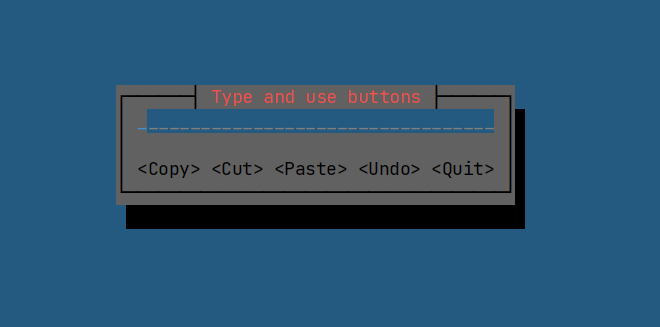

# Command
**Command** is a behavioral design pattern that converts requests or simple operations into objects.

The conversion allows deferred or remote execution of commands, storing command history, etc.

In 🦀 Rust, a command instance should *NOT hold a permanent reference to global context*, instead the latter should be 
passed *from top to down as a mutable parameter* of the "`execute`" method:

```rust
fn execute(&mut self, app: &mut cursive::Cursive) -> bool;
```


## Text Editor: Commands and Undo
Key points:
- Each button runs a separate command.
- Because a command is represented as an object, it can be pushed into a `history` array in order to be undone later.
- TUI is created with `cursive` crate.

### How to launch:

```bash
cargo run --example command
```

### Output



## Reference
[Command in Rust](https://refactoring.guru/design-patterns/command/rust/example)
