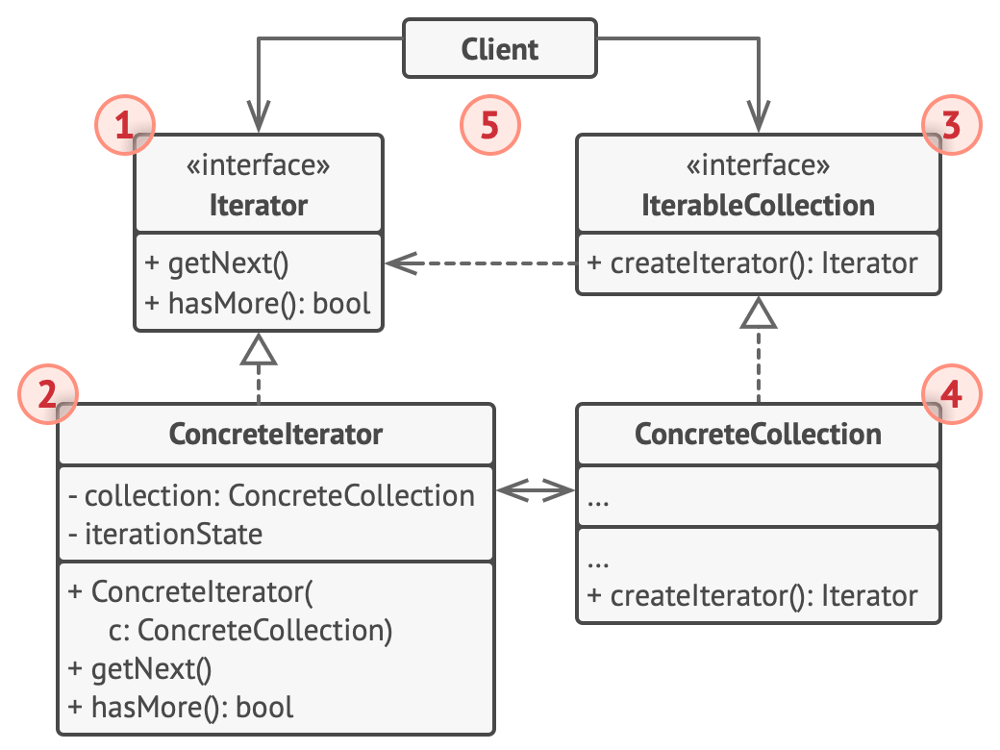

## Iterator

### :snowflake: Intent
**Iterator** is a behavioral design pattern that lets you traverse elements of a collection without exposing its 
underlying representation (list, stack, tree, etc.).  
译:


### :worried: Problem
Collections are one of the most used data types in programming. Nonetheless, a collection is just a container for a 
group of objects.  
译:


Most collections store their elements in simple lists. However, some of them are based on stacks, trees, graphs and 
other complex data structures.  
译:

But no matter how a collection is structured, it must provide some way of accessing its elements so that other code can 
use these elements. There should be a way to go through each element of the collection without accessing the same 
elements over and over.  
译:

This may sound like an easy job if you have a collection based on a list. You just loop over all the elements. But 
how do you sequentially traverse elements of a complex data structure, such as a tree? For example, one day you might 
be just fine with depth-first traversal of a tree. Yet the next day you might require breadth-first traversal. And the 
next week, you might need something else, like random access to the tree elements.  
译:


Adding more and more traversal algorithms to the collection gradually blurs its primary responsibility, which is 
efficient data storage. Additionally, some algorithms might be tailored for a specific application, so including them 
in a generic collection class would be weird.  
译:

On the other hand, the client code that's supposed to work with various collections may not even care how they store 
their elements. However, since collections all provide different ways of accessing their elements, you have no option 
other than to couple your code to the specific collection classes.  
译:


### :smile: Solution
The main idea of the Iterator pattern is to extract the traversal behavior of a collection into a separate object 
called an *iterator*.  
译:


In addition to implementing the algorithm itself, an iterator object encapsulates all the traversal details, such as 
the current position and how many elements are left till the end. Because of this, several iterators can go through the 
same collection at the same time, independently of each other.  
译:

Usually, iterators provide one primary method for fetching elements of the collection. The client can keep running this 
method until it doesn't return anything, which means that the iterator has traversed all the elements.  
译:

All iterators must implement the same interface. This makes the client code compatible with any collection type or any 
traversal algorithm as long as there's a proper iterator. If you need a special way to traverse a collection, you just 
create a new iterator class, without having to change the collection or the client.  
译:


### :car: Real-World Analogy


You plan to visit Rome for a few days and visit all of its main sights and attractions. But once there, you could waste 
a lot of time walking in circles, unable to find even the Colosseum.  
译:

On the other hand, you could buy a virtual guide app for your smartphone and use it for navigation. It's smart and 
inexpensive, and you could be staying at some interesting places for as long as you want.  
译:

A third alternative is that you could spend some of the trip's budget and hire a local guide who knows the city like 
the back of his hand. The guide would be able to tailor the tour to your liking, show you every attraction and tell a 
lot of exciting stories. That'll be even more fun; but, alas, more expensive, too.  
译:

All of these options—the random directions born in your head, the smartphone navigator or the human guide—act as 
iterators over the vast collection of sights and attractions located in Rome.  
译:


### :lollipop: Structure


1. The **Iterator** interface declares the operations required for traversing a collection: fetching the next element, 
   retrieving the current position, restarting iteration, etc.
2. **Concrete Iterators** implement specific algorithms for traversing a collection. The iterator object should track 
   the traversal progress on its own. This allows several iterators to traverse the same collection independently of 
   each other.
3. The **Collection** interface declares one or multiple methods for getting iterators compatible with the collection. 
   Note that the return type of the methods must be declared as the iterator interface so that the concrete collections 
   can return various kinds of iterators.
4. **Concrete Collections** return new instances of a particular concrete iterator class each time the client requests 
   one. You might be wondering, where's the rest of the collection's code? Don't worry, it should be in the same class. 
   It's just that these details aren't crucial to the actual pattern, so we're omitting them.
5. The **Client** works with both collections and iterators via their interfaces. This way the client isn't coupled to 
   concrete classes, allowing you to use various collections and iterators with the same client code.  

   Typically, clients don't create iterators on their own, but instead get them from collections. Yet in certain cases, 
   the client can create one directly; for example, when the client defines its own special iterator.


### :hash: Pseudocode
In this example, the **Iterator** pattern is used to walk through a special kind of collection which encapsulates 
access to Facebook's social graph. The collection provides several iterators that can traverse profiles in various ways.  
译:


The 'friends' iterator can be used to go over the friends of a given profile. The 'colleagues' iterator does the same, 
except it omits friends who don't work at the same company as a target person. Both iterators implement a common 
interface which allows clients to fetch profiles without diving into implementation details such as authentication and 
sending REST requests.  
译:

The client code isn't coupled to concrete classes because it works with collections and iterators only through 
interfaces. If you decide to connect your app to a new social network, you simply need to provide new collection and 
iterator classes without changing the existing code.  
译:

```c++
 1 // The collection interface must declare a factory method for
 2 // producing iterators. You can declare several methods if there
 3 // are different kinds of iteration available in your program.
 4 interface SocialNetwork is
 5     method createFriendsIterator(profileId):ProfileIterator
 6     method createCoworkersIterator(profileId):ProfileIterator
 7 
 8 
 9 // Each concrete collection is coupled to a set of concrete
10 // iterator classes it returns. But the client isn't, since the
11 // signature of these methods returns iterator interfaces.
12 class Facebook implements SocialNetwork is
13     // ... The bulk of the collection's code should go here ...
14 
15     // Iterator creation code.
16     method createFriendsIterator(profileId) is
17         return new FacebookIterator(this, profileId, "friends")
18     method createCoworkersIterator(profileId) is
19         return new FacebookIterator(this, profileId, "coworkers")
20 
21 
22 // The common interface for all iterators.
23 interface ProfileIterator is
24     method getNext():Profile
25     method hasMore():bool
26 
27 
28 // The concrete iterator class.
29 class FacebookIterator implements ProfileIterator is
30     // The iterator needs a reference to the collection that it
31     // traverses.
32     private field facebook: Facebook
33     private field profileId, type: string
34 
35     // An iterator object traverses the collection independently
36     // from other iterators. Therefore, it has to store the
37     // iteration state.
38     private field currentPosition
39     private field cache: array of Profile
40 
41     constructor FacebookIterator(facebook, profileId, type) is
42         this.facebook = facebook
43         this.profileId = profileId
44         this.type = type
45 
46     private method lazyInit() is
47         if (cache == null)
48             cache = facebook.socialGraphRequest(profileId, type)
49 
50     // Each concrete iterator class has its own implementation
51     // of the common iterator interface.
52     method getNext() is
53         if (hasMore())
54             currentPosition++
55             return cache[currentPosition]
56 
57     method hasMore() is
58         lazyInit()
59         return currentPosition < cache.length
60 
61 
62 // Here is another useful trick: you can pass an iterator to a
63 // client class instead of giving it access to a whole
64 // collection. This way, you don't expose the collection to the
65 // client.
66 //
67 // And there's another benefit: you can change the way the
68 // client works with the collection at runtime by passing it a
69 // different iterator. This is possible because the client code
70 // isn't coupled to concrete iterator classes.
71 class SocialSpammer is
72     method send(iterator: ProfileIterator, message: string) is
73         while (iterator.hasMore())
74             profile = iterator.getNext()
75             System.sendEmail(profile.getEmail(), message)
76 
77 
78 // The application class configures collections and iterators
79 // and then passes them to the client code.
80 class Application is
81     field network: SocialNetwork
82     field spammer: SocialSpammer
83 
84     method config() is
85         if working with Facebook
86             this.network = new Facebook()
87         if working with LinkedIn
88             this.network = new LinkedIn()
89         this.spammer = new SocialSpammer()
90 
91     method sendSpamToFriends(profile) is
92         iterator = network.createFriendsIterator(profile.getId())
93         spammer.send(iterator, "Very important message")
94 
95     method sendSpamToCoworkers(profile) is
96         iterator = network.createCoworkersIterator(profile.getId())
97         spammer.send(iterator, "Very important message")
```


### :apple: Applicability
> :bug: **Use the Iterator pattern when your collection has a complex data structure under the hood, but you want to 
> hide its complexity from clients (either for convenience or security reasons).**
> 
> :zap: The iterator encapsulates the details of working with a complex data structure, providing the client with 
> several simple methods of accessing the collection elements. While this approach is very convenient for the client, 
> it also protects the collection from careless or malicious actions which the client would be able to perform if 
> working with the collection directly.

> :bug: **Use the pattern to reduce duplication of the traversal code across your app.**
> 
> :zap: The code of non-trivial iteration algorithms tends to be very bulky. When placed within the business logic of 
> an app, it may blur the responsibility of the original code and make it less maintainable. Moving the traversal code 
> to designated iterators can help you make the code of the application more lean and clean.

> :bug: **Use the Iterator when you want your code to be able to traverse different data structures or when the types 
> of these structures are unknown beforehand.**
> 
> :zap: The pattern provides a couple of generic interfaces for both collections and iterators. Given that your code 
> now uses these interfaces, it'll still work if you pass it various kinds of collections and iterators that implement 
> these interfaces.


### :book: How to Implement
1. Declare the iterator interface. At the very least, it must have a method for fetching the next element from a 
   collection. But for the sake of convenience, you can add a couple of other methods, such as fetching the previous 
   element, tracking the current position, and checking the end of the iteration.
2. Declare the collection interface and describe a method for fetching iterators. The return type should be equal to 
   that of the iterator interface. You may declare similar methods if you plan to have several distinct groups of iterators.
3. Implement concrete iterator classes for the collections that you want to be traversable with iterators. An iterator 
   object must be linked with a single collection instance. Usually, this link is established via the iterator's 
   constructor.
4. Implement the collection interface in your collection classes. The main idea is to provide the client with a shortcut 
   for creating iterators, tailored for a particular collection class. The collection object must pass itself to the 
   iterator's constructor to establish a link between them.
5. Go over the client code to replace all the collection traversal code with the use of iterators. The client fetches a 
   new iterator object each time it needs to iterate over the collection elements.


### :notes: Pros and Cons
:heavy_check_mark: *Single Responsibility Principle*. You can clean up the client code and the collections by extracting 
bulky traversal algorithms into separate classes.

:heavy_check_mark: *Open/Closed Principle*. You can implement new types of collections and iterators and pass them to 
existing code without breaking anything.

:heavy_check_mark: You can iterate over the same collection in parallel because each iterator object contains its own 
iteration state.

:heavy_check_mark: For the same reason, you can delay an iteration and continue it when needed.

:x: Applying the pattern can be an overkill if your app only works with simple collections.

:x: Using an iterator may be less efficient than going through elements of some specialized collections directly.


### :repeat: Relations with Other Patterns
- You can use [**Iterators**][Iterator] to traverse [**Composite**][Composite] trees.
- You can use [**Factory Method**][Factory Method] along with [**Iterator**][Iterator] to let collection subclasses 
  return different types of iterators that are compatible with the collections.
- You can use [**Memento**][Memento] along with [**Iterator**][Iterator] to capture the current iteration state and 
  roll it back if necessary.
- You can use [**Visitor**][Visitor] along with [**Iterator**][Iterator] to traverse a complex data structure and 
  execute some operation over its elements, even if they all have different classes.


[Factory Method]:../../1_creational_design_patterns/1_factory_method/

[Composite]:../../2_structural_design_patterns/3_composite/

[Iterator]:../3_iterator/

[Memento]:../5_memento/

[Visitor]:../10_visitor/


