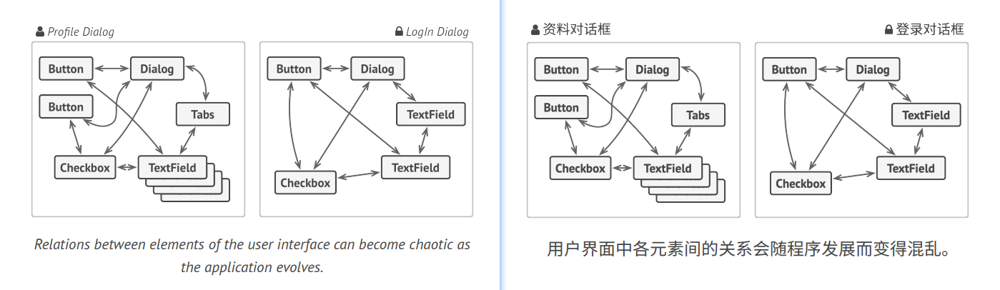
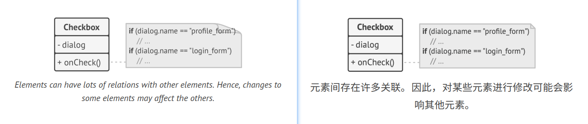
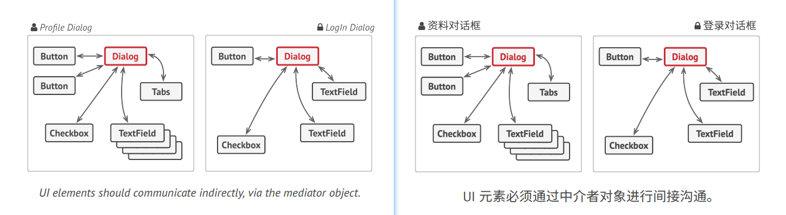
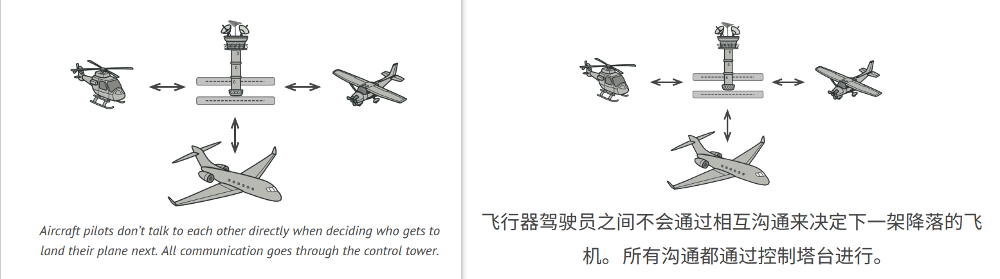
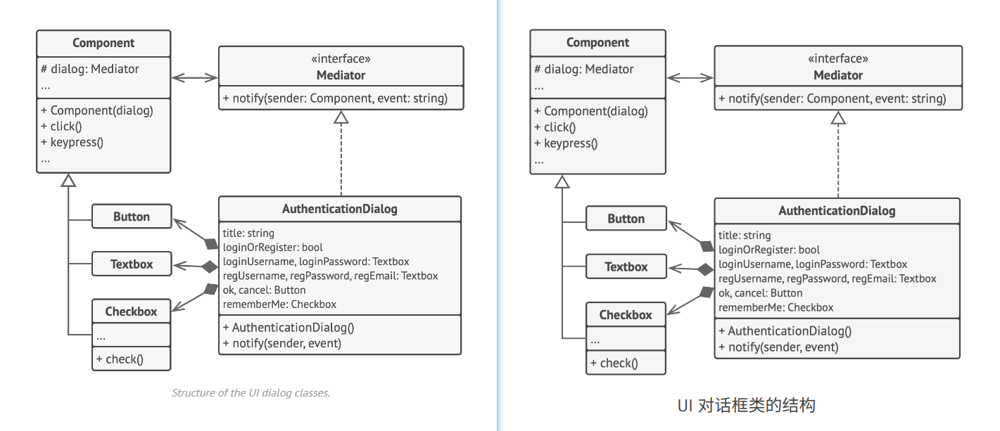

## Mediator
**Also known as:** Intermediary, Controller


### :snowflake: Intent
**Mediator** is a behavioral design pattern that lets you reduce chaotic dependencies between objects. The pattern 
restricts direct communications between the objects and forces them to collaborate only via a mediator object.  
译:


### :worried: Problem
Say you have a dialog for creating and editing customer profiles. It consists of various form controls such as text 
fields, checkboxes, buttons, etc.  
译:



Some of the form elements may interact with others. For instance, selecting the "I have a dog" checkbox may reveal a 
hidden text field for entering the dog's name. Another example is the submit button that has to validate values of all 
fields before saving the data.  
译:



By having this logic implemented directly inside the code of the form elements, you make these elements' classes much 
harder to reuse in other forms of the app. For example, you won't be able to use that checkbox class inside another 
form, because it's coupled to the dog's text field. You can use either all the classes involved in rendering the 
profile form, or none at all.  
译:


### :smile: Solution
The Mediator pattern suggests that you should cease all direct communication between the components which you want to 
make independent of each other. Instead, these components must collaborate indirectly, by calling a special mediator 
object that redirects the calls to appropriate components. As a result, the components depend only on a single mediator 
class instead of being coupled to dozens of their colleagues.  
译:

In our example with the profile editing form, the dialog class itself may act as the mediator. Most likely, the dialog 
class is already aware of all of its sub-elements, so you won't even need to introduce new dependencies into this class.  
译:



The most significant change happens to the actual form elements. Let's consider the submit button. Previously, each 
time a user clicked the button, it had to validate the values of all individual form elements. Now its single job is 
to notify the dialog about the click. Upon receiving this notification, the dialog itself performs the validations or 
passes the task to the individual elements. Thus, instead of being tied to a dozen form elements, the button is only 
dependent on the dialog class.  
译:

You can go further and make the dependency even looser by extracting the common interface for all types of dialogs. 
The interface would declare the notification method which all forms elements can use to notify the dialog about events 
happening to those elements. Thus, our submit button should now be able to work with any dialog that implements that 
interface.  
译:

This way, the Mediator pattern lets you encapsulate a complex web of relations between various objects inside a single 
mediator object. The fewer dependencies a class has, the easier it becomes to modify, extend or reuse that class.  
译:


### :car: Real-World Analogy


Pilots of aircraft that approach or depart the airport control area don't communicate directly with each other. 
Instead, they speak to an air traffic controller, who sits in a tall tower somewhere near the airstrip. Without the air 
traffic controller, pilots would need to be aware of every plane in the vicinity of the airport, discussing landing 
priorities with a committee of dozens of other pilots. That would probably skyrocket the airplane crash statistics.  
译:

The tower doesn't need to control the whole flight. It exists only to enforce constraints in the terminal area because 
the number of involved actors there might be overwhelming for a pilot.  
译:


### :lollipop: Structure


1. **Components** are various classes that contain some business logic. Each component has a reference to a mediator, 
   declared with the type of the mediator interface. The component isn't aware of the actual class of the mediator, so 
   you can reuse the component in other programs by linking it to a different mediator.
2. The **Mediator** interface declares methods of communication with components, which usually include just a single 
   notification method. Components may pass any context as arguments of this method, including their own objects, but 
   only in such a way that no coupling occurs between a receiving component and the sender's class.
3. **Concrete Mediators** encapsulate relations between various components. Concrete mediators often keep references to 
   all components they manage and sometimes even manage their lifecycle.
4. Components must not be aware of other components. If something important happens within or to a component, it must 
   only notify the mediator. When the mediator receives the notification, it can easily identify the sender, which 
   might be just enough to decide what component should be triggered in return.

   From a component's perspective, it all looks like a total black box. The sender doesn't know who'll end up handling 
   its request, and the receiver doesn't know who sent the request in the first place.


### :hash: Pseudocode
In this example, the **Mediator** pattern helps you eliminate mutual dependencies between various UI classes: buttons, 
 checkboxes, and text labels.  
译:



An element, triggered by a user, doesn't communicate with other elements directly, even if it looks like it's supposed 
to. Instead, the element only needs to let its mediator know about the event, passing any contextual info along with 
that notification.  
译:

In this example, the whole authentication dialog acts as the mediator. It knows how concrete elements are supposed to 
collaborate and facilitate their indirect communication. Upon receiving a notification about an event, the dialog 
decides what element should address the event and redirects the call accordingly.  
译:

```c++
 1 // The mediator interface declares a method used by components
 2 // to notify the mediator about various events. The mediator may
 3 // react to these events and pass the execution to other
 4 // components.
 5 interface Mediator is
 6     method notify(sender: Component, event: string)
 7 
 8 
 9 // The concrete mediator class. The intertwined web of
10 // connections between individual components has been untangled
11 // and moved into the mediator.
12 class AuthenticationDialog implements Mediator is
13     private field title: string
14     private field loginOrRegisterChkBx: Checkbox
15     private field loginUsername, loginPassword: Textbox
16     private field registrationUsername, registrationPassword,
17                   registrationEmail: Textbox
18     private field okBtn, cancelBtn: Button
19 
20     constructor AuthenticationDialog() is
21         // Create all component objects by passing the current
22         // mediator into their constructors to establish links.
23 
24     // When something happens with a component, it notifies the
25     // mediator. Upon receiving a notification, the mediator may
26     // do something on its own or pass the request to another
27     // component.
28     method notify(sender, event) is
29         if (sender == loginOrRegisterChkBx and event == "check")
30             if (loginOrRegisterChkBx.checked)
31                 title = "Log in"
32                 // 1. Show login form components.
33                 // 2. Hide registration form components.
34             else
35                 title = "Register"
36                 // 1. Show registration form components.
37                 // 2. Hide login form components
38 
39         if (sender == okBtn && event == "click")
40             if (loginOrRegister.checked)
41                 // Try to find a user using login credentials.
42                 if (!found)
43                     // Show an error message above the login
44                     // field.
45             else
46                 // 1. Create a user account using data from the
47                 // registration fields.
48                 // 2. Log that user in.
49                 // ...
50 
51 
52 // Components communicate with a mediator using the mediator
53 // interface. Thanks to that, you can use the same components in
54 // other contexts by linking them with different mediator
55 // objects.
56 class Component is
57     field dialog: Mediator
58 
59     constructor Component(dialog) is
60         this.dialog = dialog
61 
62     method click() is
63         dialog.notify(this, "click")
64 
65     method keypress() is
66         dialog.notify(this, "keypress")
67 
68 // Concrete components don't talk to each other. They have only
69 // one communication channel, which is sending notifications to
70 // the mediator.
71 class Button extends Component is
72     // ...
73 
74 class Textbox extends Component is
75     // ...
76 
77 class Checkbox extends Component is
78     method check() is
79         dialog.notify(this, "check")
80    // ...
```


### :apple: Applicability
> :bug: **Use the Mediator pattern when it's hard to change some of the classes because they are tightly coupled to a 
> bunch of other classes.**
> 
> :zap: The pattern lets you extract all the relationships between classes into a separate class, isolating any changes 
> to a specific component from the rest of the components.

> :bug: **Use the pattern when you can't reuse a component in a different program because it's too dependent on other 
> components.**
> 
> :zap: After you apply the Mediator, individual components become unaware of the other components. They could still 
> communicate with each other, albeit indirectly, through a mediator object. To reuse a component in a different app, 
> you need to provide it with a new mediator class.

> :bug: **Use the Mediator when you find yourself creating tons of component subclasses just to reuse some basic 
> behavior in various contexts.**
> 
> :zap: Since all relations between components are contained within the mediator, it's easy to define entirely new ways 
> for these components to collaborate by introducing new mediator classes, without having to change the components 
> themselves.


### :book: How to Implement
1. Identify a group of tightly coupled classes which would benefit from being more independent (e.g., for easier 
   maintenance or simpler reuse of these classes).
2. Declare the mediator interface and describe the desired communication protocol between mediators and various 
   components. In most cases, a single method for receiving notifications from components is sufficient.

   This interface is crucial when you want to reuse component classes in different contexts. As long as the component 
   works with its mediator via the generic interface, you can link the component with a different implementation of the 
   mediator.

3. Implement the concrete mediator class. Consider storing references to all components inside the mediator. This way, 
   you could call any component from the mediator's methods.
4. You can go even further and make the mediator responsible for the creation and destruction of component objects. 
   After this, the mediator may resemble a [**factory**][Abstract Factory] or a [**facade**][Facade].
5. Components should store a reference to the mediator object. The connection is usually established in the component's 
   constructor, where a mediator object is passed as an argument.
6. Change the components' code so that they call the mediator's notification method instead of methods on other 
   components. Extract the code that involves calling other components into the mediator class. Execute this code 
   whenever the mediator receives notifications from that component.


### :notes: Pros and Cons
:heavy_check_mark: *Single Responsibility Principle*. You can extract the communications between various components 
into a single place, making it easier to comprehend and maintain.

:heavy_check_mark: *Open/Closed Principle*. You can introduce new mediators without having to change the actual components.

:heavy_check_mark: You can reduce coupling between various components of a program.

:heavy_check_mark: You can reuse individual components more easily.

:x: Over time a mediator can evolve into a God Object.


### :repeat: Relations with Other Patterns
- [**Chain of Responsibility**][Chain of Responsibility], [**Command**][Command], [**Mediator**][Mediator] and [**Observer**][Observer] 
  address various ways of connecting senders and receivers of requests:
  - *Chain of Responsibility* passes a request sequentially along a dynamic chain of potential receivers until one of 
    them handles it.
  - *Command* establishes unidirectional connections between senders and receivers.
  - *Mediator* eliminates direct connections between senders and receivers, forcing them to communicate indirectly via 
    a mediator object.
  - *Observer* lets receivers dynamically subscribe to and unsubscribe from receiving requests.

- [**Facade**][Facade] and [**Mediator**][Mediator] have similar jobs: they try to organize collaboration between lots 
  of tightly coupled classes.
  - *Facade* defines a simplified interface to a subsystem of objects, but it doesn't introduce any new functionality. 
    The subsystem itself is unaware of the facade. Objects within the subsystem can communicate directly.
  - *Mediator* centralizes communication between components of the system. The components only know about the mediator 
    object and don't communicate directly.

- The difference between [**Mediator**][Mediator] and [**Observer**][Observer] is often elusive. In most cases, you can 
  implement either of these patterns; but sometimes you can apply both simultaneously. Let's see how we can do that.

  The primary goal of *Mediator* is to eliminate mutual dependencies among a set of system components. Instead, these 
  components become dependent on a single mediator object. The goal of *Observer* is to establish dynamic one-way 
  connections between objects, where some objects act as subordinates of others.

  There's a popular implementation of the *Mediator* pattern that relies on *Observer*. The mediator object plays the 
  role of publisher, and the components act as subscribers which subscribe to and unsubscribe from the mediator's 
  events. When *Mediator* is implemented this way, it may look very similar to *Observer*.

  When you're confused, remember that you can implement the Mediator pattern in other ways. For example, you can 
  permanently link all the components to the same mediator object. This implementation won't resemble *Observer* but 
  will still be an instance of the Mediator pattern.

  Now imagine a program where all components have become publishers, allowing dynamic connections between each other. 
  There won't be a centralized mediator object, only a distributed set of observers.


  


[Abstract Factory]:../../1_creational_design_patterns/2_abstract_factory/

[Facade]:../../2_structural_design_patterns/5_facade/

[Chain of Responsibility]:../1_chain_of_responsibility/

[Command]:../2_command/

[Mediator]:../4_mediator/

[Observer]:../6_observer/


