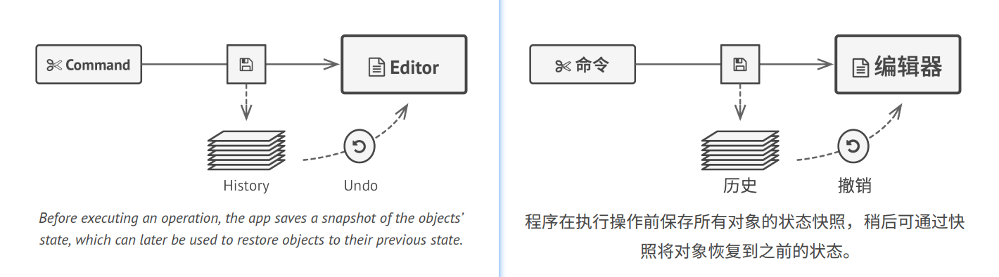
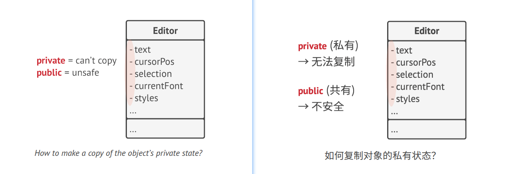
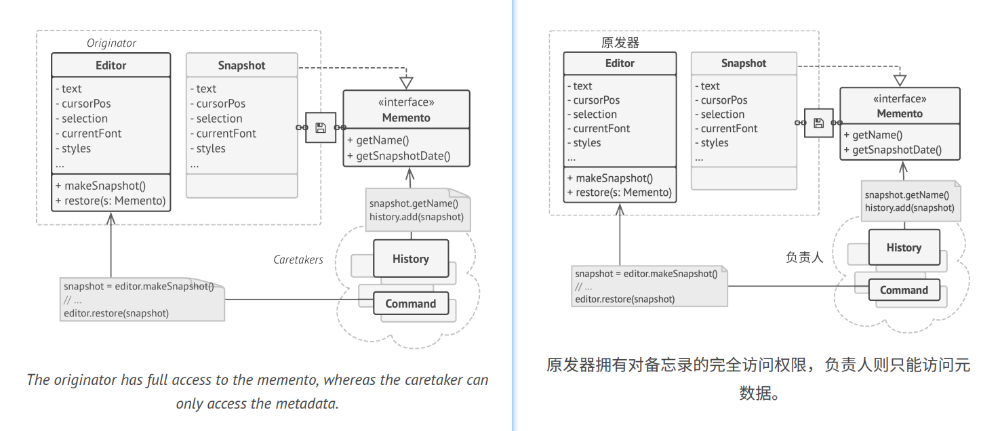
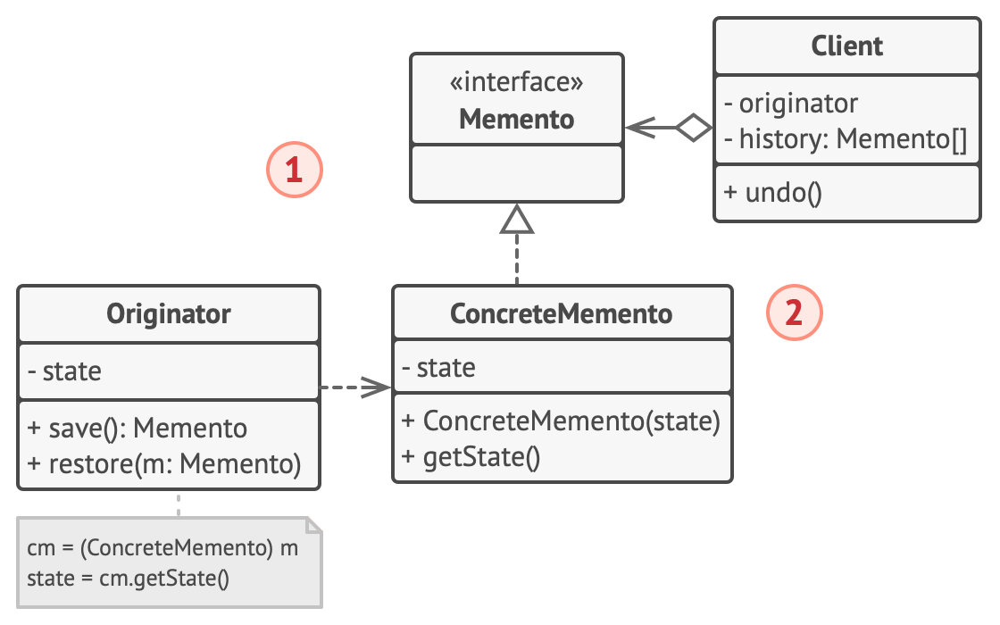
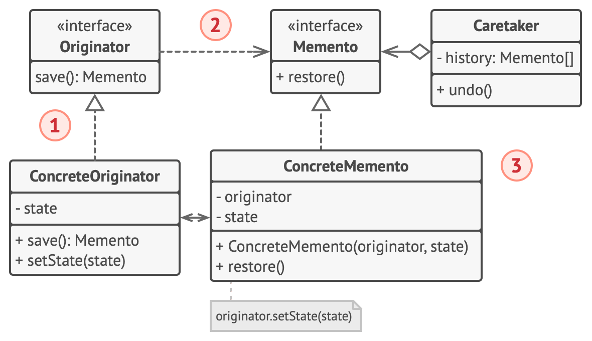
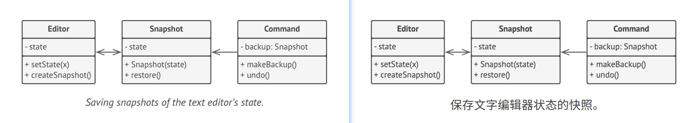

## Memento
**Also known as:** Snapshot


### :snowflake: Intent
**Memento** is a behavioral design pattern that lets you save and restore the previous state of an object without 
revealing the details of its implementation.  
译:


### :worried: Problem
Imagine that you're creating a text editor app. In addition to simple text editing, your editor can format text, 
insert inline images, etc.  
译:

At some point, you decided to let users undo any operations carried out on the text. This feature has become so common 
over the years that nowadays people expect every app to have it. For the implementation, you chose to take the direct 
approach. Before performing any operation, the app records the state of all objects and saves it in some storage. 
Later, when a user decides to revert an action, the app fetches the latest snapshot from the history and uses it to 
restore the state of all objects.  
译:



Let's think about those state snapshots. How exactly would you produce one? You'd probably need to go over all the 
fields in an object and copy their values into storage. However, this would only work if the object had quite relaxed 
access restrictions to its contents. Unfortunately, most real objects won't let others peek inside them that easily, 
hiding all significant data in private fields.  
译:

Ignore that problem for now and let's assume that our objects behave like hippies: preferring open relations and 
keeping their state public. While this approach would solve the immediate problem and let you produce snapshots of 
objects' states at will, it still has some serious issues. In the future, you might decide to refactor some of the 
editor classes, or add or remove some fields. Sounds easy, but this would also require changing the classes 
responsible for copying the state of the affected objects.  
译:



But there's more. Let's consider the actual "snapshots" of the editor's state. What data does it contain? At a bare 
minimum, it must contain the actual text, cursor coordinates, current scroll position, etc. To make a snapshot, you'd 
need to collect these values and put them into some kind of container.  
译:

Most likely, you're going to store lots of these container objects inside some list that would represent the history. 
Therefore, the containers would probably end up being objects of one class. The class would have almost no methods, 
but lots of fields that mirror the editor's state. To allow other objects to write and read data to and from a 
snapshot, you'd probably need to make its fields public. That would expose all the editor's states, private or not. 
Other classes would become dependent on every little change to the snapshot class, which would otherwise happen within 
private fields and methods without affecting outer classes.  
译:

It looks like we've reached a dead end: you either expose all internal details of classes, making them too fragile, 
or restrict access to their state, making it impossible to produce snapshots. Is there any other way to implement the 
"undo"?  
译:


### :smile: Solution
Broken encapsulation causes all problems that we've just experienced. Some objects try to do more than they 
are supposed to. To collect the data required to perform some action, they invade the private space of other objects 
instead of letting these objects perform the actual action.  
译:

The Memento pattern delegates creating the state snapshots to the actual owner of that state, the *originator* object. 
Hence, instead of other objects trying to copy the editor's state from the "outside," the editor class itself can make 
the snapshot since it has full access to its own state.  
译:

The pattern suggests storing the copy of the object's state in a special object called *memento*. The contents of the 
memento aren't accessible to any other object except the one that produced it. Other objects must communicate with 
mementos using a limited interface which may allow fetching the snapshot's metadata (creation time, the name of the 
performed operation, etc.), but not the original object's state contained in the snapshot.  
译:



Such a restrictive policy lets you store mementos inside other objects, usually called *caretakers*. Since the 
caretaker works with the memento only via the limited interface, it's not able to tamper with the state stored inside 
the memento. At the same time, the originator has access to all fields inside the memento, allowing it to restore its 
previous state at will.  
译:

In our text editor example, we can create a separate history class to act as the caretaker. A stack of mementos stored 
inside the caretaker will grow each time the editor is about to execute an operation. You could even render this stack 
within the app's UI, displaying the history of previously performed operations to a user.  
译:

When a user triggers the undo, the history grabs the most recent memento from the stack and passes it back to the 
editor, requesting a roll-back. Since the editor has full access to the memento, it changes its own state with the 
values taken from the memento.  
译:


### :lollipop: Structure
#### Implementation based on nested classes
The classic implementation of the pattern relies on support for nested classes, available in many popular programming 
languages (such as C++, C#, and Java).  
译:


1. The **Originator** class can produce snapshots of its own state, as well as restore its state from snapshots when needed.
2. The **Memento** is a value object that acts as a snapshot of the originator's state. It's a common practice to make 
   the memento immutable and pass it the data only once, via the constructor.
3. The **Caretaker** knows not only "when" and "why" to capture the originator's state, but also when the state should 
   be restored.

   A caretaker can keep track of the originator's history by storing a stack of mementos. When the originator has to 
   travel back in history, the caretaker fetches the topmost memento from the stack and passes it to the originator's 
   restoration method.

4. In this implementation, the memento class is nested inside the originator. This lets the originator access the 
   fields and methods of the memento, even though they're declared private. On the other hand, the caretaker has very 
   limited access to the memento's fields and methods, which lets it store mementos in a stack but not tamper with 
   their state.

#### Implementation based on an intermediate interface
There's an alternative implementation, suitable for programming languages that don't support nested classes (yeah, 
PHP, I'm talking about you).  
译:



1. In the absence of nested classes, you can restrict access to the memento's fields by establishing a convention that 
   caretakers can work with a memento only through an explicitly declared intermediary interface, which would only 
   declare methods related to the memento's metadata.
2. On the other hand, originators can work with a memento object directly, accessing fields and methods declared in 
   the memento class. The downside of this approach is that you need to declare all members of the memento public.

#### Implementation with even stricter encapsulation
There's another implementation that is useful when you don't want to leave even the slightest chance of other classes
accessing the state of the originator through the memento.  
译:



1. This implementation allows having multiple types of originators and mementos. Each originator works with a 
   corresponding memento class. Neither originators nor mementos expose their state to anyone.
2. Caretakers are now explicitly restricted from changing the state stored in mementos. Moreover, the caretaker class 
   becomes independent of the originator because the restoration method is now defined in the memento class.
3. Each memento becomes linked to the originator that produced it. The originator passes itself to the memento's 
   constructor, along with the values of its state. Thanks to the close relationship between these classes, a memento 
   can restore the state of its originator, given that the latter has defined the appropriate setters.


### :hash: Pseudocode
This example uses the Memento pattern alongside the [**Command**][Command] pattern for storing snapshots of the 
complex text editor's state and restoring an earlier state from these snapshots when needed.  
译:



The command objects act as caretakers. They fetch the editor's memento before executing operations related to commands. 
When a user attempts to undo the most recent command, the editor can use the memento stored in that command to revert 
itself to the previous state.  
译:

The memento class doesn't declare any public fields, getters or setters. Therefore, no object can alter its contents. 
Mementos are linked to the editor object that created them. This lets a memento restore the linked editor's state by 
passing the data via setters on the editor object. Since mementos are linked to specific editor objects, you can make 
your app support several independent editor windows with a centralized undo stack.  
译:

```c++
 1 // The originator holds some important data that may change over
 2 // time. It also defines a method for saving its state inside a
 3 // memento and another method for restoring the state from it.
 4 class Editor is
 5     private field text, curX, curY, selectionWidth
 6 
 7     method setText(text) is
 8         this.text = text
 9 
10     method setCursor(x, y) is
11         this.curX = x
12         this.curY = y
13 
14     method setSelectionWidth(width) is
15         this.selectionWidth = width
16 
17     // Saves the current state inside a memento.
18     method createSnapshot():Snapshot is
19         // Memento is an immutable object; that's why the
20         // originator passes its state to the memento's
21         // constructor parameters.
22         return new Snapshot(this, text, curX, curY, selectionWidth)
23 
24 // The memento class stores the past state of the editor.
25 class Snapshot is
26     private field editor: Editor
27     private field text, curX, curY, selectionWidth
28 
29     constructor Snapshot(editor, text, curX, curY, selectionWidth) is
30         this.editor = editor
31         this.text = text
32         this.curX = x
33         this.curY = y
34         this.selectionWidth = selectionWidth
35 
36     // At some point, a previous state of the editor can be
37     // restored using a memento object.
38     method restore() is
39         editor.setText(text)
40         editor.setCursor(curX, curY)
41         editor.setSelectionWidth(selectionWidth)
42 
43 // A command object can act as a caretaker. In that case, the
44 // command gets a memento just before it changes the
45 // originator's state. When undo is requested, it restores the
46 // originator's state from a memento.
47 class Command is
48     private field backup: Snapshot
49 
50     method makeBackup() is
51         backup = editor.createSnapshot()
52 
53     method undo() is
54         if (backup != null)
55             backup.restore()
56     // ...
```


### :apple: Applicability
> :bug: **Use the Memento pattern when you want to produce snapshots of the object's state to be able to restore a 
> previous state of the object.**
> 
> :zap: The Memento pattern lets you make full copies of an object's state, including private fields, and store them 
> separately from the object. While most people remember this pattern thanks to the "undo" use case, it's also 
> indispensable when dealing with transactions (i.e., if you need to roll back an operation on error).

> :bug: **Use the pattern when direct access to the object's fields/getters/setters violates its encapsulation.**
> 
> :zap: The Memento makes the object itself responsible for creating a snapshot of its state. No other object can read 
> the snapshot, making the original object's state data safe and secure.


### :book: How to Implement
1. Determine what class will play the role of the originator. It's important to know whether the program uses one 
   central object of this type or multiple smaller ones.
2. Create the memento class. One by one, declare a set of fields that mirror the fields declared inside the originator 
   class.
3. Make the memento class immutable. A memento should accept the data just once, via the constructor. The class should 
   have no setters.
4. If your programming language supports nested classes, nest the memento inside the originator. If not, extract a 
   blank interface from the memento class and make all other objects use it to refer to the memento. You may add some 
   metadata operations to the interface, but nothing that exposes the originator's state.
5. Add a method for producing mementos to the originator class. The originator should pass its state to the memento 
   via one or multiple arguments of the memento's constructor.

   The return type of the method should be of the interface you extracted in the previous step (assuming that you 
   extracted it completely). Under the hood, the memento-producing method should work directly with the memento class.

6. Add a method for restoring the originator's state to its class. It should accept a memento object as an argument. 
   If you extracted an interface in the previous step, make it the type of the parameter. In this case, you need to 
   typecast the incoming object to the memento class, since the originator needs full access to that object.
7. The caretaker, whether it represents a command object, a history, or something entirely different, should know when 
   to request new mementos from the originator, how to store them and when to restore the originator with a particular 
   memento.
8. The link between caretakers and originators may be moved into the memento class. In this case, each memento must be 
   connected to the originator that had created it. The restoration method would also move to the memento class. 
   However, this would all make sense only if the memento class is nested into originator or the originator class 
   provides sufficient setters for overriding its state.


### :notes: Pros and Cons
:heavy_check_mark: You can produce snapshots of the object's state without violating its encapsulation.

:heavy_check_mark: You can simplify the originator's code by letting the caretaker maintain the history of the 
originator's state.

:x: The app might consume lots of RAM if clients create mementos too often.

:x: Caretakers should track the originator's lifecycle to be able to destroy obsolete mementos.

:x: Most dynamic programming languages, such as PHP, Python and JavaScript, can't guarantee that the state within the 
memento stays untouched.


### :repeat: Relations with Other Patterns
- You can use [**Command**][Command] and [**Memento**][Memento] together when implementing "undo". In this case, 
  commands are responsible for performing various operations over a target object, while mementos save the state of 
  that object just before a command gets executed.
- You can use [**Memento**][Memento] along with [**Iterator**][Iterator] to capture the current iteration state and 
  roll it back if necessary.
- Sometimes [**Prototype**][Prototype] can be a simpler alternative to [**Memento**][Memento]. This works if the object, 
  the state of which you want to store in the history, is fairly straightforward and doesn't have links to external 
  resources, or the links are easy to re-establish.


  

[Prototype]:../../1_creational_design_patterns/4_prototype/

[Command]:../2_command/

[Iterator]:../3_iterator/

[Memento]:../5_memento/

