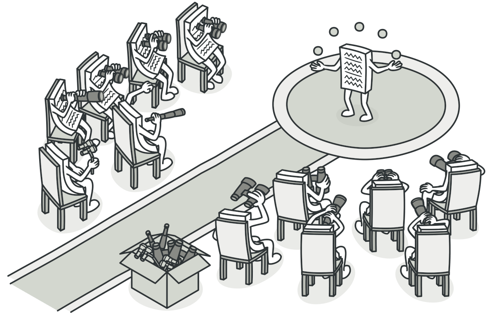
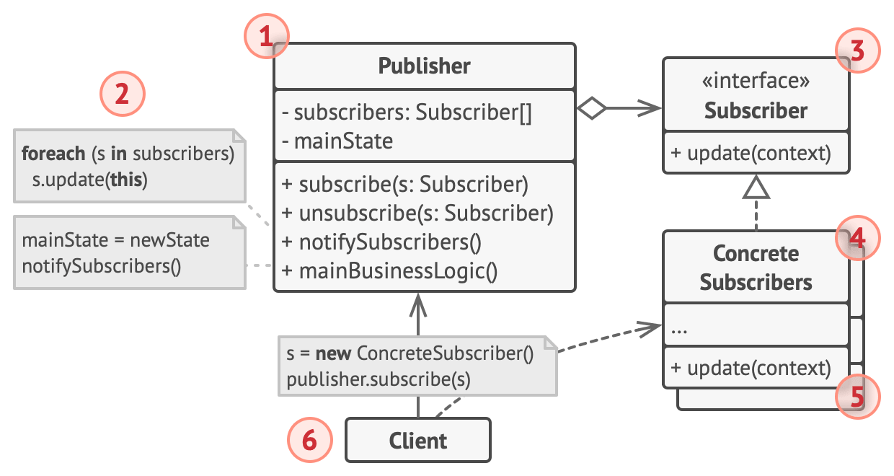

## Observer
**Also known as:** Event-Subscriber, Listener


### :snowflake: Intent
**Observer** is a behavioral design pattern that lets you define a subscription mechanism to notify multiple objects 
about any events that happen to the object they're observing.  
译:




### :worried: Problem
Imagine that you have two types of objects: a `Customer` and a `Store`. The customer is very interested in a particular 
brand of product (say, it's a new model of the iPhone) which should become available in the store very soon.  
译:

The customer could visit the store every day and check product availability. But while the product is still en route, 
most of these trips would be pointless.  
译:


On the other hand, the store could send tons of emails (which might be considered spam) to all customers each time a 
new product becomes available. This would save some customers from endless trips to the store. At the same time, it'd 
upset other customers who aren't interested in new products.  
译:

It looks like we've got a conflict. Either the customer wastes time checking product availability or the store wastes 
resources notifying the wrong customers.  
译:


### :smile: Solution
The object that has some interesting state is often called *subject*, but since it's also going to notify other objects 
about the changes to its state, we'll call it *publisher*. All other objects that want to track changes to the 
publisher's state are called *subscribers*.  
译:

The Observer pattern suggests that you add a subscription mechanism to the publisher class so individual objects can 
subscribe to or unsubscribe from a stream of events coming from that publisher. Fear not! Everything isn't as 
complicated as it sounds. In reality, this mechanism consists of 1) an array field for storing a list of references to 
subscriber objects and 2) several public methods which allow adding subscribers to and removing them from that list.  
译:


Now, whenever an important event happens to the publisher, it goes over its subscribers and calls the specific 
notification method on their objects.  
译:

Real apps might have dozens of different subscriber classes that are interested in tracking events of the same 
publisher class. You wouldn't want to couple the publisher to all of those classes. Besides, you might not even know 
about some of them beforehand if your publisher class is supposed to be used by other people.  
译:

That's why it's crucial that all subscribers implement the same interface and that the publisher communicates with 
them only via that interface. This interface should declare the notification method along with a set of parameters 
that the publisher can use to pass some contextual data along with the notification.  
译:


If your app has several different types of publishers, and you want to make your subscribers compatible with all of 
them, you can go even further and make all publishers follow the same interface. This interface would only need to 
describe a few subscription methods. The interface would allow subscribers to observe publishers' states without 
coupling to their concrete classes.  
译:


### :car: Real-World Analogy


If you subscribe to a newspaper or magazine, you no longer need to go to the store to check if the next issue is 
available. Instead, the publisher sends new issues directly to your mailbox right after publication or even in advance.  
译:

The publisher maintains a list of subscribers and knows which magazines they're interested in. Subscribers can leave 
the list at any time when they wish to stop the publisher sending new magazine issues to them.  
译:


### :lollipop: Structure


1. The **Publisher** issues events of interest to other objects. These events occur when the publisher changes its 
   state or executes some behaviors. Publishers contain a subscription infrastructure that lets new subscribers join 
   and current subscribers leave the list.
2. When a new event happens, the publisher goes over the subscription list and calls the notification method declared 
   in the subscriber interface on each subscriber object.
3. The **Subscriber** interface declares the notification interface. In most cases, it consists of a single `update` 
   method. The method may have several parameters that let the publisher pass some event details along with the update.
4. **Concrete Subscribers** perform some actions in response to notifications issued by the publisher. All of these 
   classes must implement the same interface so the publisher isn't coupled to concrete classes.
5. Usually, subscribers need some contextual information to handle the update correctly. For this reason, publishers 
   often pass some context data as arguments of the notification method. The publisher can pass itself as an argument, 
   letting subscriber fetch any required data directly.
6. The **Client** creates publisher and subscriber objects separately and then registers subscribers for publisher updates.


### :hash: Pseudocode
In this example, the **Observer** pattern lets the text editor object notify other service objects about changes in 
its state.  
译:


The list of subscribers is compiled dynamically: objects can start or stop listening to notifications at runtime, 
depending on the desired behavior of your app.  
译:

In this implementation, the editor class doesn't maintain the subscription list by itself. It delegates this job to 
the special helper object devoted to just that. You could upgrade that object to serve as a centralized event 
dispatcher, letting any object act as a publisher.  
译:

Adding new subscribers to the program doesn't require changes to existing publisher classes, as long as they work with 
all subscribers through the same interface.  
译:

```c++
 1 // The base publisher class includes subscription management
 2 // code and notification methods.
 3 class EventManager is
 4     private field listeners: hash map of event types and listeners
 5 
 6     method subscribe(eventType, listener) is
 7         listeners.add(eventType, listener)
 8 
 9     method unsubscribe(eventType, listener) is
10         listeners.remove(eventType, listener)
11 
12     method notify(eventType, data) is
13         foreach (listener in listeners.of(eventType)) do
14             listener.update(data)
15 
16 // The concrete publisher contains real business logic that's
17 // interesting for some subscribers. We could derive this class
18 // from the base publisher, but that isn't always possible in
19 // real life because the concrete publisher might already be a
20 // subclass. In this case, you can patch the subscription logic
21 // in with composition, as we did here.
22 class Editor is
23     public field events: EventManager
24     private field file: File
25 
26     constructor Editor() is
27         events = new EventManager()
28 
29     // Methods of business logic can notify subscribers about
30     // changes.
31     method openFile(path) is
32         this.file = new File(path)
33         events.notify("open", file.name)
34 
35     method saveFile() is
36         file.write()
37         events.notify("save", file.name)
38 
39     // ...
40 
41 
42 // Here's the subscriber interface. If your programming language
43 // supports functional types, you can replace the whole
44 // subscriber hierarchy with a set of functions.
45 interface EventListener is
46     method update(filename)
47 
48 // Concrete subscribers react to updates issued by the publisher
49 // they are attached to.
50 class LoggingListener implements EventListener is
51     private field log: File
52     private field message: string
53 
54     constructor LoggingListener(log_filename, message) is
55         this.log = new File(log_filename)
56         this.message = message
57 
58     method update(filename) is
59         log.write(replace('%s',filename,message))
60 
61 class EmailAlertsListener implements EventListener is
62     private field email: string
63     private field message: string
64 
65     constructor EmailAlertsListener(email, message) is
66         this.email = email
67         this.message = message
68 
69     method update(filename) is
70         system.email(email, replace('%s',filename,message))
71 
72 
73 // An application can configure publishers and subscribers at
74 // runtime.
75 class Application is
76     method config() is
77         editor = new Editor()
78 
79         logger = new LoggingListener(
80             "/path/to/log.txt",
81             "Someone has opened the file: %s")
82         editor.events.subscribe("open", logger)
83 
84         emailAlerts = new EmailAlertsListener(
85             "admin@example.com",
86             "Someone has changed the file: %s")
87         editor.events.subscribe("save", emailAlerts)
```


### :apple: Applicability
> :bug: **Use the Observer pattern when changes to the state of one object may require changing other objects, and the 
> actual set of objects is unknown beforehand or changes dynamically.**
> 
> :zap: You can often experience this problem when working with classes of the graphical user interface. For example, 
> you created custom button classes, and you want to let the clients hook some custom code to your buttons so that it 
> fires whenever a user presses a button.
> 
> The Observer pattern lets any object that implements the subscriber interface subscribe for event notifications in 
> publisher objects. You can add the subscription mechanism to your buttons, letting the clients hook up their custom 
> code via custom subscriber classes.


> :bug: **Use the pattern when some objects in your app must observe others, but only for a limited time or in specific 
> cases.**
> 
> :zap: The subscription list is dynamic, so subscribers can join or leave the list whenever they need to.


### :book: How to Implement
1. Look over your business logic and try to break it down into two parts: the core functionality, independent of other 
   code, will act as the publisher; the rest will turn into a set of subscriber classes.

2. Declare the subscriber interface. At a bare minimum, it should declare a single `update` method.

3. Declare the publisher interface and describe a pair of methods for adding a subscriber object to and removing it 
   from the list. Remember that publishers must work with subscribers only via the subscriber interface.

4. Decide where to put the actual subscription list and the implementation of subscription methods. Usually, this code 
   looks the same for all types of publishers, so the obvious place to put it is in an abstract class derived directly 
   from the publisher interface. Concrete publishers extend that class, inheriting the subscription behavior.

   However, if you're applying the pattern to an existing class hierarchy, consider an approach based on composition: 
   put the subscription logic into a separate object, and make all real publishers use it.

5. Create concrete publisher classes. Each time something important happens inside a publisher, it must notify all its 
   subscribers.

6. Implement the update notification methods in concrete subscriber classes. Most subscribers would need some context 
   data about the event. It can be passed as an argument of the notification method.

   But there's another option. Upon receiving a notification, the subscriber can fetch any data directly from the 
   notification. In this case, the publisher must pass itself via the update method. The less flexible option is to 
   link a publisher to the subscriber permanently via the constructor.

7. The client must create all necessary subscribers and register them with proper publishers.


### :notes: Pros and Cons
:heavy_check_mark: *Open/Closed Principle*. You can introduce new subscriber classes without having to change the 
publisher's code (and vice versa if there's a publisher interface).

:heavy_check_mark: You can establish relations between objects at runtime.

:x: Subscribers are notified in random order.


### :repeat: Relations with Other Patterns
- [**Chain of Responsibility**][Chain of Responsibility], [**Command**][Command], [**Mediator**][Mediator] and 
  [**Observer**][Observer] address various ways of connecting senders and receivers of requests:

  - *Chain of Responsibility* passes a request sequentially along a dynamic chain of potential receivers until one of 
    them handles it.

  - *Command* establishes unidirectional connections between senders and receivers.

  - *Mediator* eliminates direct connections between senders and receivers, forcing them to communicate indirectly via 
    a mediator object.

  - *Observer* lets receivers dynamically subscribe to and unsubscribe from receiving requests.

- The difference between [**Mediator**][Mediator] and [**Observer**][Observer] is often elusive. In most cases, you 
  can implement either of these patterns; but sometimes you can apply both simultaneously. Let's see how we can do that.

  The primary goal of *Mediator* is to eliminate mutual dependencies among a set of system components. Instead, these 
  components become dependent on a single mediator object. The goal of *Observer* is to establish dynamic one-way 
  connections between objects, where some objects act as subordinates of others.

  There's a popular implementation of the *Mediator* pattern that relies on *Observer*. The mediator object plays the 
  role of publisher, and the components act as subscribers which subscribe to and unsubscribe from the mediator's 
  events. When *Mediator* is implemented this way, it may look very similar to Observer.

  When you're confused, remember that you can implement the Mediator pattern in other ways. For example, you can 
  permanently link all the components to the same mediator object. This implementation won't resemble *Observer* but 
  will still be an instance of the Mediator pattern.

  Now imagine a program where all components have become publishers, allowing dynamic connections between each other. 
  There won't be a centralized mediator object, only a distributed set of observers.


[Chain of Responsibility]:../1_chain_of_responsibility/

[Command]:../2_command/

[Mediator]:../4_mediator/

[Observer]:../6_observer/


