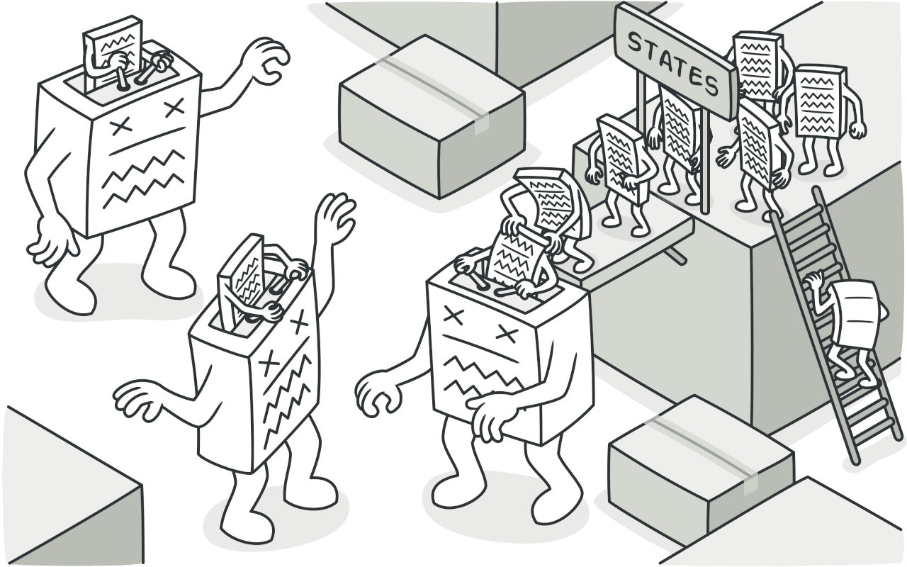
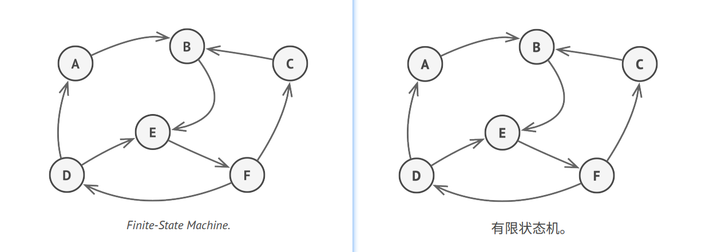
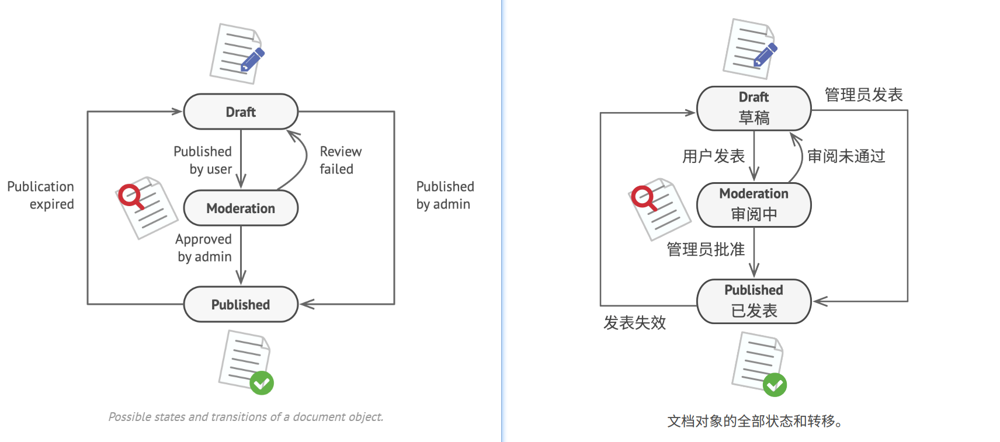
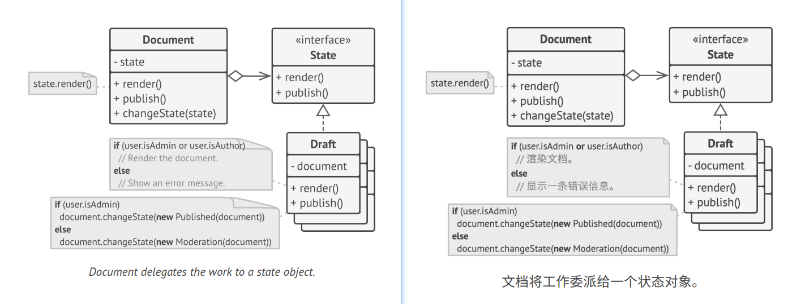
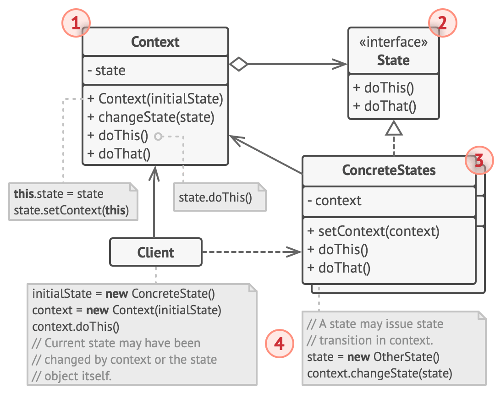
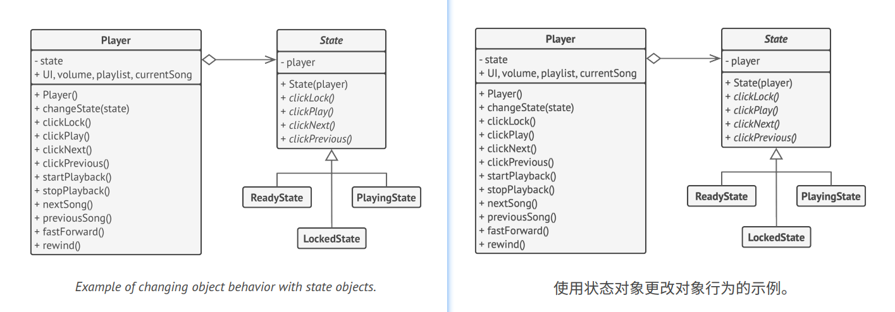

## State

### :snowflake: Intent
**State** is a behavioral design pattern that lets an object alter its behavior when its internal state changes. It 
appears as if the object changed its class.  
译:




### :worried: Problem
The State pattern is closely related to the concept of a [*Finite-State Machine*][Finite State Machine].



The main idea is that, at any given moment, there's a *finite* number of *states* which a program can be in. Within 
any unique state, the program behaves differently, and the program can be switched from one state to another 
instantaneously. However, depending on the current state, the program may or may not switch to certain other states. 
These switching rules, called *transitions*, are also finite and predetermined.  
译:

You can also apply this approach to objects. Imagine that we have a `Document` class. A document can be in one of three 
states: `Draft`, `Moderation` and `Published`. The `publish` method of the document works a little bit differently in 
each state:
- In `Draft`, it moves the document to moderation.
- In `Moderation`, it makes the document public, but only if the current user is an administrator.
- In `Published`, it doesn't do anything at all.



State machines are usually implemented with lots of conditional statements (`if` or `switch`) that select the 
appropriate behavior depending on the current state of the object. Usually, this "state" is just a set of values of 
the object's fields. Even if you've never heard about finite-state machines before, you've probably implemented a 
state at least once. Does the following code structure ring a bell?  
译:

```c++
 1 class Document is
 2     field state: string
 3     // ...
 4     method publish() is
 5         switch (state)
 6             "draft":
 7                 state = "moderation"
 8                 break
 9             "moderation":
10                 if (currentUser.role == "admin")
11                     state = "published"
12                 break
13             "published":
14                 // Do nothing.
15                 break
16     // ...
```

The biggest weakness of a state machine based on conditionals reveals itself once we start adding more and more states 
and state-dependent behaviors to the `Document` class. Most methods will contain monstrous conditionals that pick the 
proper behavior of a method according to the current state. Code like this is very difficult to maintain because any 
change to the transition logic may require changing state conditionals in every method.  
译:

The problem tends to get bigger as a project evolves. It's quite difficult to predict all possible states and 
transitions at the design stage. Hence, a lean state machine built with a limited set of conditionals can grow into a 
bloated mess over time.  
译:


### :smile: Solution
The State pattern suggests that you create new classes for all possible states of an object and extract all 
state-specific behaviors into these classes.  
译:

Instead of implementing all behaviors on its own, the original object, called *context*, stores a reference to one of 
the state objects that represents its current state, and delegates all the state-related work to that object.  
译:



To transition the context into another state, replace the active state object with another object that represents that 
new state. This is possible only if all state classes follow the same interface and the context itself works with these 
objects through that interface.  
译:

This structure may look similar to the [**Strategy**][Strategy] pattern, but there's one key difference. In the State 
pattern, the particular states may be aware of each other and initiate transitions from one state to another, whereas 
strategies almost never know about each other.  
译:


### :car: Real-World Analogy
The buttons and switches in your smartphone behave differently depending on the current state of the device:
- When the phone is unlocked, pressing buttons leads to executing various functions.
- When the phone is locked, pressing any button leads to the unlocked screen.
- When the phone's charge is low, pressing any button shows the charging screen.


### :lollipop: Structure


1. **Context** stores a reference to one of the concrete state objects and delegates to it all state-specific work. 
   The context communicates with the state object via the state interface. The context exposes a setter for passing it 
   a new state object.

2. The **State** interface declares the state-specific methods. These methods should make sense for all concrete states 
   because you don't want some of your states to have useless methods that will never be called.

3. **Concrete States** provide their own implementations for the state-specific methods. To avoid duplication of 
   similar code across multiple states, you may provide intermediate abstract classes that encapsulate some common 
   behavior.

   State objects may store a backreference to the context object. Through this reference, the state can fetch any 
   required info from the context object, as well as initiate state transitions.

4. Both context and concrete states can set the next state of the context and perform the actual state transition by 
   replacing the state object linked to the context.


### :hash: Pseudocode
In this example, the **State** pattern lets the same controls of the media player behave differently, depending on the 
current playback state.  
译:



The main object of the player is always linked to a state object that performs most of the work for the player. Some 
actions replace the current state object of the player with another, which changes the way the player reacts to user 
interactions.  
译:

```c++
  1 // The AudioPlayer class acts as a context. It also maintains a
  2 // reference to an instance of one of the state classes that
  3 // represents the current state of the audio player.
  4 class AudioPlayer is
  5     field state: State
  6     field UI, volume, playlist, currentSong
  7 
  8     constructor AudioPlayer() is
  9         this.state = new ReadyState(this)
 10 
 11         // Context delegates handling user input to a state
 12         // object. Naturally, the outcome depends on what state
 13         // is currently active, since each state can handle the
 14         // input differently.
 15         UI = new UserInterface()
 16         UI.lockButton.onClick(this.clickLock)
 17         UI.playButton.onClick(this.clickPlay)
 18         UI.nextButton.onClick(this.clickNext)
 19         UI.prevButton.onClick(this.clickPrevious)
 20 
 21     // Other objects must be able to switch the audio player's
 22     // active state.
 23     method changeState(state: State) is
 24         this.state = state
 25 
 26     // UI methods delegate execution to the active state.
 27     method clickLock() is
 28         state.clickLock()
 29     method clickPlay() is
 30         state.clickPlay()
 31     method clickNext() is
 32         state.clickNext()
 33     method clickPrevious() is
 34         state.clickPrevious()
 35 
 36     // A state may call some service methods on the context.
 37     method startPlayback() is
 38         // ...
 39     method stopPlayback() is
 40         // ...
 41     method nextSong() is
 42         // ...
 43     method previousSong() is
 44         // ...
 45     method fastForward(time) is
 46         // ...
 47     method rewind(time) is
 48         // ...
 49 
 50 
 51 // The base state class declares methods that all concrete
 52 // states should implement and also provides a backreference to
 53 // the context object associated with the state. States can use
 54 // the backreference to transition the context to another state.
 55 abstract class State is
 56     protected field player: AudioPlayer
 57 
 58     // Context passes itself through the state constructor. This
 59     // may help a state fetch some useful context data if it's
 60     // needed.
 61     constructor State(player) is
 62         this.player = player
 63 
 64     abstract method clickLock()
 65     abstract method clickPlay()
 66     abstract method clickNext()
 67     abstract method clickPrevious()
 68 
 69 
 70 // Concrete states implement various behaviors associated with a
 71 // state of the context.
 72 class LockedState extends State is
 73 
 74     // When you unlock a locked player, it may assume one of two
 75     // states.
 76     method clickLock() is
 77         if (player.playing)
 78             player.changeState(new PlayingState(player))
 79         else
 80             player.changeState(new ReadyState(player))
 81 
 82     method clickPlay() is
 83         // Locked, so does nothing.
 84 
 85     method clickNext() is
 86         // Locked, so does nothing.
 87 
 88     method clickPrevious() is
 89         // Locked, so does nothing.
 90 
 91 
 92 // They can also trigger state transitions in the context.
 93 class ReadyState extends State is
 94     method clickLock() is
 95         player.changeState(new LockedState(player))
 96 
 97     method clickPlay() is
 98         player.startPlayback()
 99         player.changeState(new PlayingState(player))
100 
101     method clickNext() is
102         player.nextSong()
103 
104     method clickPrevious() is
105         player.previousSong()
106 
107 
108 class PlayingState extends State is
109     method clickLock() is
110         player.changeState(new LockedState(player))
111 
112     method clickPlay() is
113         player.stopPlayback()
114         player.changeState(new ReadyState(player))
115 
116     method clickNext() is
117         if (event.doubleclick)
118             player.nextSong()
119         else
120             player.fastForward(5)
121 
122     method clickPrevious() is
123         if (event.doubleclick)
124             player.previous()
125         else
126             player.rewind(5)
```


### :apple: Applicability
> :bug: **Use the State pattern when you have an object that behaves differently depending on its current state, the 
> number of states is enormous, and the state-specific code changes frequently.**
> 
> :zap: The pattern suggests that you extract all state-specific code into a set of distinct classes. As a result, 
> you can add new states or change existing ones independently of each other, reducing the maintenance cost.

> :bug: **Use the pattern when you have a class polluted with massive conditionals that alter how the class behaves 
> according to the current values of the class's fields.**
> 
> :zap: The State pattern lets you extract branches of these conditionals into methods of corresponding state classes. 
> While doing so, you can also clean temporary fields and helper methods involved in state-specific code out of your 
> main class.

> :bug: **Use State when you have a lot of duplicate code across similar states and transitions of a condition-based 
> state machine.**
> 
> :zap: The State pattern lets you compose hierarchies of state classes and reduce duplication by extracting common 
> code into abstract base classes.


### :book: How to Implement
1. Decide what class will act as the context. It could be an existing class that already has the state-dependent code; 
   or a new class if the state-specific code is distributed across multiple classes.

2. Declare the state interface. Although it may mirror all the methods declared in the context, aim only for those 
   that may contain state-specific behavior.

3. For every actual state, create a class that derives from the state interface. Then go over the methods of the 
   context and extract all code related to that state into your newly created class.

   While moving the code to the state class, you might discover that it depends on private members of the context. 
   There are several workarounds:
   - Make these fields or methods public.
   - Turn the behavior you're extracting into a public method in the context and call it from the state class. 
     This way is ugly but quick, and you can always fix it later.
   - Nest the state classes into the context class, but only if your programming language supports nesting classes.

4. In the context class, add a reference field of the state interface type and a public setter that allows overriding 
   the value of that field.

5. Go over the method of the context again and replace empty state conditionals with calls to corresponding methods of 
   the state object.

6. To switch the state of the context, create an instance of one of the state classes and pass it to the context. 
   You can do this within the context itself, or in various states, or in the client. Wherever this is done, 
   the class becomes dependent on the concrete state class that it instantiates.


### :notes: Pros and Cons
:heavy_check_mark: *Single Responsibility Principle*. Organize the code related to particular states into separate classes.

:heavy_check_mark: *Open/Closed Principle*. Introduce new states without changing existing state classes or the context.

:heavy_check_mark: Simplify the code of the context by eliminating bulky state machine conditionals.

:x: Applying the pattern can be overkill if a state machine has only a few states or rarely changes.


### :repeat: Relations with Other Patterns
- [**Bridge**][Bridge], [**State**][State], [**Strategy**][Strategy] (and to some degree [**Adapter**][Adapter]) have 
  very similar structures. Indeed, all of these patterns are based on composition, which is delegating work to other 
  objects. However, they all solve different problems. A pattern isn't just a recipe for structuring your code in a 
  specific way. It can also communicate to other developers the problem the pattern solves.

- [**State**][State] can be considered as an extension of [**Strategy**][Strategy]. Both patterns are based on 
  composition: they change the behavior of the context by delegating some work to helper objects. *Strategy* makes 
  these objects completely independent and unaware of each other. However, *State* doesn't restrict dependencies 
  between concrete states, letting them alter the state of the context at will.


  
[Adapter]:../../2_structural_design_patterns/1_adapter/

[Bridge]:../../2_structural_design_patterns/2_bridge/

[State]:../7_state/

[Strategy]:../8_strategy/

[Finite State Machine]:https://refactoring.guru/fsm