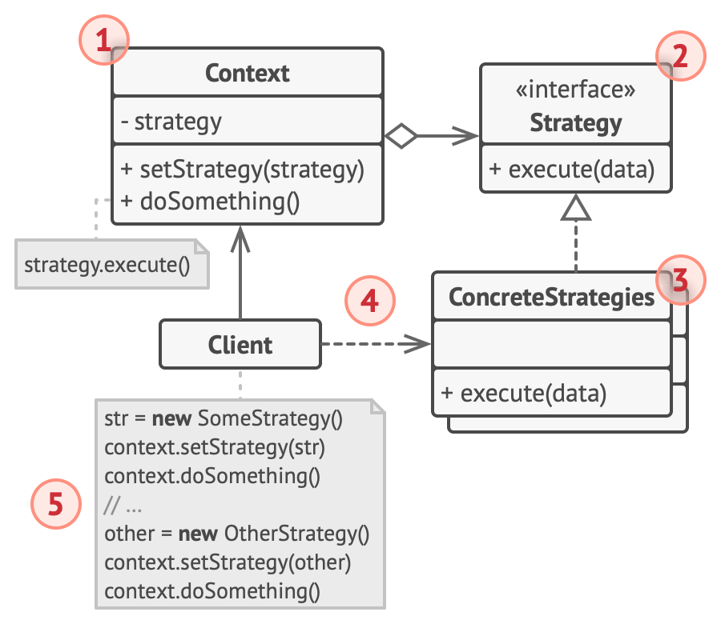

## Strategy

### :snowflake: Intent
**Strategy** is a behavioral design pattern that lets you define a family of algorithms, put each of them into a 
separate class, and make their objects interchangeable.  
译:


### :worried: Problem
One day you decided to create a navigation app for casual travelers. The app was centered around a beautiful map which 
helped users quickly orient themselves in any city.  
译:

One of the most requested features for the app was automatic route planning. A user should be able to enter an address 
and see the fastest route to that destination displayed on the map.  
译:

The first version of the app could only build the routes over roads. People who traveled by car were bursting with joy. 
But apparently, not everybody likes to drive on their vacation. So with the next update, you added an option to build 
walking routes. Right after that, you added another option to let people use public transport on their routes.  
译:

However, that was only the beginning. Later, you planned to add route building for cyclists. And even later, another 
option for building routes through all the city's tourist attractions.  
译:


While from a business perspective, the app was a success, the technical part caused you many headaches. Each time you 
added a new routing algorithm, the main class of the navigator doubled in size. At some point, the beast became too 
hard to maintain.  
译:

Any change to one of the algorithms, whether it was a simple bug fix or a slight adjustment of the street score, 
affected the whole class, increasing the chance of creating an error in already-working code.  
译:

In addition, teamwork became inefficient. Your teammates, who had been hired right after the successful release, 
complain that they spend too much time resolving merge conflicts. Implementing a new feature requires you to change the 
same huge class, conflicting with the code produced by other people.  
译:


### :smile: Solution
The Strategy pattern suggests that you take a class that does something specific in a lot of different ways and 
extract all of these algorithms into separate classes called *strategies*.  
译:

The original class, called *context*, must have a field for storing a reference to one of the strategies. The context 
delegates the work to a linked strategy object instead of executing it on its own.  
译:

The context isn't responsible for selecting an appropriate algorithm for the job. Instead, the client passes the 
desired strategy to the context. In fact, the context doesn't know much about strategies. It works with all strategies 
through the same generic interface, which only exposes a single method for triggering the algorithm encapsulated within 
the selected strategy.  
译:

This way the context becomes independent of concrete strategies, so you can add new algorithms or modify existing ones 
without changing the code of the context or other strategies.  
译:


In our navigation app, each routing algorithm can be extracted to its own class with a single `buildRoute` method. 
The method accepts an origin and destination and returns a collection of the route's checkpoints.  
译:

Even though given the same arguments, each routing class might build a different route, the main navigator class 
doesn't really care which algorithm is selected since its primary job is to render a set of checkpoints on the map. 
The class has a method for switching the active routing strategy, so its clients, such as the buttons in the user 
interface, can replace the currently selected routing behavior with another one.  
译:


### :car: Real-World Analogy


Imagine that you have to get to the airport. You can catch a bus, order a cab, or get on your bicycle. These are your 
transportation strategies. You can pick one of the strategies depending on factors such as budget or time constraints.  
译:


### :lollipop: Structure


1. The **Context** maintains a reference to one of the concrete strategies and communicates with this object only via 
   the strategy interface.

2. The **Strategy** interface is common to all concrete strategies. It declares a method the context uses to execute a 
   strategy.

3. **Concrete Strategies** implement different variations of an algorithm the context uses.

4. The context calls the execution method on the linked strategy object each time it needs to run the algorithm. The 
   context doesn't know what type of strategy it works with or how the algorithm is executed.

5. The **Client** creates a specific strategy object and passes it to the context. The context exposes a setter which 
   lets clients replace the strategy associated with the context at runtime.


### :hash: Pseudocode
In this example, the context uses multiple **strategies** to execute various arithmetic operations.  
译:

```c++
 1 // The strategy interface declares operations common to all
 2 // supported versions of some algorithm. The context uses this
 3 // interface to call the algorithm defined by the concrete
 4 // strategies.
 5 interface Strategy is
 6     method execute(a, b)
 7 
 8 // Concrete strategies implement the algorithm while following
 9 // the base strategy interface. The interface makes them
10 // interchangeable in the context.
11 class ConcreteStrategyAdd implements Strategy is
12     method execute(a, b) is
13         return a + b
14 
15 class ConcreteStrategySubtract implements Strategy is
16     method execute(a, b) is
17         return a - b
18 
19 class ConcreteStrategyMultiply implements Strategy is
20     method execute(a, b) is
21         return a * b
22 
23 // The context defines the interface of interest to clients.
24 class Context is
25     // The context maintains a reference to one of the strategy
26     // objects. The context doesn't know the concrete class of a
27     // strategy. It should work with all strategies via the
28     // strategy interface.
29     private strategy: Strategy
30 
31     // Usually the context accepts a strategy through the
32     // constructor, and also provides a setter so that the
33     // strategy can be switched at runtime.
34     method setStrategy(Strategy strategy) is
35         this.strategy = strategy
36 
37     // The context delegates some work to the strategy object
38     // instead of implementing multiple versions of the
39     // algorithm on its own.
40     method executeStrategy(int a, int b) is
41         return strategy.execute(a, b)
42 
43 
44 // The client code picks a concrete strategy and passes it to
45 // the context. The client should be aware of the differences
46 // between strategies in order to make the right choice.
47 class ExampleApplication is
48     method main() is
49         Create context object.
50 
51         Read first number.
52         Read last number.
53         Read the desired action from user input.
54 
55         if (action == addition) then
56             context.setStrategy(new ConcreteStrategyAdd())
57 
58         if (action == subtraction) then
59             context.setStrategy(new ConcreteStrategySubtract())
60 
61         if (action == multiplication) then
62             context.setStrategy(new ConcreteStrategyMultiply())
63 
64         result = context.executeStrategy(First number, Second number)
65 
66         Print result.
```


### :apple: Applicability
> :bug: **Use the Strategy pattern when you want to use different variants of an algorithm within an object and be able 
> to switch from one algorithm to another during runtime.**
> 
> :zap: The Strategy pattern lets you indirectly alter the object's behavior at runtime by associating it with 
> different sub-objects which can perform specific sub-tasks in different ways.

> :bug: **Use the Strategy when you have a lot of similar classes that only differ in the way they execute some behavior.**
> 
> :zap: The Strategy pattern lets you extract the varying behavior into a separate class hierarchy and combine the 
> original classes into one, thereby reducing duplicate code.

> :bug: **Use the pattern to isolate the business logic of a class from the implementation details of algorithms that 
> may not be as important in the context of that logic.**
>
> :zap: The Strategy pattern lets you isolate the code, internal data, and dependencies of various algorithms from the 
> rest of the code. Various clients get a simple interface to execute the algorithms and switch them at runtime.

> :bug: **Use the pattern when your class has a massive conditional statement that switches between different variants 
> of the same algorithm.**
>
> :zap: The Strategy pattern lets you do away with such a conditional by extracting all algorithms into separate 
> classes, all of which implement the same interface. The original object delegates execution to one of these objects, 
> instead of implementing all variants of the algorithm.


### :book: How to Implement
1. In the context class, identify an algorithm that's prone to frequent changes. It may also be a massive conditional 
   that selects and executes a variant of the same algorithm at runtime.

2. Declare the strategy interface common to all variants of the algorithm.

3. One by one, extract all algorithms into their own classes. They should all implement the strategy interface.

4. In the context class, add a field for storing a reference to a strategy object. Provide a setter for replacing 
   values of that field. The context should work with the strategy object only via the strategy interface. The context 
   may define an interface which lets the strategy access its data.

5. Clients of the context must associate it with a suitable strategy that matches the way they expect the context to 
   perform its primary job.


### :notes: Pros and Cons
:heavy_check_mark: You can swap algorithms used inside an object at runtime.

:heavy_check_mark: You can isolate the implementation details of an algorithm from the code that uses it.

:heavy_check_mark: You can replace inheritance with composition.

:heavy_check_mark: *Open/Closed Principle*. You can introduce new strategies without having to change the context.

:x: If you only have a couple of algorithms and they rarely change, there's no real reason to overcomplicate the 
program with new classes and interfaces that come along with the pattern.

:x: Clients must be aware of the differences between strategies to be able to select a proper one.

:x: A lot of modern programming languages have functional type support that lets you implement different versions of an 
algorithm inside a set of anonymous functions. Then you could use these functions exactly as you'd have used the 
strategy objects, but without bloating your code with extra classes and interfaces.


### :repeat: Relations with Other Patterns
- [**Bridge**][Bridge], [**State**][State], [**Strategy**][Strategy] (and to some degree [**Adapter**][Adapter]) have 
  very similar structures. Indeed, all of these patterns are based on composition, which is delegating work to other 
  objects. However, they all solve different problems. A pattern isn't just a recipe for structuring your code in a 
  specific way. It can also communicate to other developers the problem the pattern solves.

- [**Command**][Command] and [**Strategy**][Strategy] may look similar because you can use both to parameterize an 
  object with some action. However, they have very different intents.

  - You can use *Command* to convert any operation into an object. The operation's parameters become fields of that 
    object. The conversion lets you defer execution of the operation, queue it, store the history of commands, send 
    commands to remote services, etc.

  - On the other hand, *Strategy* usually describes different ways of doing the same thing, letting you swap these 
    algorithms within a single context class.

- [**Decorator**][Decorator] lets you change the skin of an object, while [**Strategy**][Strategy] lets you change the 
  guts.

- [**Template Method**][Template Method] is based on inheritance: it lets you alter parts of an algorithm by extending 
  those parts in subclasses. [**Strategy**][Strategy] is based on composition: you can alter parts of the object's 
  behavior by supplying it with different strategies that correspond to that behavior. *Template Method* works at the 
  class level, so it's static. *Strategy* works on the object level, letting you switch behaviors at runtime.

- [**State**][State] can be considered as an extension of [**Strategy**][Strategy]. Both patterns are based on 
  composition: they change the behavior of the context by delegating some work to helper objects. *Strategy* makes 
  these objects completely independent and unaware of each other. However, *State* doesn't restrict dependencies 
  between concrete states, letting them alter the state of the context at will.


[Adapter]:../../2_structural_design_patterns/1_adapter/

[Bridge]:../../2_structural_design_patterns/2_bridge/

[Decorator]:../../2_structural_design_patterns/4_decorator/

[Command]:../2_command/

[State]:../7_state/

[Strategy]:../8_strategy/

[Template Method]:../9_template_method/