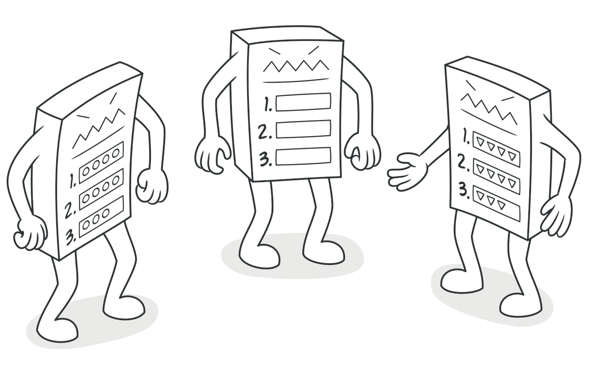

## Template Method

### :snowflake: Intent
**Template Method** is a behavioral design pattern that defines the skeleton of an algorithm in the superclass but lets 
subclasses override specific steps of the algorithm without changing its structure.  
译:




### :worried: Problem
Imagine that you're creating a data mining application that analyzes corporate documents. Users feed the app documents 
in various formats (PDF, DOC, CSV), and it tries to extract meaningful data from these docs in a uniform format.  
译:

The first version of the app could work only with DOC files. In the following version, it was able to support CSV files. 
A month later, you "taught" it to extract data from PDF files.  
译:


At some point, you noticed that all three classes have a lot of similar code. While the code for dealing with various 
data formats was entirely different in all classes, the code for data processing and analysis is almost identical. 
Wouldn't it be great to get rid of the code duplication, leaving the algorithm structure intact?  
译:

There was another problem related to client code that used these classes. It had lots of conditionals that picked a 
proper course of action depending on the class of the processing object. If all three processing classes had a common 
interface or a base class, you'd be able to eliminate the conditionals in client code and use polymorphism when calling 
methods on a processing object.  
译:


### :smile: Solution
The Template Method pattern suggests that you break down an algorithm into a series of steps, turn these steps into 
methods, and put a series of calls to these methods inside a single *template method*. The steps may either be 
`abstract`, or have some default implementation. To use the algorithm, the client is supposed to provide its own 
subclass, implement all abstract steps, and override some of the optional ones if needed (but not the template method 
itself).  
译:

Let's see how this will play out in our data mining app. We can create a base class for all three parsing algorithms. 
This class defines a template method consisting of a series of calls to various document-processing steps.  
译:


At first, we can declare all steps `abstract`, forcing the subclasses to provide their own implementations for these 
methods. In our case, subclasses already have all necessary implementations, so the only thing we might need to do is 
adjust signatures of the methods to match the methods of the superclass.  
译:

Now, let's see what we can do to get rid of the duplicate code. It looks like the code for opening/closing files and 
extracting/parsing data is different for various data formats, so there's no point in touching those methods. However, 
implementation of other steps, such as analyzing the raw data and composing reports, is very similar, so it can be 
pulled up into the base class, where subclasses can share that code.  
译:

As you can see, we've got two types of steps:
- *abstract steps* must be implemented by every subclass
- *optional steps* already have some default implementation, but still can be overridden if needed

There's another type of step, called *hooks*. A hook is an optional step with an empty body. A template method would 
work even if a hook isn't overridden. Usually, hooks are placed before and after crucial steps of algorithms, 
providing subclasses with additional extension points for an algorithm.  
译:


### :car: Real-World Analogy


The template method approach can be used in mass housing construction. The architectural plan for building a standard 
house may contain several extension points that would let a potential owner adjust some details of the resulting house.  
译:

Each building step, such as laying the foundation, framing, building walls, installing plumbing and wiring for water 
and electricity, etc., can be slightly changed to make the resulting house a little bit different from others.  
译:


### :lollipop: Structure


1. The **Abstract Class** declares methods that act as steps of an algorithm, as well as the actual template method 
   which calls these methods in a specific order. The steps may either be declared `abstract` or have some default 
   implementation.

2. **Concrete Classes** can override all the steps, but not the template method itself.


### :hash: Pseudocode
In this example, the **Template Method** pattern provides a "skeleton" for various branches of artificial intelligence 
in a simple strategy video game.  
译:


All races in the game have almost the same types of units and buildings. Therefore, you can reuse the same AI structure 
for various races, while being able to override some details. With this approach, you can override the orcs' AI 
to make it more aggressive, make humans more defense-oriented, and make monsters unable to build anything. Adding a 
new race to the game would require creating a new AI subclass and overriding the default methods declared in the base 
AI class.  
译:

```c++
 1 // The abstract class defines a template method that contains a
 2 // skeleton of some algorithm composed of calls, usually to
 3 // abstract primitive operations. Concrete subclasses implement
 4 // these operations, but leave the template method itself
 5 // intact.
 6 class GameAI is
 7     // The template method defines the skeleton of an algorithm.
 8     method turn() is
 9         collectResources()
10         buildStructures()
11         buildUnits()
12         attack()
13 
14     // Some steps may be implemented right in a base
15     // class.
16     method collectResources() is
17         foreach (s in this.builtStructures) do
18             s.collect()
19 
20     // And some of them may be defined as abstract.
21     abstract method buildStructures()
22     abstract method buildUnits()
23 
24     // A class can have several template methods.
25     method attack() is
26         enemy = closestEnemy()
27         if (enemy == null)
28             sendScouts(map.center)
29         else
30             sendWarriors(enemy.position)
31 
32     abstract method sendScouts(position)
33     abstract method sendWarriors(position)
34 
35 // Concrete classes have to implement all abstract operations of
36 // the base class but they must not override the template method
37 // itself.
38 class OrcsAI extends GameAI is
39     method buildStructures() is
40         if (there are some resources) then
41             // Build farms, then barracks, then stronghold.
42 
43     method buildUnits() is
44         if (there are plenty of resources) then
45             if (there are no scouts)
46                 // Build peon, add it to scouts group.
47             else
48                 // Build grunt, add it to warriors group.
49 
50     // ...
51 
52     method sendScouts(position) is
53         if (scouts.length > 0) then
54             // Send scouts to position.
55 
56     method sendWarriors(position) is
57         if (warriors.length > 5) then
58             // Send warriors to position.
59 
60 // Subclasses can also override some operations with a default
61 // implementation.
62 class MonstersAI extends GameAI is
63     method collectResources() is
64         // Monsters don't collect resources.
65 
66     method buildStructures() is
67         // Monsters don't build structures.
68 
69     method buildUnits() is
70        // Monsters don't build units.
```


### :apple: Applicability
> :bug: **Use the Template Method pattern when you want to let clients extend only particular steps of an algorithm, 
> but not the whole algorithm or its structure.**
> 
> :zap: The Template Method lets you turn a monolithic algorithm into a series of individual steps which can be easily 
> extended by subclasses while keeping intact the structure defined in a superclass.

> :bug: **Use the pattern when you have several classes that contain almost identical algorithms with some minor 
> differences. As a result, you might need to modify all classes when the algorithm changes.**
> 
> :zap: When you turn such an algorithm into a template method, you can also pull up the steps with similar 
> implementations into a superclass, eliminating code duplication. Code that varies between subclasses can remain in 
> subclasses.


### :book: How to Implement
1. Analyze the target algorithm to see whether you can break it into steps. Consider which steps are common to all 
   subclasses and which ones will always be unique.

2. Create the abstract base class and declare the template method and a set of abstract methods representing the 
   algorithm's steps. Outline the algorithm's structure in the template method by executing corresponding steps. 
   Consider making the template method `final` to prevent subclasses from overriding it.

3. It's okay if all the steps end up being abstract. However, some steps might benefit from having a default 
   implementation. Subclasses don't have to implement those methods.

4. Think of adding hooks between the crucial steps of the algorithm.

5. For each variation of the algorithm, create a new concrete subclass. It *must* implement all the abstract steps, 
   but *may* also override some of the optional ones.


### :notes: Pros and Cons
:heavy_check_mark: You can let clients override only certain parts of a large algorithm, making them less affected by 
changes that happen to other parts of the algorithm.

:heavy_check_mark: You can pull the duplicate code into a superclass.

:x: Some clients may be limited by the provided skeleton of an algorithm.

:x: You might violate the *Liskov Substitution Principle* by suppressing a default step implementation via a subclass.

:x: Template methods tend to be harder to maintain the more steps they have.


### :repeat: Relations with Other Patterns
- [**Factory Method**][Factory Method] is a specialization of [**Template Method**][Template Method]. At the same time, 
  a *Factory Method* may serve as a step in a large *Template Method*.

- [**Template Method**][Template Method] is based on inheritance: it lets you alter parts of an algorithm by extending 
  those parts in subclasses. [**Strategy**][Strategy] is based on composition: you can alter parts of the object's 
  behavior by supplying it with different strategies that correspond to that behavior. *Template Method* works at the 
  class level, so it's static. *Strategy* works on the object level, letting you switch behaviors at runtime.


[Factory Method]:../../1_creational_design_patterns/1_factory_method/

[Strategy]:../8_strategy/

[Template Method]:../9_template_method/

