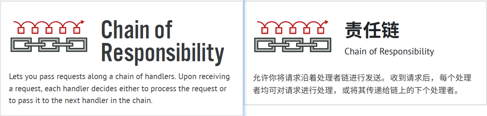
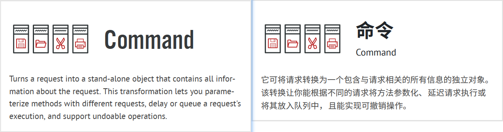
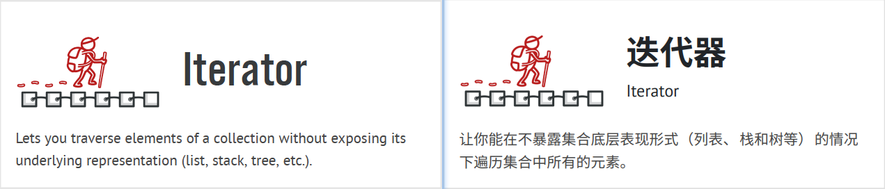
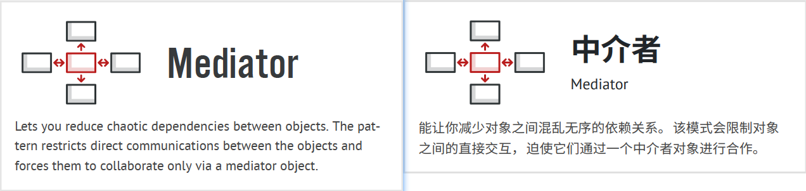
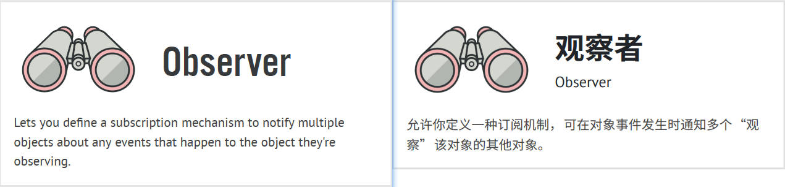
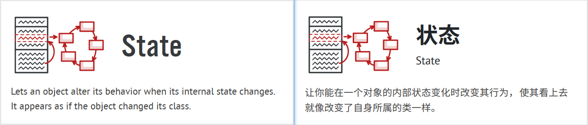
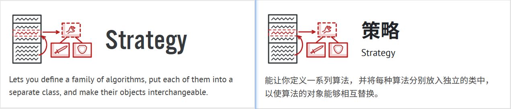
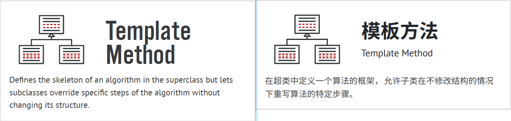
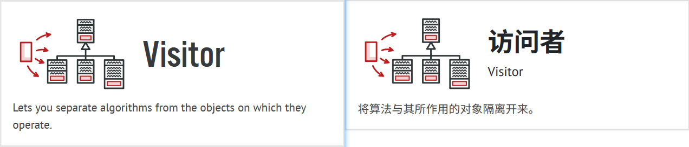

## Behavioral Design Patterns 行为型设计模式

Behavioral design patterns are concerned with algorithms and the assignment of responsibilities between objects.  
译:

- [**Chain of Responsibility 责任链**](../3_behavioral_design_patterns/1_chain_of_responsibility/)

- [**Command 命令**](../3_behavioral_design_patterns/2_command/)

- [**Iterator 迭代器**](../3_behavioral_design_patterns/3_iterator/)

- [**Mediator 中介者**](../3_behavioral_design_patterns/4_mediator/)

- [**Memento 备忘录**](../3_behavioral_design_patterns/5_memento/)

- [**Observer 观察者**](../3_behavioral_design_patterns/6_observer/)

- [**State 状态**](../3_behavioral_design_patterns/7_state/)

- [**Strategy 策略**](../3_behavioral_design_patterns/8_strategy/)

- [**Template Method 模板方法**](../3_behavioral_design_patterns/9_template_method/)

- [**Visitor 访问者**](../3_behavioral_design_patterns/10_visitor/)

