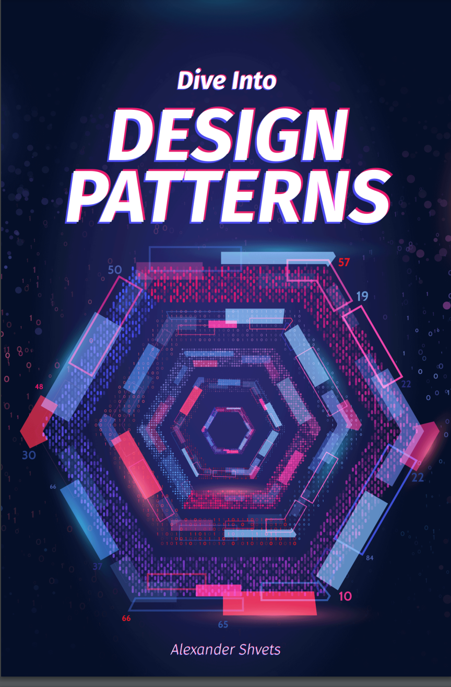

# Dive Into Design Patterns 深入设计模式

## Table of Contents 目录

## How to Read This Book 如何阅读本书

## Introduction to OOP 面向对象编程简介
### Basic of OOP 面向对象编程基础
### Pillars of OOP 面向对象编程特征
### Relation Between Objects 对象之间的关系

## Introduction to Design Patterns 设计模式简介
### What's a Design Patterns? 什么是设计模式?
### Why Should I Learn Patterns? 为什么要学习设计模式?

## Software Design Principles 软件设计原则
### Features of Good Design 优秀设计的特点
### Design Principles 设计原则
#### ①Encapsulate What Varies 封装变化的内容
#### ②Program to an Interface, not an Implementation 面向接口开发，而不是面向实现
#### ③Favor Composition Over Inheritance 组合优于继承

### SOLID Principles SOLID原则
#### ①Single Responsibility Principle 单一职责原则
#### ②Open/Closed Principle 开闭原则
#### ③Liskov Substitution Principle 里氏替换原则
#### ④Interface Segregation Principle 接口隔离原则
#### ⑤Dependency Inversion Principle 依赖倒置原则

## Catalog of Design Patterns 设计模式分类
### Creational Design Patterns 创建型模式
#### ①Factory Method 工厂方法
#### ②Abstract Factory 抽象工厂
#### ③Builder 构建者
#### ④Prototype 原型
#### ⑤Singleton 单例

### Structural Design Patterns 结构型模式
#### ①Adapter 适配器
#### ②Bridge 桥接
#### ③Composite 组合
#### ④Decorator 装饰器
#### ⑤Facade 外观
#### ⑥Flyweight 享元
#### ⑦Proxy 代理

### Behavioral Design Patterns 行为模式
#### ①Chain of Responsibility 责任链
#### ②Command 命令
#### ③Iterator 迭代器
#### ④Mediator 中介
#### ⑤Memento 备忘录
#### ⑥Observer 观察者
#### ⑦State 状态
#### ⑧Strategy 策略
#### ⑨Template Method 模板方法
#### ⑩Visitor 访问者