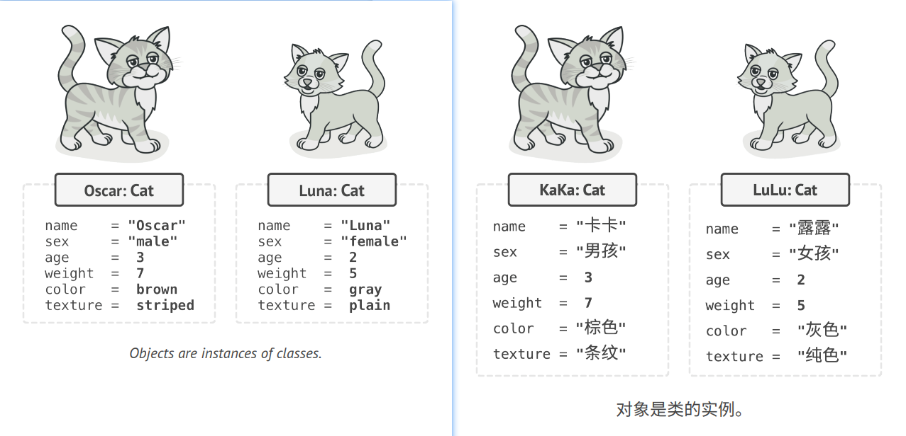

## Basics of OOP 面向对象编程简介

**O**bject-**o**riented **p**rogramming is a paradigm based on the concept of wrapping pieces of data, and behavior 
related to that data, into special bundles called **objects**, which are constructed from a set of "blueprints", 
defined by a programmer, called **classes**.   
译: **面向对象编程**(Object-Oriented Programming，缩写为OOP)是一种范式，其基本理念是将数据块及与数据相关的行为封装成特殊的、名为
**对象**的实体，同时对象实体的生成工作则是基于程序员给出的一系列"蓝图"，这些"蓝图"就是**类**。

### Objects, Class 对象和类
Do you like cats? I hope you do because I'll try to explain the OOP concepts using various cat examples.    
译: 你喜欢猫吗?希望你喜欢，因为我将用和猫有关的各种示例来解释面向对象编程的概念。

This is a UML class diagram. You'll see a lot of such diagrams in the book.   
译: 这是一个UML类图。你将在本书中看到许多类似的图示。

Say you have a cat named Oscar. Oscar is an object, an instance of the **Cat** class. Every cat has a lot of standard 
attributes: name, sex, age, weight, color, favorite food, etc. These are the class's *fields*.   
译: 假设你有一只名为奥斯卡的猫。奥斯卡是一个对象，也是**猫Cat**这个类的一个实例。每只猫都有许多基本属性： 名字name、性别sex、年龄age、
体重weight、毛色color以及最爱的食物等等。这些都是该类的*成员变量*。

All cats also behave similarly: they breathe, eat, run, sleep and meow. These are the class's *methods*. Collectively, 
fields and methods can be referenced as the *members* of their class.   
译: 所有猫都有相似的行为： 它们会呼吸breathe、进食eat、奔跑run、睡觉sleep以及喵喵叫meow。这些都是该类的*方法*。成员变量和方法可以统称为类的
*成员*。

Data stored inside the object's fields is often referenced as state,
and all the object's methods define its behavior.   
译: 存储在对象成员变量中的数据通常被称为状态，且对象中的所有方法定义了其行为。

Luna, your friend's cat, is also an instance of the Cat class. It has the same set of attributes as Oscar. The 
difference is in the values of these attributes: her sex is female, she has a different color, and weighs less.   
译: 你朋友的猫"露娜"也是猫这个类的一个实例。它拥有与"奥斯卡"相同的一些属性。不同之处在于这些属性的值: 她的性别是"母猫"，她的毛色不同且体重较轻。

So a class is like a blueprint that defines the structure for objects, which are concrete instances of that class.   
译: 因此类就像是定义对象结构的蓝图，而对象则是类的具体实例。

### Class hierarchies 类的层次结构
Everything is fine and dandy when we talk about one class. Naturally, a real program contains more than a single class. 
Some of these classes might be organized into **class hierarchies**. Let's find out what that means.   
译: 当我们谈论一个类时一切都好说。一般地，一个真实的项目不会仅包含一个类。一些类可能会组织起来形成**类层次结构**。让我们来了解一下这是什么意思。

Say your neighbor has a dog called Fido. It turns out, dogs and cats have a lot in common: name, sex, age, and color 
are attributes of both dogs and cats. Dogs can breathe, sleep and run the same way cats do. So it seems that we can 
define the base Animal class that would list the common attributes and behaviors.   
译: 假如你的邻居有一只名为 "旺财" 的狗。其实狗和猫有很多相同的地方：它们都有名字、性别、年龄和毛色等属性。狗和猫一样可以呼吸、睡觉和奔跑。
因此我们似乎可以定义一个动物Animal的基类来列出它们所共有的属性和行为。

A parent class, like the one we’ve just defined, is called a **superclass**. Its children are **subclasses**. Subclasses 
inherit state and behavior from their parent, defining only attributes or behaviors that differ. Thus, the Cat class 
would have the meow method, and the Dog class the bark method.   
译: 我们刚刚定义的父类被称为**超类**。继承它的类被称为**子类**。子类会继承其父类的状态和行为，且只需定义不同于父类的属性或行为。因此，猫类将包含
喵喵叫meow方法，而狗Dog类则将包含汪汪叫bark方法。

Assuming that we have a related business requirement, we can go even further and extract a more general class for all 
living Organisms which will become a superclass for Animals and Plants. Such a pyramid of classes is a **hierarchy**. 
In such a hierarchy, the Cat class inherits everything from both the Animal and Organism classes.   
译: 假如我们接到一个相关的业务需求，那就可以继续为所有活的生物体Organisms抽取出一个更通用的类，并将其作为动物和植物Plants类的超类。
这种由各种类组成的金字塔就是**层次结构**。在这个层次结构中，猫类将继承动物和生物体类的全部内容。

Subclasses can override the behavior of methods that they inherit from parent classes. A subclass can either completely 
replace the default behavior or just enhance it with some extra stuff.   
译: 子类可以对从父类中继承而来的方法进行重写。子类既可以完全替换掉默认的行为，也可以仅通过额外的内容来对其进行增强。
