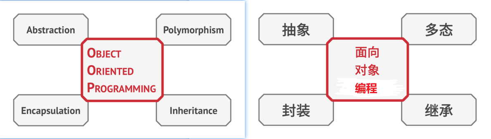

## Pillars of OOP 特征之面向对象编程
Object-oriented programming is based on four pillars, concepts that differentiate it from other programming 
paradigms.   
译: 面向对象编程的四个基本特征使其区别于其他编程范式。




### Abstraction 抽象
Most of the time when you're creating a program with OOP, you shape objects of the program based on real-world objects.
However, objects of the program don't represent the originals with 100% accuracy (and it's rarely required that they do).
Instead, your objects only model attributes and behaviors of real objects in a specific context, ignoring the rest.   
译: 当使用面向对象编程的理念开发一款程序时，你会将大部分时间用于根据真实世界对象来设计程序中的对象。但是，程序中的对象并不需要能够百分之百准确地
反映其原型(极少情况下才需要做到这一点)。实际上，你的对象只需模拟真实对象的特定属性和行为即可，其他内容可以忽略。

For example, an Airplane class could probably exist in both a flight simulator and a flight booking application. 
But in the former case, it would hold details related to the actual flight, whereas in the latter class you would 
care only about the seat map and which seats are available.   
译: 例如，飞行模拟器和航班预订程序中都可能会包含一个飞机Airplane类。但是前者需包含与实际飞行相关的详细信息，而后者则只需关心座位图和哪些座位
是可供预订的。


*Abstraction* is a model of a real-world object or phenomenon, limited to a specific context, which represents all 
details relevant to this context with high accuracy and omits all the rest.   
译: *抽象*是一种反映真实世界对象或现象中特定内容的模型，它能准确地反映出所有与特定内容相关的详细信息，同时忽略其他内容。


### Encapsulation 封装
To start a car engine, you only need to turn a key or press a button. You don't need to connect wires under the hood, 
rotate the crankshaft and cylinders, and initiate the power cycle of the engine. These details are hidden under the 
hood of the car. You have only a simple interface: a start switch, a steering wheel and some pedals. This illustrates 
how each object has an **interface**—a public part of an object, open to interactions with other objects.   
译: 如果想要启动一辆车的发动机，你只需转动钥匙或按下按钮即可，无需打开引擎盖手动接线、转动曲轴和气缸并启动发动机的动力循环。这些细节都隐藏在
引擎盖下，你只会看到一些简单的接口：启动开关、方向盘和一些踏板。该示例讲述了什么是对象的**接口**——它是对象的公有部分，能够同其他对象进行交互。

*Encapsulation* is the ability of an object to hide parts of its state and behaviors from other objects, exposing only a 
limited interface to the rest of the program.   
译: *封装*是指一个对象对其他对象隐藏其部分状态和行为，而仅向程序其他部分暴露有限的接口的能力。

To encapsulate something means to make it **private**, and thus accessible only from within of the methods of its own class.
There's a little bit less restrictive mode called **protected** that makes a member of a class available to subclasses as
well.   
译: 封装某个内容意味着使用关键字**private私有**来对其进行修饰，这样仅有其所在类中的方法才能访问这些内容。还有一种限制程度较小的关键字
**protected保护**，其所修饰的对象仅允许父类访问其类中的成员。

Interface and abstract classes/methods of most programming languages are based on the concepts of abstraction and 
encapsulation. In modern object-oriented programming languages, the interface mechanism (usually declared with the 
**interface** or **protocol** keyword) lets you define contracts of interaction between objects. That's one of the 
reasons why the interface only cares about behaviors of objects, and why you can't declare a field in an interface.   
译: 绝大多数编程语言的接口和抽象类(或方法)都基于抽象和封装这些概念。在现代面向对象的编程语言中，接口机制(通常使用**interface**或**protocol**
关键字来声明)允许你定义对象之间的交互协议。这也是接口仅关心对象行为，以及你不能在接口中声明成员变量的原因之一。

The fact that the word *interface* stands for a public part of an object, while there's also the **interface** type in 
most programming languages, is very confusing. I'm with you on that.   
译: 由于*接口interface*这个词代表对象的公有部分，而在绝大部分编程语言中又有interface类型，因此很容易造成混淆。在这里我将对此进行说明。

Image that you have a FlyingTransport interface with a method fly(origin, destination, passengers). When designing an 
air transportation simulator, you could restrict the Airport class to work only with objects that implement the 
FlyingTransport interface. After this, you can be sure that any object passed to an airport object, whether it's an 
Airplane, a Helicopter or a freaking DomesticatedGryphon would be able to arrive or depart from this type of airport.   
译: 假如你的航空运输FlyingTransport接口中有一个fly(origin, destination, passengers)方法(注: 即以起点、终点以及乘客为参数的飞行方法)。 
在设计航空运输模拟器时，你可以对机场Airport类做出限制，使其仅与实现了航空运输FlyingTransport接口的对象进行交互。此后，你可以确保传递给机场
对象的任何对象——无论是飞机Airplane、直升机Helicopter还是可怕的家养狮鹫DomesticatedGryphon——都能到达或离开这种类型的机场。


You could change the implementation of the fly method in these classes in any way you want. As long as the signature
of the method remains the same as declared in the interface, all instances of the Airport class can work with your 
flying objects just fine.   
译: 你可以以任何方式更改这些类中fly方法的实现方式。只要方法签名与接口中的声明保持一致，那么所有机场类的实例都能与飞行对象进行交互。


### Inheritance 继承
*Inheritance* is the ability to build new classes on top of existing ones. The main benefit of inheritance is code 
reuse. If you want to create a class that's slightly different from an existing one, there's no need to duplicate code. 
Instead, you extend the existing class and put the extra functionality into a resulting subclass, which inherits fields 
and methods of the superclass.   
译: *继承*是指根据已有类创建新类的能力。继承最主要的好处是代码复用。如果你想要创建的类与已有的类差异不大，那也没必要重复编写相同的代码。你只需
扩展已有的类并将额外的功能放入生成的子类(它会继承父类的成员变量和方法)中即可。

The consequence of using inheritance is that subclasses have the same interface as their parent class. You can't hide a
method in a subclass if it was declared in the superclass. You must also implement all abstract methods, even if they 
don't make sense for your subclass.   
译: 使用继承后，子类将拥有与其父类相同的接口。如果父类中声明了某个方法，那么你将无法在子类中隐藏该方法。你还必须实现所有的抽象方法，即使它们对于
你的子类而言没有意义。


In most programming languages a subclass can extend only one superclass. On the other hand, any class can implement
several interfaces at the same time. But, as I mentioned before, if a superclass implements an interface, all of its 
subclasses must also implement it.   
译: 在大多数编程语言中，子类只能对一个父类进行扩展。另一方面，任何类都可以同时实现多个接口。但是正如我之前提到的那样，如果父类实现了某个接口，
那么其所有子类也必须实现该接口。


### Polymorphism 多态
Let's look at some animal examples. Most Animals can make sounds. We can anticipate that all subclasses will need to 
override the base makeSound method so each subclass can emit the correct sound; therefore we can declare it abstract 
right away. This lets us omit any default implementation of the method in the superclass, but force all subclasses to 
come up with their own.   
译: 让我们看一些动物的例子。绝大部分动物Animals可以发出声音。我们需要所有子类都重写基类的makeSound发出声音方法，让每个子类都发出正确的声音，
因此我们可以马上将其声明为抽象。这让我们得以忽略父类中该方法的所有默认实现，从而强制要求所有子类自行提供该方法的实现。


Imagine that we've put several cats and dogs into a large bag. Then, with closed eyes, we take the animals one-by-one 
out of the bag. After taking an animal from the bag, we don't know for sure what it is. However, if we cuddle it hard 
enough, the animal will emit a specific sound of joy, depending on its concrete class.   
译: 假如你将几只猫和狗放入一个大袋子中。然后，我们闭上眼睛，将动物们一个一个地从袋中取出来。取出后，我们并不知道自己取出的是何种动物。但如果我们
好好地摸摸它们的话，它就会根据自己的具体类发出特定的欢快叫声。

```text
bag = [new Cat(), new Dog()];

foreach (Animal a : bag)
    a.makeSound()

// Meow! 喵喵
// Woof! 汪汪
```

The program doesn't know the concrete type of the object contained inside the 'a' variable; but, thanks to the special 
mechanism called polymorphism, the program can trace down the subclass of the object whose method is being executed and
run the appropriate behavior.   
译: 程序并不知道a变量中所包含的对象的具体类型，但幸亏有被称为多态的特殊机制，程序可以追踪对象的子类并调用其方法，从而执行恰当的行为。

*Polymorphism* is the ability of a program to detect the real class of an object and call its implementation even when 
its real type is unknown in the current context.   
译: *多态*是指程序能够检测对象所属的实际类，并在当前上下文不知道其真实类型的情况下调用其实现的能力。

You can also think of polymorphism as the ability of an object to "pretend" to be something else, usually a class it 
extends or an interface it implements. In our example, the dogs and cats in the bag were pretending to be generic 
animals.   
译: 你还可以将多态看成是一个对象"假扮"成其他东西(通常是其扩展的类或实现的接口)的能力。在我们的示例中，袋中的狗和猫就相当于假扮成了一般的动物。
