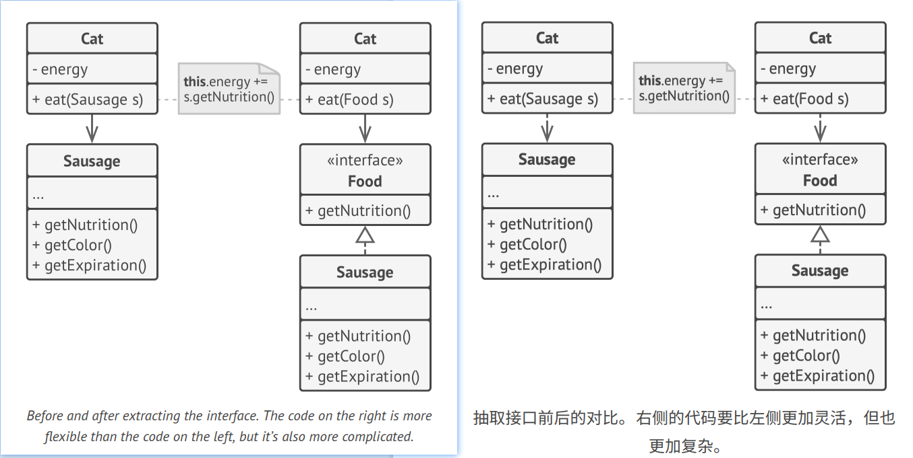
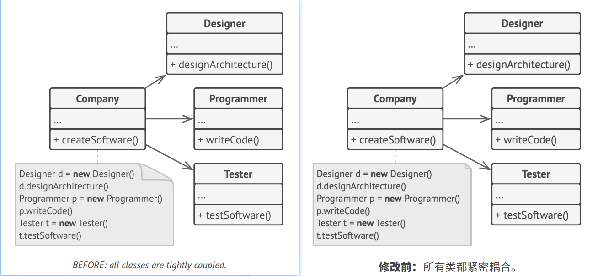
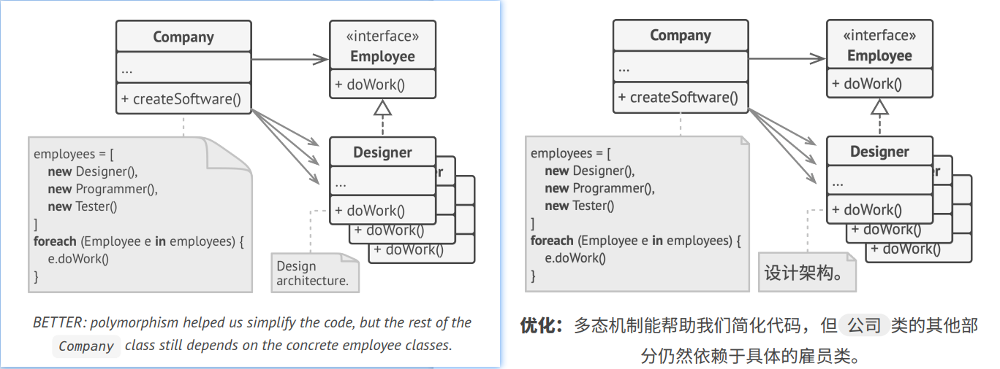
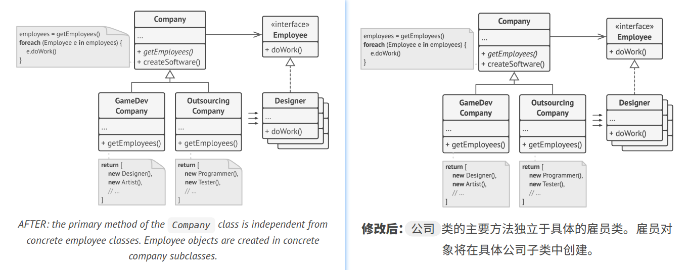

## Program to an Interface, not an Implementation 面向接口开发，而不是面向实现
> Program to an interface, not an implementation. Depend on abstractions, not on concrete classes.
> 
> 译: 面向接口进行开发，而不是面向实现；依赖于抽象类，而不是具体类。

You can tell that the design is flexible enough if you can easily extend it without breaking any existing code. Let's 
make sure that this statement is correct by looking at another cat example. A `Cat` that can eat any food is more 
flexible than one that can eat just sausages. You can still feed the first cat with sausages because they are a subset 
of "any food"; however, you can extend that cat's menu with any other food.   
译: 如果无需修改已有的代码就能轻松对类进行扩展，那就可以说这样的设计是灵活的。让我们再来看一个关于猫的例子，以验证这个说法是否正确。一只可以吃任何
食物的猫`Cat`要比只吃香肠的猫更加灵活。对于前者，你可以继续喂给它香肠，因为香肠是 "任何食物" 的一个子集；当然，你也可以喂这只猫任何食物。

When you want to make two classes collaborate, you can start by making one of them dependent on the other. Hell, I 
often start by doing that myself. However, there's another, more flexible way to set up collaboration between objects:
1. Determine what exactly one object needs from the other: which methods does it execute?
2. Describe these methods in a new interface or abstract class.
3. Make the class that is a dependency implement this interface.
4. Now make the second class dependent on this interface rather than on the concrete class. You still can make it work 
with objects of the original class, but the connection is now much more flexible.

译: 当你需要两个类互相合作时，可以让其中一个类依赖于另一个类。说实话，我自己也经常这么做。但是，你可以用另外一种更灵活的方式来设置对象之间的合作
关系:
1. 确定一个对象对另一个对象的确切需求: 它需要执行哪些方法?
2. 在一个新的接口或抽象类中定义这些方法。
3. 让被依赖的类实现该接口。
4. 现在让有需求的类依赖于这个接口，而不依赖于具体的类。你依旧可以与原始类的对象进行互动，但现在二者的连接变得灵活得多。

After making this change, you won't probably feel any immediate benefit. On the contrary, the code has become more 
complicated than it was before. However, if you feel that this might be a good extension point for some extra 
functionality, or that some other people who use your code might want to extend it here, then go for it.   
译: 完成修改后，你并不会立马从中受益。相反，现在的代码也变得比以前更加地复杂。但如果你觉得这里可以是个不错的额外功能扩展点，或者其他使用这些
代码的用户希望在此进行扩展的话，那就马上动手去做吧。

### Example 示例
Let's look at another example which illustrates that working with objects through interfaces might be more beneficial 
than depending on their concrete classes. Imagine that you're creating a software development company simulator. You 
have different classes that represent various employee types.   
译: 让我们来看看另外一个例子，它说明了通过接口与对象进行交互要比通过具体的类好处更多。想象一下你正在开发一款软件开发公司模拟器。你使用了不同的类
来代表各种类型的雇员。

In the beginning, the `Company` class is tightly coupled to concrete classes of employees. However, despite the 
difference in their implementations, we can generalize various work-related methods and then extract a common interface 
for all employee classes.   
译: 刚开始时，公司`Company`类与具体的雇员类紧密耦合。尽管各种雇员的实现不尽相同，但我们还是可以归纳出几个与工作相关的方法，并且将其抽取为所有
雇员类的通用接口。

After doing that, we can apply polymorphism inside the `Company` class, treating various employee objects via the 
`Employee` interface.   
译: 此后， 我们可在公司`Company`类内应用多态机制，通过雇员`Employee`接口来处理各种雇员对象。

The `Company` class remains coupled to the employee classes. This is bad because if we introduce new types of companies
that work with other types of employees, we'll need to override most of the `Company` class instead of reusing that code.   
译: 公司`Company`类仍然与雇员类相耦合，这很糟糕，因为如果引入包含其他类型雇员的公司类型的话，我们就需要重写绝大部分的公司`Company`类了，无法
复用其代码。

To solve this problem, we could declare the method for getting employees as *abstract*. Each concrete company will 
implement this method differently, creating only those employees that it needs.   
译: 为了解决这个问题，我们可以声明一个*抽象*方法来获取雇员。每个具体公司都将以不同的方式实现该方法，从而创建自己所需的雇员。

After this change, the `Company` class has become independent of various employee classes. Now you can extend this class
and introduce new types of companies and employees while still reusing a portion of the base company class. Extending
the base company class doesn't break any existing code that already relies on it.   
译: 修改后，公司`Company`类将独立于各种雇员类。现在你可以对该类进行扩展，并在复用部分公司基类的情况下引入新的公司和雇员类型。对公司基类进行
扩展时无需修改任何依赖于基类的已有代码。

By the way, you've just seen applying a design pattern in action! That was an example of the *Factory Method* pattern.
Don't worry: we'll discuss it later in detail.   
译: 顺便提一句，你刚刚目睹的就是设计模式的应用! 这就是*工厂方法*模式的一个示例。不要担心，稍后我们会对其进行详细讨论。