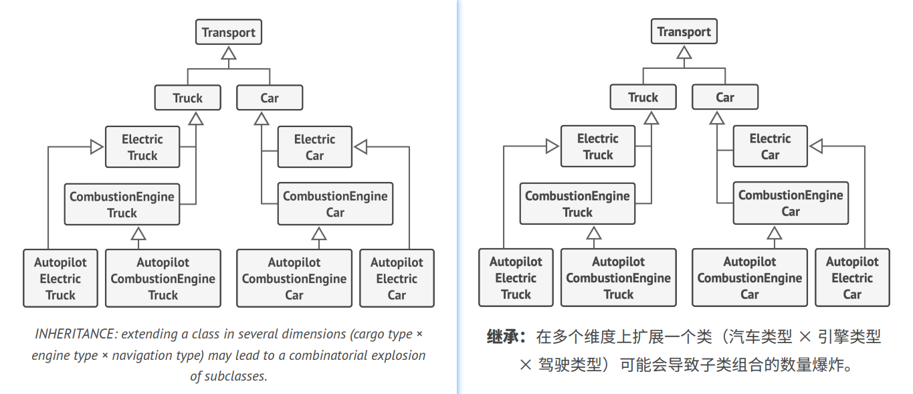

## Favor Composition Over Inheritance 组合优于继承
Inheritance is probably the most obvious and easy way of reusing code between classes. You have two classes with the
same code. Create a common base class for these two and move the similar code into it. Piece of cake!   
译: 继承可能是类之间最明显、最简单的代码复用方式。现在你有两个代码大致相同的类。你可以为它们创建一个通用的基类，然后将相似的代码移动到其中。
很简单吧！

Unfortunately, inheritance comes with caveats that often become apparent only after your program already has tons of
classes and changing anything is pretty hard. Here's a list of those problems.
- **A subclass can't reduce the interface of the superclass.** You have to implement all abstract methods of the parent 
class even if you won't be using them.
- **When overriding methods you need to make sure that the new behavior is compatible with the base one.** It's important
because objects of the subclass may be passed to any code that expects objects of the superclass and you don't want 
that code to break.
- **Inheritance breaks encapsulation of the superclass** because the internal details of the parent class become available 
to the subclass. There might be an opposite situation where a programmer makes a superclass aware of some details of 
subclasses for the sake of making a further extension easier.
- **Subclasses are tightly coupled to superclasses.** Any change in a superclass may break the functionality of subclasses.
- **Trying to reuse code through inheritance can lead to creating parallel inheritance hierarchies.** Inheritance usually 
takes place in a single dimension. But whenever there are two or more dimensions, you have to create lots of class 
combinations, bloating the class hierarchy to a ridiculous size.

译: 不幸的是，继承通常只有在程序中已包含大量的类且修改任何东西都非常困难时才会引起关注。下面就是此类问题的清单。
- **子类不能减少超类的接口**。你必须实现父类中所有的抽象方法，即使子类不使用它们。
- **在重写方法时，你需要确保新行为与基类中的版本兼容**。这一点很重要，因为子类的所有对象都可能被传递给以超类对象为参数的任何代码，相信你不会希望
这些代码崩溃的。
- **继承打破了超类的封装**，因为子类拥有访问父类内部详情的权限。此外还可能会有相反的情况，那就是程序员为了进一步扩展的便利性而让超类知晓子类部分
详情。
- **子类与超类紧密耦合**。超类中的任何修改都有可能破坏子类的功能。
- **通过继承复用代码可能会导致平行继承体系的产生**。继承通常发生在一个维度中。只要出现了两个以上的维度，你就必须创建数量巨大的类组合，从而使类
层次结构膨胀到不可思议的程度。

There's an alternative to inheritance called *composition*. Whereas inheritance represents the "is a" relationship 
between classes (a car *is a* transport), composition represents the "has a" relationship (a car *has an* engine).   
译: *组合*可以代替继承。继承代表的是类之间的"是" 关系(汽车*是*交通工具)，而组合则代表的是"有"关系(汽车*有*一个引擎)

I should mention that this principle also applies to aggregation—a more relaxed variant of composition where one object
may have a reference to the other one but doesn't manage its lifecycle. Here's an example: a car *has a* driver, but he 
or she may use another car or just walk *without the car*.   
译: 值得一提的是，这个原则也同样适用于聚合(一种更松弛的组合变体，一个对象可引用另一个对象，但并不管理其生命周期)。例如: 一辆汽车有一个司机，但是
司机可能会使用另一辆汽车，或者选择步行而不使用汽车。

### Example 示例
Imagine that you need to create a catalog app for a car manufacturer. The company makes both cars and trucks; they can be
either electric or gas; all models have either manual controls or an autopilot.   
译: 假设你需要为汽车制造商开发一个目录程序。该公司同时生产汽车和卡车；这些车辆要么是电动的要么是烧油的；所有车型都配备了手动控制或自动驾驶功能。

As you see, each additional parameter results in multiplying the number of subclasses. There's a lot of duplicate code
between subclasses because a subclass can't extend two classes at the same time.   
译: 正如你所见，每个额外参数都将使子类的数量倍增。子类中将有大量重复的代码，因为子类不能同时继承两个类。

You can solve this problem with composition. Instead of car objects implementing a behavior on their own, they can 
delegate it to other objects.   
译: 你可以使用组合来解决这个问题。汽车对象可将行为委派给其他对象，而不是自行实现。

The added benefit is that you can replace the behavior at runtime. For instance, you can replace an engine object linked 
to a car object just by assigning a different engine object to the car.   
译: 还有一个好处就是你可以在运行时对行为进行替换。例如，你可以通过重新为汽车对象分配一个不同的引擎对象来替换汽车已有的引擎。

This structure of classes resembles the Strategy pattern, which we'll go over later in this book.   
译: 上述类的结构类似于我们稍后将在本书中讨论的策略模式。
