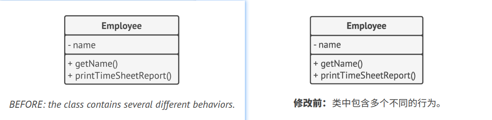
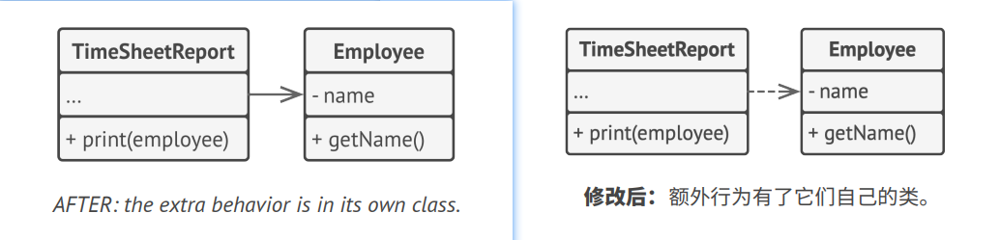

## `S`ingle Responsibility Principle 单一职责原则

> A class should have just one reason to change.
> 
> 译: 一个类被修改的原因只能有1个

Try to make every class responsible for a single part of the functionality provided by the software, and make that 
responsibility entirely encapsulated by (you can also say *hidden within*) the class.   
译: 尽量让每个类只负责软件中的一个功能，并将该功能完全封装(你也可以称之为*隐藏*)在该类中。

The main goal of this principle is reducing complexity. You don't need to invent a sophisticated design for a program 
that only has about 200 lines of code. Make a dozen methods pretty, and you'll be fine.   
译: 这条原则的主要目的是减少复杂度。你不需要费尽心机地去构思如何仅用200行代码来实现复杂的设计，实际上使用多个方法反而清晰的多。

The real problems emerge when your program constantly grows and changes. At some point classes become so big that you 
can no longer remember their details. Code navigation slows down to a crawl, and you have to scan through whole classes 
or even an entire program to find specific things. The number of entities in program overflows your brain stack, and
you feel that you're losing control over the code.   
译: 当程序规模不断扩大、变更不断增加后，真实的问题才会逐渐显现。到了某个时候，类会变得非常庞大，以至于你无法记住其中的细节。查找代码将变得非常缓慢，
你必须浏览整个类甚至整个程序才能找到需要的东西。程序中实体类的数量超出你的大脑上限，你会感觉自己对代码失去了控制。

There's more: if a class does too many things, you have to change it every time one of these things changes. While 
doing that, you're risking breaking other parts of the class which you didn't even intend to change.   
译: 还有一点: 如果一个类负责的功能太多，那么当其中任何一个功能发生变化时，你都必须对类进行修改。而在修改时，你就有可能改动类中自己并不希望改动的
部分。

If you feel that it's becoming hard to focus on specific aspects of the program one at a time, remember the single 
responsibility principle and check whether it's time to divide some classes into parts.   
译: 在同时关注程序特定方面的内容时，如果你感到有些困难的话，请记得单一职责原则并考虑现在是否应将某个类分割为几部分。

### Example 示例

The `Employee` class has several reasons to change. The first reason might be related to the main job of the class: 
managing employee data. However, there's another reason: the format of the timesheet report may change over time, 
requiring you to change the code within the class.   
译: 我们有几个理由来对雇员`Employee`类进行修改。第一个理由与该类的主要工作(管理雇员数据)有关。但还有另外一个理由: 时间表报告的格式可能会随着
时间而改变，从而使你需要对类中的代码进行修改。

Solve the problem by moving the behavior related to printing timesheet reports into a separate class. This change lets 
you move other report-related stuff to the new class.   
译: 解决该问题的方法是将与打印时间表报告相关的行为移动到一个单独的类中。这个改变让你能将其他与报告相关的内容移动到一个新的类中。

