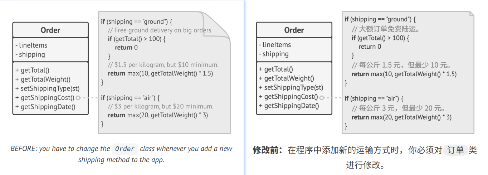
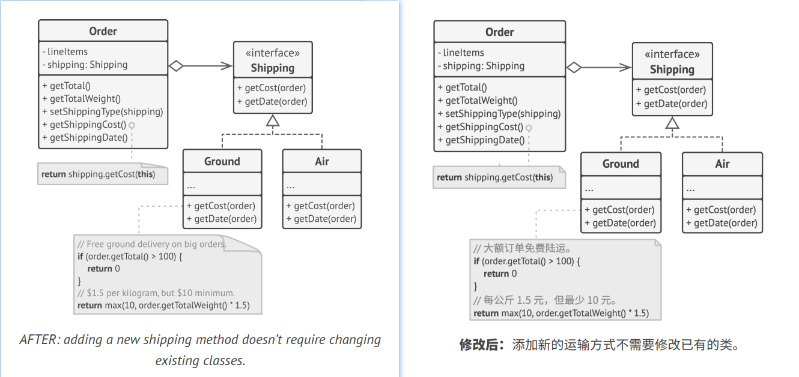

## `O`pen/Closed Principle 开闭原则

> Classes should be open for extension but closed for modification.
> 
> 译: 对类应该扩展，而不是修改

The main idea of this principle is to keep existing code from breaking when you implement new features.   
译: 本原则的主要理念是在实现新功能时能保持已有的代码不变。

A class is *open* if you can extend it, produce a subclass and do whatever you want with it—add new methods or fields,
override base behavior, etc. Some programming languages let you restrict a further extension of a class with special 
keywords, such as `final`. After this, the class is no longer open. At the same time, the class is *closed* (you can also 
say *complete*) if it's 100% ready to be used by other classes—its interface is clearly defined and won't be changed in 
the future.   
译: 如果你可以对一个类进行扩展，可以创建它的子类并对它做任何事情(如新增方法或成员变量、重写基类行为等)，那么它就是*开放*的。有些编程语言允许你
通过特殊的关键字(例如`final`)来限制对于类的进一步扩展，这样类就不再是 "开放" 的了。与此同时，如果某个类完全可以被另一个类所使用(即其接口已明确
定义好且以后不会再修改)，那么该类就是*封闭*(你也可以称之为*完整*)的。

When I first learned about this principle, I was confused because the words *open* & *closed* sound mutually exclusive.
But in terms of this principle, a class can be both open (for extension) and closed (for modification) at the same time.   
译: 当我第一次知道这条原则时，我曾感到困惑，因为*开*和*闭*这两个词听上去是互斥的。但是根据这条原则，一个类既可以是 "开放(对于扩展而言)" 的，
也可以是 "封闭(对于修改而言)" 的。

If a class is already developed, tested, reviewed, and included in some framework or otherwise used in an app, trying to
mess with its code is risky. Instead of changing the code of the class directly, you can create a subclass and override 
parts of the original class that you want to behave differently. You'll achieve your goal but also won't break any 
existing clients of the original class.   
译: 如果一个类已被定义、测试、审核，而且属于某个框架或者正被其他代码所使用，那么修改这个类就是有风险的。你可以创建一个子类并重写父类的部分内容
以实现不同的行为，而不是直接对父类的代码进行修改。这样你既可以达到自己的目标，同时又无需修改已有的原始类客户端。

This principle isn't meant to be applied for all changes to a class. If you know that there's a bug in the class, just 
go on and fix it; don't create a subclass for it. A child class shouldn't be responsible for the parent's issues.   
译: 这条原则并不能适用于所有对类进行的修改。如果你发现类中存在一处缺陷，那么直接将其修复即可，而不要为它创建子类。子类不应该对其父类的问题负责。

### Example 示例
You have an e-commerce application with an `Order` class that calculates shipping costs and all shipping methods are 
hardcoded inside the class. If you need to add a new shipping method, you have to change the code of the `Order` class 
and risk breaking it.   
译: 你的电子商务应用中包含一个计算运输费用的订单`Order`类，该类中所有的运输方法都以硬编码的方式实现。如果你需要添加一种新的运输方式，那你必须
修改订单`Order`类的代码，同时承担相应的风险。

You can solve the problem by applying the *Strategy* pattern. Start by extracting shipping methods into separate classes 
with a common interface.   
译: 你可以应用*策略*模式来解决这个问题。首先应将运输方法抽取到拥有相同接口的不同类中。

Now when you need to implement a new shipping method, you can derive a new class from the `Shipping` interface without
touching any of the `Order` class' code. The client code of the `Order` class will link orders with a shipping object of 
the new class whenever the user selects this shipping methods in the UI.   
译: 现在，当你需要实现一种新的运输方式时，你可以创建一个新类并实现运输方式`Shipping`这一接口，而无需修改任何订单`Order`类的代码。当用户在
界面(UI即用户界面)选择这种运输方式时，订单`Order`类的客户端代码会将订单链接到新的运输方式对象。

As a bonus, this solution let you move the delivery time calculation to more relevant classes, according to the 
*single responsibility principle*.   
译: 此外，根据*单一职责原则*，这个解决方案还能让你将计算运输时间的代码移动到与其相关度更高的类中。
