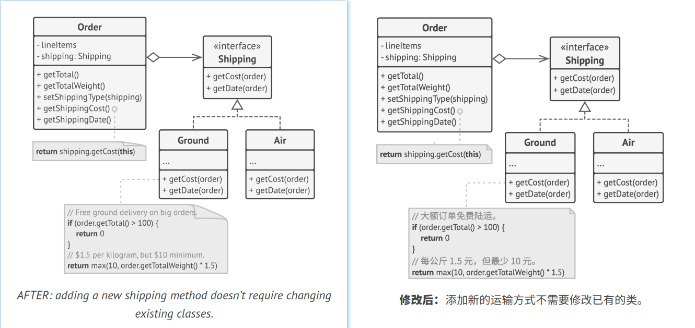

## `O`pen/Closed Principle

> Classes should be open for extension but closed for modification.
> 
> 译: 

The main idea of this principle is to keep existing code from breaking when you implement new features.   
译；

A class is *open* if you can extend it, produce a subclass and do whatever you want with it—add new methods or fields,
override base behavior, etc. Some programming languages let you restrict further extension of a class with special 
keywords, such as *final*. After this, the class is no longer open. At the same time, the class is *closed* (you can also 
say *complete*) if it's 100% ready to be used by other classes—its interface is clearly defined and won't be changed in 
the future.   
译: 

When I first learned about this principle, I was confused because the words *open* & *closed* sound mutually exclusive.
But in terms of this principle, a class can be both open (for extension) and closed (for modification) at the same time.   
译: 

If a class is already developed, tested, reviewed, and included in some framework or otherwise used in an app, trying to
mess with its code is risky. Instead of changing the code of the class directly, you can create a subclass and override 
parts of the original class that you want to behave differently. You'll achieve your goal but also won't break any 
existing clients of the original class.   
译: 

This principle isn't meant to be applied for all changes to a class. If you know that there's a bug in the class, just 
go on and fix it; don't create a subclass for it. A child class shouldn't be responsible for the parent's issues.   
译: 

### Example
You have an e-commerce application with an `Order` class that calculates shipping costs and all shipping methods are 
hardcoded inside the class. If you need to add a new shipping method, you have to change the code of the `Order` class 
and risk breaking it.   
译: 

You can solve the problem by applying the *Strategy* pattern. Start by extracting shipping methods into separate classes 
with a common interface.   
译: 

Now when you need to implement a new shipping method, you can derive a new class from the `Shipping` interface without
touching any of the `Order` class' code. The client code of the `Order` class will link orders with a shipping object of 
the new class whenever the user selects this shipping methods in the UI.   
译: 

As a bonus, this solution let you move the delivery time calculation to more relevant classes, according to the 
*single responsibility principle*.   
译: 