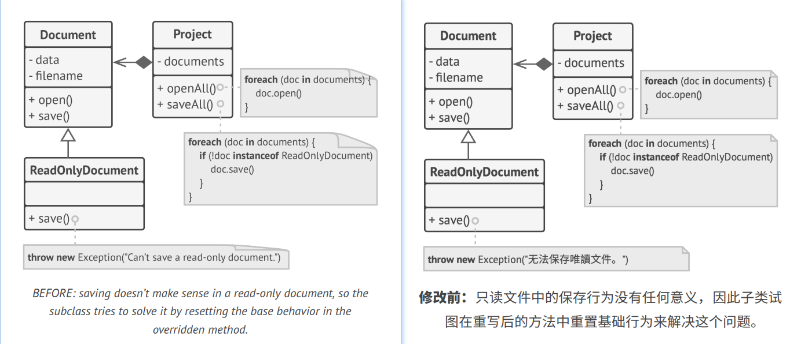
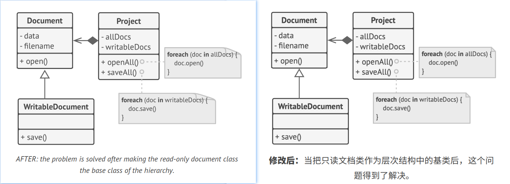

## `L`iskov Substitution Principle

> When extending a class, remember that you should be able to pass objects of the subclass in place of objects of the 
> parent class without breaking the client code.
> 
> 译: 

This means that the subclass should remain compatible with the behavior of the superclass. When overriding a method,
extend the base behavior rather than replacing it with something else entirely.   
译: 

The substitution principle is a set of checks that help predict whether a subclass remains compatible with the code 
that was able to work with objects of the superclass. This concept is critical when developing libraries and frameworks 
because your classes are going to be used by other people whose code you can't directly access and change.   
译: 

Unlike other design principles which are wide open for interpretation, the substitution principle has a set of formal
requirements for subclasses, and specifically for their methods. Let's go over this checklist in detail.   
译: 

- **Parameter types in a method of a subclass should *match* or be *more abstract* than parameter types in the method of 
the superclass.** Sounds confusing? Let's have an example.
  - Say there's a class with a method that's supposed to feed cats: `feed(Cat c)`. Client code always passes cat objects
    into this method.   
  - **Good:** Say you created a subclass that overrode the method so that it can feed any animal (a superclass of cats):
    `feed(Animal c)`. Now if you pass an object of this subclass instead of an object of the superclass to the client 
    code, everything would still work fine. The method can feed all animals, so it can still feed any cat passed by the 
    client.
  - **Bad:** You created another subclass and restricted the feeding method to only accept Bengal cats (a subclass of 
    cats): `feed(BengalCat c)`. What will happen to the client code if you link it with an object like this instead of 
    with the original class? Since the method can only feed a specific breed of cats, it won't serve generic cats passed 
    by the client, breaking all related functionality.

译: 

- **The return type in a method of a subclass should *match* or be a *subtype* of the return type in the method of the 
superclass.** As you can see, requirements for a return type are inverse to requirements for parameter types.
  - Say you have a class with a method `buyCat(): Cat`. The client code expects to receive any cat as a result of 
  executing this method.
  - **Good:** A subclass overrides the method as follows: `buyCat(): BengalCat`. The client gets a Bengal cat, which
    is still a cat, so everything is okay.
  - **Bad:** A subclass overrides the method as follows: `buyCat(): Animal`. Now the client code breaks since it receives 
    an unknown generic animal (an alligator? a bear?) that doesn't fit a structure designed for a cat.

译: 
Another anti-example comes from the world of programming languages with dynamic typing: the base method returns a 
string, but the overridden method returns a number.
译: 

- **A method in a subclass shouldn't throw types of exceptions which the base method isn't expected to throw.** In other 
words, types of exceptions should *match* or be *subtypes* of the ones that the base method is already able to throw. 
This rule comes from the fact that `try-catch` blocks in the client code target specific types of exceptions which the 
base method is likely to throw. Therefore, an unexpected exception might slip through the defensive lines of the client 
code and crash the entire application.   
译: 
> In most modern programming languages, especially statically typed ones (Java, C#, and others), these rules are built 
> into the language. You won't be able to compile a program that violates these rules.
> 
> 译: 

- **A subclass shouldn't strengthen pre-conditions.** For example, the base method has a parameter with type `int`. If 
a subclass overrides this method and requires that the value of an argument passed to the method should be positive (by 
throwing an exception if the value is negative), this strengthens the pre-conditions. The client code, which used to 
work fine when passing negative numbers into the method, now breaks if it starts working with an object of this subclass.
译: 

- **A subclass shouldn't weaken post-conditions.** Say you have a class with a method that works with a database. A 
method of the class is supposed to always close all opened database connections upon returning a value.   
译: 
You created a subclass and changed it so that database connections remain open so you can reuse them. But the client
might not know anything about your intentions. Because it expects the methods to close all the connections, it may 
simply terminate the program right after calling the method, polluting a system with ghost database connections.   
译: 

- **Invariants of a superclass must be preserved.** This is probably the least formal rule of all. *Invariants* are 
conditions in which an object makes sense. For example, invariants of a cat are having four legs, a tail, ability to 
meow, etc. The confusing part about invariants is that while they can be defined explicitly in the form of interface 
contracts or a set of assertions within methods, they could also be implied by certain unit tests and expectations of 
the client code.   
译: 
The rule on invariants is the easiest to violate because you might misunderstand or not realize all the invariants of
a complex class. Therefore, the safest way to extend a class is to introduce new fields and methods, and not mess with
any existing members of the superclass. Of course, that's not always doable in real life.   
译: 

- **A subclass shouldn't change the values of private fields of the superclass.** *What? How's that even possible?* It 
turns out some programming languages let you access private members of a class via reflection mechanisms. Other 
languages (Python, JavaScript) don't have any protection for the private members at all.   
译: 

### Example

Let's look at an example of a hierarchy of document classes that violates the substitution principle.   
译: 

The `save` method in the `ReadOnlyDocuments` subclass throws an exception if someone tries to call it. The base method
doesn't have this restriction. This means that the client code will break if we don't check the document type before 
saving it.   
译: 

The resulting code also violates the open/closed principle, since the client code becomes dependent on concrete classes 
of documents. If you introduce a new document subclass, you'll need to change the client code to support it.   
译: 

You can solve the problem by redesigning the class hierarchy: a subclass should extend the behavior of a superclass,
therefore the read-only document becomes the base class of the hierarchy. The writable document is now a subclass which
extends the base class and adds the saving behavior.   
译: 