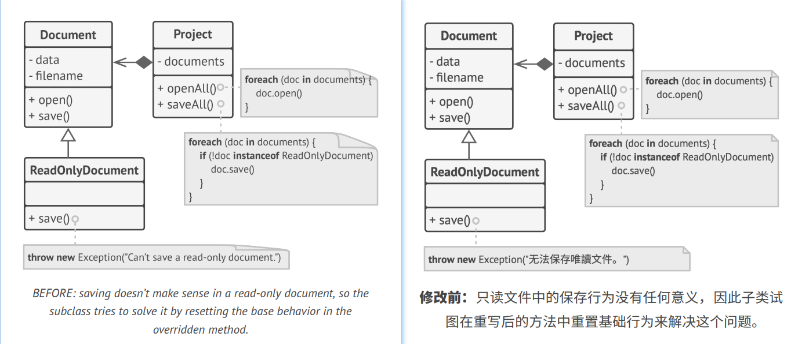
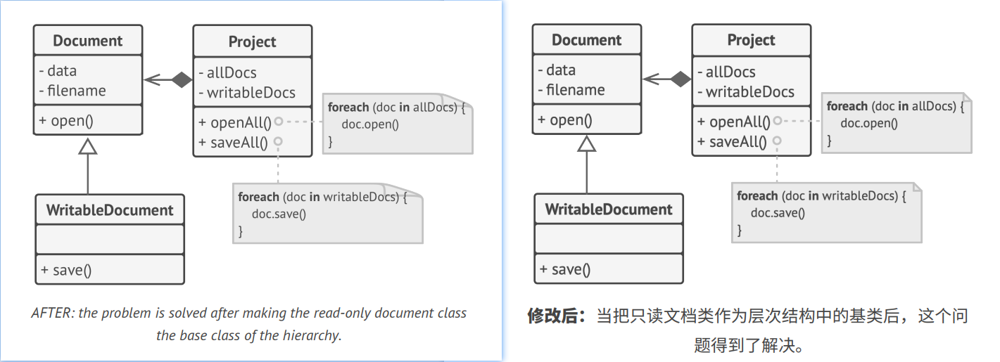

## `L`iskov Substitution Principle [里氏替换原则][里氏替换原则]

> When extending a class, remember that you should be able to pass objects of the subclass in place of objects of the 
> parent class without breaking the client code.
> 
> 译: 当你扩展一个类时，记住你应该要能在不修改客户端代码的情况下将子类的对象作为父类对象进行传递。

This means that the subclass should remain compatible with the behavior of the superclass. When overriding a method,
extend the base behavior rather than replacing it with something else entirely.   
译: 这意味着子类的行为必须与父类的保持兼容。在重写一个方法时，应对基类行为进行扩展而不是将其完全替换。

The substitution principle is a set of checks that help predict whether a subclass remains compatible with the code 
that was able to work with objects of the superclass. This concept is critical when developing libraries and frameworks 
because your classes are going to be used by other people whose code you can't directly access and change.   
译: 替换原则相当于一系列检查，这些检查能帮忙预测子类是否与与超类对象协作的代码兼容。这一概念在开发依赖库和框架时非常重要，因为你的类将会被他人
使用，而你是无法直接访问和修改别人的代码的。

Unlike other design principles which are wide open for interpretation, the substitution principle has a set of formal
requirements for subclasses, and specifically for their methods. Let's go over this checklist in detail.   
译: 与有着多种解释方式的其他设计模式不同，替代原则有一系列对子类(特别是其方法)的形式要求。让我们来看看这些要求。

- **Parameter types in a method of a subclass should *match* or be *more abstract* than parameter types in the method of 
the superclass.** Sounds confusing? Let's have an example.
- 译: **子类方法的参数类型应该与超类方法的参数类型相*匹配*或*更加抽象*。** 听上去有点晕? 让我们来看一个例子。
  - Say there's a class with a method that's supposed to feed cats: `feed(Cat c)`. Client code always passes cat objects
    into this method.
  - 假设某个类有一个方法用于给猫咪喂食:`feed(Cat c)`。客户端代码总是将"猫(cat)"对象传递给该方法。
  - **Good:** Say you created a subclass that overrode the method so that it can feed any animal (a superclass of cats):
    `feed(Animal c)`. Now if you pass an object of this subclass instead of an object of the superclass to the client 
    code, everything would still work fine. The method can feed all animals, so it can still feed any cat passed by the 
    client.
  - **优雅的方式:** 假如你创建了一个子类并重写了前面的方法，使其能够给任何动物(animal，猫的超类)喂食: `feed(Animal c)` 。现在如果你将 
    一个子类对象而非超类对象传递给客户端代码，程序仍将正常工作。该方法可以用于给任何动物喂食，因此它也同样可以给猫咪喂食。
  - **Bad:** You created another subclass and restricted the feeding method to only accept Bengal cats (a subclass of 
    cats): `feed(BengalCat c)`. What will happen to the client code if you link it with an object like this instead of 
    with the original class? Since the method can only feed a specific breed of cats, it won't serve generic cats passed 
    by the client, breaking all related functionality.
  - **糟糕的方式:** 你创建了另一个子类且限制喂食的方法只能接受"孟加拉猫(BengalCat，猫的子类)": `feed(BengalCat c)` 。如果你用它来替代
    链接在某个对象中的原始类，客户端侧的代码会发生什么呢? 由于该方法只能对特殊种类的猫咪进行喂食，因此它无法为客户端侧传递过来的普通猫咪提供服务，
    从而破坏所有相关的功能。

- **The return type in a method of a subclass should *match* or be a *subtype* of the return type in the method of the 
superclass.** As you can see, requirements for a return type are inverse to requirements for parameter types.
- 译: **子类方法的返回值类型应该与超类方法的返回值类型相*匹配*或是其*子类*。** 正如你所看到的，对于返回值类型的要求与对于参数类型的要求是相反的。
  - Say you have a class with a method `buyCat(): Cat`. The client code expects to receive any cat as a result of 
  executing this method.
  - 假如你有一个类，类中有一个方法 `buyCat(): Cat` 。客户端侧的代码执行该方法后，期待返回的结果是任意类型的"猫"。
  - **Good:** A subclass overrides the method as follows: `buyCat(): BengalCat`. The client gets a Bengal cat, which
    is still a cat, so everything is okay.
  - **优雅的方式:** 子类将该方法重写为: `buyCat(): BengalCat`。客户端将获得一只"孟加拉猫"，而它自然也是一种"猫"，因此一切运行正常。
  - **Bad:** A subclass overrides the method as follows: `buyCat(): Animal`. Now the client code breaks since it receives 
    an unknown generic animal (an alligator? a bear?) that doesn't fit a structure designed for a cat.
  - **糟糕的方式:** 子类将该方法重写为: `buyCat(): Animal`。现在客户端侧的代码将会出错，因为它获得的是某种未知的动物(短吻鳄? 熊?)，这
    并不适用于为一只"猫"而设计的结构。

Another anti-example comes from the world of programming languages with dynamic typing: the base method returns a 
string, but the overridden method returns a number.   
译: 另一个反例是来自编程语言世界中的动态类型: 基类方法返回一个字符串，但重写后的方法返回一个数字。

- **A method in a subclass shouldn't throw types of exceptions which the base method isn't expected to throw.** In other 
words, types of exceptions should *match* or be *subtypes* of the ones that the base method is already able to throw. 
This rule comes from the fact that `try-catch` blocks in the client code target specific types of exceptions which the 
base method is likely to throw. Therefore, an unexpected exception might slip through the defensive lines of the client 
code and crash the entire application.   
- 译: **子类中的方法不应抛出超出基类方法预期的异常类型。** 换句话说，子类方法抛出的异常类型应该与基础方法抛出的相*匹配*或是其*子类*。这条规则
源自这样一个事实: 客户端代码的 `try-catch` 代码块针对的是基类方法可能抛出的异常类型。因此，预期之外的异常可能会穿透客户端的防御代码，进而使
整个应用崩溃。
> In most modern programming languages, especially statically typed ones (Java, C#, and others), these rules are built 
> into the language. You won't be able to compile a program that violates these rules.
> 
> 译: 对于大多数现代编程语言，特别是静态类型的编程语言(Java和C#等等)，这些规则已内置其中。如果违反了这些规则，你将无法对程序进行编译。

- **A subclass shouldn't strengthen pre-conditions.** For example, the base method has a parameter with type `int`. If 
a subclass overrides this method and requires that the value of an argument passed to the method should be positive (by 
throwing an exception if the value is negative), this strengthens the pre-conditions. The client code, which used to 
work fine when passing negative numbers into the method, now breaks if it starts working with an object of this subclass.
- 译: **子类不应加强其前置条件。** 例如，基类方法有一个`int`类型的参数。如果子类重写该方法时，要求传递给该方法的参数值必须为正数(如果该值为
负数则抛出异常)，这就是加强了前置条件。客户端代码之前将负数传递给该方法时程序能正常运行，但现在使用子类对象时却使程序出了错。

- **A subclass shouldn't weaken post-conditions.** Say you have a class with a method that works with a database. A 
method of the class is supposed to always close all opened database connections upon returning a value.   
- 译: **子类不应削弱其后置条件。** 假如你有一个类，类中有个方法需要使用数据库。该方法应该在接收到返回值以后关闭所有活跃的数据库连接。

You created a subclass and changed it so that database connections remain open, so you can reuse them. But the client
might not know anything about your intentions. Because it expects the methods to close all the connections, it may 
simply terminate the program right after calling the method, polluting a system with ghost database connections.   
译: 你创建了一个子类并对其进行了修改，使得数据库连接保持活跃以便重用。但客户端可能对你的意图一无所知。因为它认为该方法会关闭所有的连接，因此可能
会在调用该方法后就马上关闭程序，使得无效的数据库连接对系统造成了 "污染"。

- **Invariants of a superclass must be preserved.** This is probably the least formal rule of all. *Invariants* are 
conditions in which an object makes sense. For example, invariants of a cat are having four legs, a tail, ability to 
meow, etc. The confusing part about invariants is that while they can be defined explicitly in the form of interface 
contracts or a set of assertions within methods, they could also be implied by certain unit tests and expectations of 
the client code.   
- 译: **超类的不变量必须保留。**  这可能是所有规则中最不 "形式" 的一条。*不变量*是让对象有意义的条件。例如，猫的 "不变量" 有四条腿、一条尾巴以及
能够喵喵叫等。不变量让人困惑的地方在于: 既可以以接口或方法内的一组断言这种形式来显式地定义它们，又可以隐含在某些单元测试和客户端代码预期中。

The rule on invariants is the easiest to violate because you might misunderstand or not realize all the invariants of
a complex class. Therefore, the safest way to extend a class is to introduce new fields and methods, and not mess with
any existing members of the superclass. Of course, that's not always doable in real life.   
译: 不变量的规则是最容易违反的，因为你可能会误解或没有意识到一个复杂类中的所有不变量。因此，扩展一个类的最安全的做法是引入新的成员变量和方法，而
不是去招惹超类中已有的成员。当然，在实际中这并非总是可行。

- **A subclass shouldn't change the values of private fields of the superclass.** *What? How's that even possible?* It 
turns out some programming languages let you access private members of a class via reflection mechanisms. Other 
languages (Python, JavaScript) don't have any protection for the private members at all.   
译: **子类不应该修改超类中私有成员变量的值。** *什么? 这怎么可能呢?* 原来有些编程语言允许通过反射机制来访问类的私有成员。还有一些编程语言
(Python和JavaScript)对私有成员没有进行任何保护。

### Example 示例

Let's look at an example of a hierarchy of document classes that violates the substitution principle.   
译: 让我们来看一个违反替换原则的文档类层次结构的例子。

The `save` method in the `ReadOnlyDocuments` subclass throws an exception if someone tries to call it. The base method
doesn't have this restriction. This means that the client code will break if we don't check the document type before 
saving it.   
译: 只读文档`ReadOnlyDocuments`子类中的保存`save`方法会在被调用时抛出一个异常。基类方法则没有这个限制。这意味着如果我们没有在保存文档前检查
文档类型，客户端代码将会出错。

The resulting code also violates the open/closed principle, since the client code becomes dependent on concrete classes 
of documents. If you introduce a new document subclass, you'll need to change the client code to support it.   
译: 此时代码也将违反开闭原则，因为客户端代码将依赖于具体的文档类。如果你引入了新的文档子类，则需要修改客户端代码才能对其进行支持。

You can solve the problem by redesigning the class hierarchy: a subclass should extend the behavior of a superclass,
therefore, the read-only document becomes the base class of the hierarchy. The writable document is now a subclass which
extends the base class and adds the saving behavior.   
译: 你可以通过重新设计类层次结构来解决这个问题: 一个子类应该扩展其超类的行为，因此只读文档变成了类层次结构中的基类。可写文档现在变成了子类，其对
基类进行了扩展并添加了保存行为。

[里氏替换原则]:https://refactoring.guru/liskov/dah
