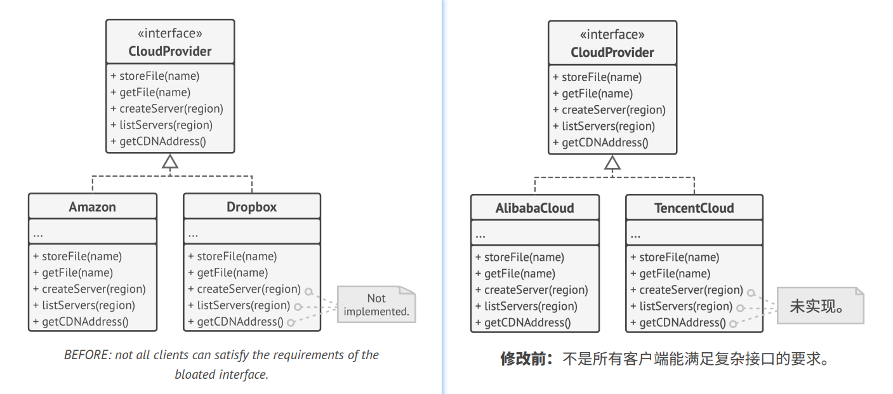
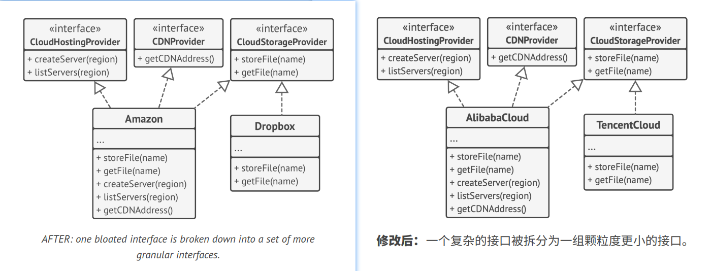

## `I`nterface Segregation Principle

> Clients shouldn't be forced to depend on methods they do not use.
> 
> 译: 

Try to make your interfaces narrow enough that client classes don't have to implement behaviors they don't need.   
译: 

According to the interface segregation principle, you should break down "fat" interfaces into more granular and specific
ones. Clients should implement only those methods that they really need. Otherwise, a change to a "fat" interface would
break even clients that don't use the changed methods.   
译: 

Class inheritance lets a class have just one superclass, but it doesn't limit the number of interfaces that the class 
can implement at the same time. Hence, there's no need to cram tons of unrelated methods to a single interface. Break 
it down into several more refined interfaces—you can implement them all in a single class if needed. However, some 
classes may be fine with implementing just one of them.   
译: 

### Example

Imagine that you created a library that makes it easy to integrate apps with various cloud computing providers. While i
the initial version it only supported Amazon Cloud, it covered the full set of cloud services and features.   
译: 

At the time you assumed that all cloud providers have the same broad spectrum of features as Amazon. But when it came 
to implementing support for another provider, it turned out that most of the interfaces of the library are too wide.
Some methods describe features that other cloud providers just don't have.   
译: 

While you can still implement these methods and put some stubs there, it wouldn't be a pretty solution. The better
approach is to break down the interface into parts. Classes that are able to implement the original interface can now 
just implement several refined interfaces. Other classes can implement only those interfaces which have methods that 
make sense for them.   
译: 

As with the other principles, you can go too far with this one. Don't further divide an interface which is already 
quite specific. Remember that the more interfaces you create, the more complex your code becomes. Keep the balance.   
译: 
