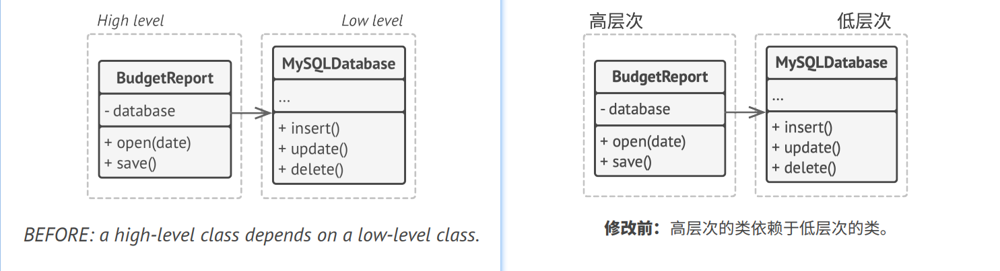
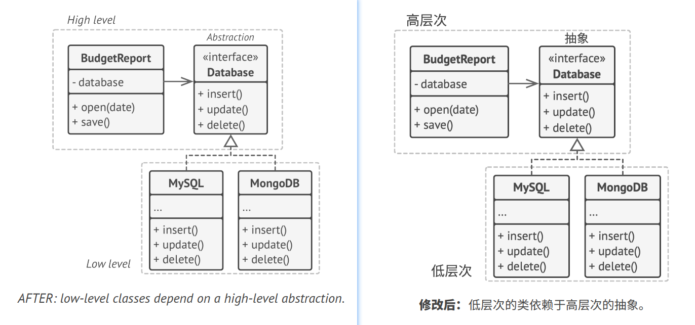

## `D`ependency Inversion Principle 依赖倒置原则

> High-level classes shouldn't depend on low-level classes. Both should depend on abstractions. Abstractions shouldn't 
> depend on details. Details should depend on abstractions.
> 
> 译: 高层次的类不应该依赖于低层次的类。两者都应该依赖于抽象接口。抽象接口不应该依赖于具体实现。具体实现应该依赖于抽象接口。

Usually when designing software, you can make a distinction between two levels of classes.
- **Low-level classes** implement basic operations such as working with a disk, transferring data over a network, 
connecting to a database, etc.
- **High-level classes** contain complex business logic that directs low-level classes to do something.

译: 通常在设计软件时，你可以识别出不同层次的类。
- **低层次的类**实现基础操作(例如磁盘操作、传输网络数据、连接数据库等)。
- **高层次的类**包含复杂的业务逻辑并指示低层次的类执行特定的操作。

Sometimes people design low-level classes first and only then start working on high-level ones. This is very common when
you start developing a prototype on a new system, and you're not even sure what's possible at the higher level because
low-level stuff isn't yet implemented or clear. With such an approach, business logic classes tend to become dependent on
primitive low-level classes.   
译: 有时人们会先设计低层次的类，然后再去开发高层次的类。这种情况在你在新系统上开发原型产品时是很常见的，由于低层次的类还没有实现或者不确定，所以
你无法确定高层次的类能实现哪些功能。如果采用这种方式，那么业务逻辑类可能会更依赖于低层次的类。

The dependency inversion principle suggests changing the direction of this dependency.
1. For starters, you need to describe interfaces for low-level operations that high-level classes rely on, preferably 
   in business terms. For instance, business logic should call a method `openReport(file)` rather than a series of methods
   `openFile(x)`, `readBytes(n)`, `closeFile(x)`. These interfaces count as high-level ones.
2. Now you can make high-level classes dependent on those interfaces, instead of on concrete low-level classes. This
   dependency will be much softer than the original one.
3. Once low-level classes implement these interfaces, they become dependent on the business logic level, reversing the
   direction of the original dependency.

译: 依赖倒置原则建议改变这种依赖方式。
1. 作为初学者，你最好使用业务术语来对高层次类所依赖的低层次操作接口进行描述。例如，业务逻辑应该调用名为`openReport(file)`方法，而不是
`openFile(x)`、`readBytes(n)`和`closeFile(x)`等一系列方法。这些接口都被视为是高层次的。
2. 现在你可以基于这些接口创建高层次的类，而不是基于低层次的具体类。这要比原来的依赖关系灵活很多。
3. 一旦低层次的类实现了这些接口，它们将依赖于业务逻辑层，从而倒置了原来的依赖关系。

The dependency inversion principle often goes along with the *open/closed principle*: you can extend low-level classes 
to use with different business logic classes without breaking existing classes.   
译: 依赖倒置原则通常和*开闭原则*共同发挥作用: 你无需修改已有的类就能用不同的业务逻辑类来扩展低层次的类。

### Example 示例
In this example, the high-level budget reporting class uses a low-level database class for reading and persisting its 
data. This means that any change in the low-level class, such as when a new version of the database server gets 
released, may affect the high-level class, which isn't supposed to care about the data storage details.   
译: 在本例中，高层次的预算报告类(BudgetReport)使用低层次的数据库类(MySQLDatabase)来读取和保存其数据。这意味着低层次类中的任何改变(例如
当数据库发布新版本时)都可能会影响到高层次的类，但高层次的类不应该关心数据存储的细节。

You can fix this problem by creating a high-level interface that describes read/write operations and making the 
reporting class use that interface instead of the low-level class. Then you can change or extend the original low-level 
class to implement the new read/write interface declared by the business logic.   
译: 要解决这个问题，你可以创建一个描述读写操作的高层次接口，并让预算报告类使用该接口代替低层次的类。然后你可以修改或扩展低层次的原始类来实现业务
逻辑声明的读写接口。

As a result, the direction of the original dependency has been inverted: low-level classes are now dependent on 
high-level abstractions.   
译: 结果是原来的依赖关系被倒置: 现在低层次的类依赖于高层次的抽象。
